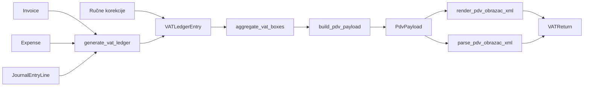

# PDV obrazac — arhitektura (Obrazac PDV v11.0)

```text
Status: Stable (Architecture Frozen)
Version: 1.0
Last updated: 2026-07-05

Zašto su donesene odluke: docs/architecture/ADR-0007-pdv-module.md, docs/architecture/ADR-0008-submission-events.md, docs/architecture/ADR-0009-submission-module-v1.md
Operativni vodič za računovođe: pdv-accountant-workflow.md
```

## Pregled pipelinea

```text
Source documents → generate_vat_ledger → VATLedgerEntry → aggregate_vat_boxes → PdvPayload → XML / PDF / HTML / API
```

Poslovni iznosi računaju se **jednom** (do `PdvPayload`). Svi izlazi koriste isti payload bez ponovnog računanja.



## Struktura koda

```
accounting/services/tax_forms/pdv/
  boxes.py          # VAT_BOX_REGISTRY — SSOT
  mapping.py        # _MAPPING_RULES, PDV_MAPPING_VERSION
  aggregate.py      # aggregate_vat_boxes, compute_vat_due
  build.py          # build_pdv_payload (arhitekturni gate)
  payload.py        # PdvPayload, TaxpayerInfo (frozen)
  canonical.py      # canonical_json, payload_hash
  parse.py          # parse_pdv_obrazac_xml
  render.py         # render_pdv_obrazac_xml (unsigned)
  validation.py     # validate_pdv_obrazac_xml (lokalni XSD)
  diff.py           # compare_pdv_payload_fields, PayloadMismatchError
  import_return.py  # import_signed_vat_return (alat — arhiva/revizija)
  submit.py         # mark_vat_return_submitted (evidencija predaje → SubmissionEvent)
  integrity.py      # check_vat_return_integrity, assert_vat_return_sync
  vat_returns.py    # create_vat_return_draft, resync_unsigned_xml_from_payload
  versions.py       # next_vat_return_version

accounting/services/submission/
  service.py        # SubmissionService — create_event, attach_confirmation, supersede, validate (ADR-0009)
  protocol.py       # SubmissionDocument protocol; VATReturn/PDVSReturn implementacije
  events.py         # Interni helperi: transition_submission_state, get_submission_events
  exceptions.py     # CreateSubmissionEventError, AttachConfirmationError, …
```

XSD sheme: `accounting/schemas/pdv/v11-0/`

## Modeli

### VATLedgerEntry (proširenje)

| Polje | Svrha |
|-------|-------|
| `vat_box` | Primarna agregacija (`VATBox` enum iz registryja) |
| `entry_category` | `domestic`, `eu_acquisition`, `import`, `adjustment` |
| `is_manual` | Ručne korekcije — ne brišu se pri `--replace` |

### VATReturn (1:N po VATPeriod)

| Polje | Svrha |
|-------|-------|
| `version` | Jedinstven po (tenant, period) |
| `status` | `draft` \| `generated` \| `signed` \| `submitted` \| `superseded` \| `imported` |
| `payload_snapshot` | Canonical JSON dict |
| `payload_hash` | SHA-256 canonical JSON |
| `mapping_version` | `PDV_MAPPING_VERSION` u trenutku kreacije |
| `schema_version` | XSD verzija (npr. `11.0`) |
| `unsigned_xml_sha256` | SHA-256 nepotpisanog XML-a pri kreaciji/resyncu (I002) |
| `xml_sha256` | SHA-256 **predanog** potpisanog XML-a (import) |

Evidencija predaje (UUID, datum, način) živi na **`SubmissionEvent`** — vidi ADR-0008. `VATReturn.status=submitted` ostaje workflow flag.

### PDVSReturn (1:1 po VATPeriod)

Lagani anchor za Obrazac PDV-S:

| Polje | Svrha |
|-------|-------|
| `vat_period` | Jedinstveno po razdoblju |
| `version` | Rezervirano za buduće XML verzioniranje (default 1) |

### SubmissionEvent (append-only audit)

Generički model evidencije predaje za sve porezne obrasce:

| Polje | Svrha |
|-------|-------|
| `event_uuid` | Javni identifikator eventa (API, logovi) — ne DB `id` |
| `document` | GenericFK → `VATReturn`, `PDVSReturn`, … |
| `submission_no` | 1, 2, 3… po dokumentu |
| `state` | `pending` \| `submitted` \| `rejected` \| `cancelled` |
| `destination` | `eporezna` \| `hzzo` \| `fina` \| `mojeporezna` \| … |
| `external_identifier` | Portal UUID (ePorezna ekran/PDF) — **ne** XML Identifikator |
| `payload_hash` | SHA-256 sadržaja predaje (audit dokaz) |
| `submitted_at`, `submitted_by` | Audit trag |
| `source` | `manual` \| `api` \| `migration` \| `import` \| `system` |
| `confirmation_attachment` | Potvrda predaje (XML/PDF/…) — postavi jednom |
| `supersedes_submission` | Lanac ispravaka (FK na prethodni event) |

`submission_type` (`initial` / `correction`) i `document_type` (`pdv` / `pdv_s`) deriviraju se — nisu u bazi.

Storage putanja:

```
vat_returns/{tenant_slug}/{year}/{month:02d}/v{version}/
  payload.json
  unsigned.xml
  submitted.xml   # kad postoji
```

## Canonical Artifact Rule

Jedini kanonski izvor PDV obrasca je `payload.json` (po `VATReturn` verziji).

`unsigned.xml` je **izvedeni artefakt** — mora odgovarati payloadu (polja u `Tijelo` obrasca). Ručne izmjene `unsigned.xml` nisu dopuštene; popravak = resync iz payloada ili novi draft.

```text
build_pdv_payload → payload.json (CANON)
payload.json      → render_pdv_obrazac_xml → unsigned.xml (DERIVED)
```

Integritet provjerava `check_vat_return_integrity()` (`integrity.py`):

| Provjera | Kod | Što uspoređuje |
|----------|-----|----------------|
| Semantička | I001 | `parse(unsigned.xml)` ↔ payload iz `payload.json` (`compare_pdv_payload_fields`) |
| Byte hash | I002 | `SHA256(unsigned.xml)` ↔ `VATReturn.unsigned_xml_sha256` (hvata ručni patch bez promjene payloada) |

Status **SYNC** = sve provjere prolaze; **OUT OF SYNC** = admin blokira preuzimanje PDV XML-a dok se ne uskladi (`resync_unsigned_xml_from_payload`) ili generira nova verzija.

Napomena: ponovni render XML-a ne daje isti SHA256 kao postojeći file (metapodaci koriste `uuid4()` i `datetime.now()`), pa se integritet ne temelji na byte-identičnom re-renderu nego na semantičkoj usporedbi polja.

### VATPeriod.current_return

`@property` — zadnji `submitted`, inače zadnja verzija. Nije FK (izbjegava nekonzistentnost).

## Lifecycle servisi

### create_vat_return_draft

```
build_pdv_payload → render_pdv_obrazac_xml → validate_pdv_obrazac_xml → payload_hash → VATReturn
```

Atomično u jednoj transakciji. Validacija pada → nema zapisa, nema djelomičnih datoteka.

### import_signed_vat_return

```
parse → validate (signed=True) → hash compare → compare_pdv_payload_fields (ako hash različit) → mark submitted
```

Sekundarni alat za arhivu i reviziju (admin **Alati**, mgmt command). Ne kreira automatski `SubmissionEvent` — portal UUID se bilježi kroz **Označi predano**.

### mark_vat_return_submitted

```
validacija (status=generated, version_confirmed) → SubmissionService.create_event(destination=eporezna, payload_hash=draft)
```

Primarni put evidencije ručne predaje na ePorezni — bez parsiranja potpisanog XML-a.

### mark_pdv_s_submitted

```
validacija (version_confirmed) → get_or_create PDVSReturn → SubmissionService.create_event(destination=eporezna)
```

Evidencija predaje PDV-S po razdoblju. Ispravci = `SubmissionService.supersede()`.

### SubmissionService.attach_confirmation

```
validate(prilog) → spremi confirmation_attachment (jednom)
```

XML: OIB, razdoblje, XSD, potpis; hash se uspoređuje s `payload_hash`. Ostalo: MIME/ekstenzija.

### archive_pdv_s_submission

```
validacija + arhiva XML → (opcionalno --create-event s --external-identifier) SubmissionService.create_event
```

### resync_unsigned_xml_from_payload

```
payload.json → render_pdv_obrazac_xml → validate → zamijeni unsigned.xml + unsigned_xml_sha256
```

Dozvoljeno samo za `status in (generated, draft)` i `source == erp_generated`. Ne mijenja `payload.json`, `payload_hash` ni `version`.

## Backward compatibility policy

Dva neovisna brojača:

| Konstanta | Što mjeri | Kada inkrementirati |
|-----------|-----------|---------------------|
| `PDV_MAPPING_VERSION` | Poslovno značenje payloada | Promjena mappinga, agregacije ili `build_pdv_payload` koja mijenja generirani sadržaj |
| `schema_version` | Službena XSD shema ePorezne | PU objavi novu shemu; promjena renderera/parsera |

**Ne inkrementirati** ako promjena ne utječe na izlazni payload/XML (refaktor, rename, optimizacija bez promjene rezultata).

Pri inkrementu: ažurirati `accounting/tests/fixtures/pdv/` i [`pdv-mapping.md`](pdv-mapping.md).

## Regresijski checkpointi

Referentni checkpoint test uspoređuje ERP izlaz (`aggregate_vat_boxes` → `build_pdv_payload`) s predanim XML-om s ePorezne za poznato razdoblje. Primjer: `test_pdv_checkpoint_april_2026.py` (travanj 2026, Mini-checkpoint 2.5).

### Pravilo: sintetički → submitted

Ako referentni submitted XML još ne postoji jer se funkcionalnost prvi put koristi za tekuće razdoblje, koristi se **privremeni sintetički checkpoint**. Sintetički test u testnoj bazi seed-a reprezentativna knjiženja (npr. manual JE, reverse charge, domaći trošak) i provjerava očekivane box vrijednosti, invarijante i XSD prolazak.

Nakon prve uspješne predaje na ePoreznu:

1. Predani XML arhivira se u `accounting/tests/fixtures/pdv/archive/`.
2. Sintetički checkpoint **zamjenjuje se** regresijskim testom koji uspoređuje ERP izlaz sa stvarno predanim XML-om (`test_pdv_checkpoint_<period>_submitted.py`).
3. Sintetički fixture **može ostati** kao unit test (`test_pdv_checkpoint_<period>_synthetic.py`) — nije gate, ali štiti poslovnu logiku izolirano.

Sintetički checkpoint nije zamjena za submitted gate; služi samo dok referentni XML ne postoji.

## Testovi

| Datoteka | Što provjerava |
|----------|----------------|
| `test_vat_box_registry.py` | Registry invarianti, sync s docs |
| `test_pdv_mapping.py` | Izvor → `vat_box` |
| `test_pdv_aggregate.py` | GROUP BY agregacija |
| `test_pdv_checkpoint_april_2026.py` | Submitted gate: ERP == referentni XML |
| `test_pdv_checkpoint_<period>_synthetic.py` | Privremeni gate dok nema submitted XML-a |
| `test_pdv_checkpoint_<period>_submitted.py` | Submitted gate nakon prve predaje razdoblja |
| `test_pdv_build_architecture.py` | Contract: jedan aggregate poziv |
| `test_pdv_payload.py` | Snapshot, round-trip |
| `test_create_vat_return_draft.py` | XSD, atomičnost, `unsigned_xml_sha256` |
| `test_vat_return_integrity.py` | I001/I002, resync, admin download gate |
| `test_import_signed_vat_return.py` | Upload, diff, arhiva, SubmissionEvent import |
| `test_mark_vat_return_submitted.py` | Evidencija predaje PDV i PDV-S |
| `test_submission_events.py` | SubmissionEvent servis, lanac ispravaka, immutability |
| `test_submission_service.py` | SubmissionService: UUID, payload_hash, attach, supersede |
| `test_pdv_submitted_archive_regression.py` | Arhivski XML fixturei |
| `test_pdv_performance.py` | Baseline performansi pipelinea |

CI: `.github/workflows/pdv-ci.yml`

## Architecture freeze

Jezgra PDV modula zamrznuta (Tickets 0–7 ✅). Operativna stabilizacija: [`pdv-stabilization-runbook.md`](pdv-stabilization-runbook.md). Proširenja tek nakon ispunjenih kriterija prijelaza — vidi [`pdv-extensions-roadmap.md`](pdv-extensions-roadmap.md).
