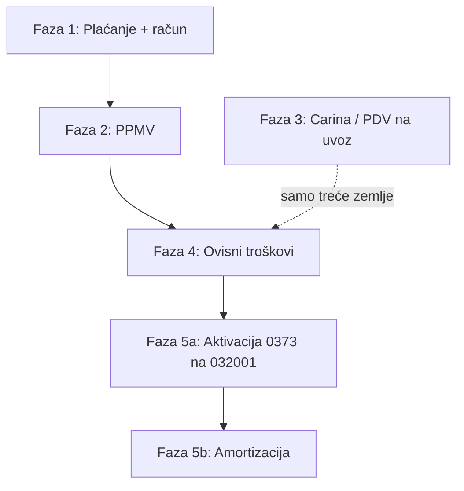

# Uvoz vozila — knjiženje u ERP-u

Referentni slučaj: **VW T-Cross**, VIN `WVGZZZC1ZPY022544` (Fine Star d.o.o.).

Izvorni dossier: `.temp/uvoz_vozila/VW_T-Cross_WVGZZZC1ZPY022544/`

Vidi i: [manual-journal-bank-matching.md](manual-journal-bank-matching.md)

---

## Što ERP trenutno ima (i nema)

| Mogućnost | Status |
|-----------|--------|
| Ručna temeljnica + bank match | ✅ Dovoljno za fazu 1 (plaćanje) |
| Expense modul (automatsko knjiženje) | ⚠️ Knjiži na **4120** (rashod), ne na imovinu — **ne koristiti za vozilo** bez custom posting rule |
| Registar osnovnih sredstava | ❌ Nema — VIN/evidencija u opisu/reference temeljnice (vidi dolje) |
| Amortizacija | ❌ Nema — kasniji modul |
| PDV na uvoz / carina (JCD) | ❌ Nema automatizacije — **nije primjenjivo na kupnju iz EU** (T-Cross, Golf); vidi fazu 3 |
| PPMV (posebni porez na MV) | ❌ Nema automatizacije — ručno |

**Zaključak:** Manual JE + Bank Matching **pokriva fazu 1**. Za kasnije faze isti alat, dok ne dođe modul osnovnih sredstava.

---

## T-Cross — podaci za knjiženje

| Polje | Vrijednost |
|-------|------------|
| Račun | 70025237, 22.05.2026. |
| Iznos | 8.000,00 EUR (neto, PDV 0 € — isporuka u RH) |
| Prodavatelj | Automobile Hadžić / uplata Admir Hadžić |
| **Prijevoz** | **Uključen u cijenu vozila** (račun 70025237) — nema zasebnog troška prijevoza |
| Bankovna isplata | 22.05.2026., 8.000 EUR |
| IBAN primatelja | DE35420500010130058580 |
| Bank ref | ZOU 497136235 |
| Opis na izvodu | PL RN VW-CROSS FM5DF0094BICAOI |
| EUR račun Fine Star | HR6124070001100204771 |
| VIN | WVGZZZC1ZPY022544 |
| Namjena | Poslovna (d.o.o.) |
| Porijeklo | **EU (Njemačka)** — nema carine / JCD / PDV-a na uvoz (faza 3) |

---

## Odabir konta — u pripremi vs. aktivirano

Na **22.05.2026.** T-Cross **nije bio spreman za uporabu** (čeka PPMV, registraciju, homologaciju). Troškovi nabave prikupljaju se na kontu **imovine u pripremi**; aktivacija na konto osobnih automobila tek nakon stavljanja u uporabu.

| RRiF konto | Naziv | Kada koristiti |
|------------|-------|----------------|
| **0373** | Osobni automobili i transportna sredstva **u pripremi** | Nabava, PPMV, ostali ovisni troškovi **koji nisu u cijeni vozila** (bez carine — EU) |
| **032001** | Osobni automobili za obavljanje djelatnosti | Tek nakon **aktivacije** (stavljanje u uporabu) |

**Prije knjiženja:** potvrditi s računovođom da je **0373** pravi konto za ovu fazu. Ako računovođa koristi drugačiju praksu, prilagoditi — ERP ne hardkodira konta.

### Aktivacija (faza 5a — nakon registracije)

Kad su svi troškovi nabave prikupljeni i vozilo stavljeno u uporabu:

```
D 032001  Osobni automobili za obavljanje djelatnosti    ukupna nabavna vrijednost
   K 0373  Osobni automobili u pripremi                   ukupna nabavna vrijednost
```

---

## Opis i referenca temeljnice (vezivanje dokumentacije)

U **opis** i/ili **referencu** temeljnice staviti sve identifikatore — kasnija pretraga po VIN-u, računu ili bank ref-u:

```text
Nabava VW T-Cross
VIN: WVGZZZC1ZPY022544
Račun: 70025237
Plaćanje: ZOU 497136235
```

Polje `reference` može sadržavati npr. `70025237|WVGZZZC1ZPY022544|ZOU497136235`.

Dossier vozila: `.temp/uvoz_vozila/VW_T-Cross_WVGZZZC1ZPY022544/`

---

## Workflow po fazama



**T-Cross / Golf (Automobile Hadžić, DE):** faze **1 → 2 → 4 → 5a → 5b**. Faza 3 se **preskače** — stjecanje iz EU, račun s 0 % PDV (isporuka u RH).

### Faza 1 — Plaćanje i nabavna vrijednost (SADA)

Račun i uplata isti dan → **jedna temeljnica** + bank match.

**Preporučeno knjiženje (22.05.2026.):**

| Duguje | Potražuje | Iznos | Napomena |
|--------|-----------|------:|----------|
| **0373** Osobni automobili u pripremi | | 8.000,00 | Nabavna vrijednost (cijena iz DE, **uključuje prijevoz**) |
| | **1000** (ili ledger konto EUR računa) | 8.000,00 | Isplata Admir Hadžić |

- **Opis** (primjer):

  ```text
  Nabava VW T-Cross
  VIN: WVGZZZC1ZPY022544
  Račun: 70025237
  Plaćanje: ZOU 497136235
  ```

- **Alat:** `create_manual_journal_entry(..., post=True)` + `match_transaction_to_journal_entry`

**Alternativa (dva koraka)** — ako računovođa želi prvo obvezu prema dobavljaču:

1. D 0373 / K **2201** (analitika Automobile Hadžić) — na datum računa  
2. D 2201 / K 1000 — na datum uplate + bank match na koraku 2  

Za T-Cross nije nužno (isti datum).

**Golf — privatna gotovina (Ante Vrcan):** plaćanje dobavljaču iz privatnih sredstava → Fine Star duguje Ante Vrcanu:

| Duguje | Potražuje | Iznos |
|--------|-----------|------:|
| **0373** | | 15.882,35 |
| | **2309-P00001** (analitika Ante Vrcan) | 15.882,35 |

Bez bank match-a. Temeljnica **JE #51** (`202605-0012`), FixedAsset id **3**. Kasnija isplata Ante Vrcanu: D 2309 / K 1000.

**Provjera bank match (T-Cross):** isplata je **debit** na izvodu → u temeljnici mora postojati stavka **potražuje** na `ledger_account` EUR računa u iznosu 8.000,00.

---

### Faza 2 — Posebni porez na MV (PPMV)

**Tko rješava:** Ministarstvo financija — **Carinska uprava**, CU Šibenik (nije carina/JCD za EU uvoz, nego PPMV postupak).

**Tko prima uplatu:** **Državni proračun RH** na IBAN `HR1210010051863000160` (model HR68, poziv `1147-36619131370`). Na bankovnom izvodu: *DRŽAVNI PRORAČUN REPUBLIKE HRVATSKE*.

Dobavljač u ERP-u: `seed_manual_suppliers` → **Ministarstvo financija — Carinska uprava, CU Šibenik** (OIB `18683136487`).

| Polje | T-Cross | Golf (referenca) |
|-------|---------|------------------|
| Prijava | 18.06.2026. | 08.06.2026. |
| Rješenje | **30.06.2026.**, ur. **513-02-8089/34-26-2** | 17.06.2026., 513-02-8089/30-26-3 |
| Ukupan porez | **191,00 €** | 1.051,04 € |
| Vrijednosna komponenta | **0,00 €** | 567,22 € |
| Ekološka komponenta | **191,00 €** | 483,82 € |
| Uplata | ⏳ rok ~15.07.2026. (JE #56 otvoreno) | ✅ 19.06.2026. (JE #54–#55) |
| Poziv na broj | 1147-36619131370 | 1147-36619131370 |

**PPMV ne ulazi u fazu 1.** Knjižiti tek kad nastane obveza odnosno uplata.

**Knjiženje (TBD s računovođom — uključivanje u nabavnu vrijednost):**

| Duguje | Potražuje | Iznos |
|--------|-----------|------:|
| **0373** | **1000** | 191,00 |

+ bank match na uplatu Poreznoj (IBAN HR1210010051863000160, model HR68).

**Golf — knjiženo (plaćeno, zatvoreno):**

| Korak | JE | Datum | Knjiženje |
|-------|-----|-------|-----------|
| Obveza (rješenje) | **#54** `202606-0011` | 17.06.2026. | D **0373** / K **2201-S00006** (Carinska), 1.051,04 € |
| Uplata | **#55** `202606-0012` | 19.06.2026. | D **2201-S00006** / K **1000**, 1.051,04 € + bank match TX **#30** |

*(Stornirana JE #52 — direktno D 0373 / K 1000.)*

**T-Cross — knjiženo (dug, neplaćeno):**

| Korak | JE | Datum | Knjiženje |
|-------|-----|-------|-----------|
| Obveza (rješenje) | **#56** `202606-0013` | 30.06.2026. | D **0373** / K **2201-S00006**, **191,00 €** — otvorena obveza |

Uplata T-Cross: kad prođe s računa → D **2201-S00006** / K **1000** + bank match.

---

### Faza 3 — Carina / PDV na uvoz (JCD) — **nije primjenjivo (EU)**

**T-Cross i Golf:** kupljeni u **Njemačkoj (EU)**. Račun 70025237 ima **PDV 0 €** (oslobođeno — isporuka u RH). **Nema** carinske deklaracije (JCD), carinskih pristojbi ni knjiženja PDV-a na uvoz kroz carinu.

Za ova vozila workflow ide **izravno s faze 2 (PPMV) na fazu 4** (registracija i sl.).

*(Referenca — samo uvoz iz trećih zemalja, npr. SAD:)*

- PDV na uvoz: D **1400** / K obveza PDV — po JCD
- Carinske pristojbe: D **0373** / K 1000 ili 2201
- Ručne temeljnice po JCD dokumentu

---

### Faza 4 — Ovisni troškovi (koji nisu u cijeni vozila)

Tehnički pregled, registracija, homologacija i sl. — kapitalizirati na **0373**:

| Duguje | Potražuje | Napomena |
|--------|-----------|----------|
| **0373** | 2201 / 1000 | Trošak povećava nabavnu vrijednost (u pripremi) |

**T-Cross:** prijevoz je **uključen u račun 70025237** (8.000 €). CMR (`07-prijevoz-cmr/`) je transportna dokumentacija, ne zasebna stavka za knjiženje. **Ne knjižiti** dodatni trošak prijevoza za ovo vozilo.

RRiF: ovisni troškovi nabave — za vozila u pripremi kapitalizirati na **0373** samo ono što stvarno nije već u cijeni kupnje.

---

### Faza 5a — Aktivacija (stavljanje u uporabu)

Nakon registracije i završetka svih troškova nabave:

```
D 032001    ukupni saldo 0373 za ovo vozilo
   K 0373    ukupni saldo 0373 za ovo vozilo
```

Opis: `Aktivacija VW T-Cross VIN: WVGZZZC1ZPY022544`

---

### Faza 5b — Amortizacija

Tek nakon što je vozilo u uporabi i nabavna vrijednost finalizirana.

- Modul osnovnih sredstava **nije implementiran**
- Do tada: evidencija izvan ERP-a ili kasniji ticket

---

## Koraci u ERP-u (faza 1 — checklist)

1. [ ] **Potvrditi s računovođom:** konto **0373** (u pripremi) za fazu 1
2. [ ] Provjeriti da tenant `finestar` ima konta **0373** i **032001** (provision RRiF chart)
3. [ ] Provjeriti `BankAccount.ledger_account` za EUR račun `HR6124070001100204771`
4. [ ] Uvesti CAMT053 izvod koji sadrži isplatu 22.05.2026. (ref ZOU 497136235)
5. [x] Kreirati dobavljača **Automobile Hadžić** u `Supplier` (`seed_manual_suppliers`, USt-IdNr `DE229674882`)
6. [x] Kreirati ručnu temeljnicu: D **0373** / K ledger konto banke, 8.000 EUR, datum **22.05.2026.**
7. [x] Opis/reference s VIN, računom i bank ref-om (vidi gore)
8. [x] Knjižiti temeljnicu
9. [x] Uskladiti bankovnu transakciju (`matched_journal_entry`) — TX **#18** ↔ JE **#49**
10. [x] Povezati ulazni dokument **Expense #16** (`T-2026-0009`) na JE #49/#57 (GFK) + status `paid` **bez** Expense approve (signal `auto_post_expense` bi knjižio 4120 — stornirano JE #99/#100)
11. [ ] Verificirati bruto bilancu / saldo **0373**

---

## API primjer (faza 1)

```python
from decimal import Decimal
from accounting.services.manual_journal import JournalLineInput, create_manual_journal_entry
from banking.models import BankTransaction
from banking.reconciliation import match_transaction_to_journal_entry

# ledger_code = bank_account.ledger_account.account_code  # npr. '1000' ili '1001'
lines = [
    JournalLineInput(
        account_code='0373',  # potvrditi s računovođom
        debit=Decimal('8000.00'),
        credit=Decimal('0'),
        description='VIN: WVGZZZC1ZPY022544 | Račun: 70025237',
    ),
    JournalLineInput(
        account_code='1000',  # zamijeni s ledger_code EUR računa
        debit=Decimal('0'),
        credit=Decimal('8000.00'),
        description='Plaćanje: ZOU 497136235 | Admir Hadžić',
    ),
]

entry = create_manual_journal_entry(
    tenant,
    user,
    entry_date=date(2026, 5, 22),
    description=(
        'Nabava VW T-Cross\n'
        'VIN: WVGZZZC1ZPY022544\n'
        'Račun: 70025237\n'
        'Plaćanje: ZOU 497136235'
    ),
    reference='70025237|WVGZZZC1ZPY022544|ZOU497136235',
    lines=lines,
    post=True,
)

bank_tx = BankTransaction.all_objects.get(
    tenant=tenant,
    transaction_date=date(2026, 5, 22),
    amount=Decimal('8000.00'),
    transaction_type='debit',
    # reference ili acct_svcr_ref prema importu
)
match_transaction_to_journal_entry(bank_tx, entry, user)
```

---

## Usporedba s Golfom

| | T-Cross | Golf |
|---|---------|------|
| VIN | WVGZZZC1ZPY022544 | WVWZZZCD8PW153457 |
| Iznos | 8.000 € (ukl. prijevoz) | 15.882,35 € |
| Datum računa | 22.05.2026. | 27.05.2026. |
| PPMV rješenje | 191,00 € (30.06.) | 1.051,04 € (17.06.) |
| PPMV uplata | čeka | ✅ 19.06.2026. (JE #52) |
| Porijeklo | EU (DE) — **bez faze 3** | EU (DE) — **bez faze 3** |
| Plaćanje nabave | Banka → Admir Hadžić (8.000 €) | **Privatna gotovina Ante Vrcan** → obveza **2309** |
| Faza 1 knjiženje | D **0373** / K **1000** (JE #49) | D **0373** / K **2309-P00001** (JE #51) |
| FixedAsset | id 2 | id 3 |

---

## Poznati gapovi (ne blokiraju fazu 1)

- Expense modul nema posting rule za dugotrajnu imovinu
- Nema `resolution_status` (#4) — nije potreban za T-Cross
- Nema modula osnovnih sredstava — **FixedAsset** za T-Cross (#2) i Golf (#3); VIN u opisu/reference
- ERP **ne hardkodira** konta — 0373 vs 032001 odluka računovođe
- PDV knjiga U-RA za stjecanje iz EU — provjeriti s računovođom (račun s 0 % PDV iz DE; **nije** PDV na uvoz / JCD)

---

## Ovisnosti iz uvoza (van knjiženja)

Checklist uvoza: `.temp/uvoz_vozila/VW_T-Cross_WVGZZZC1ZPY022544/checklist-uvoz.md`

Knjiženje ne zamjenjuje PPMV, registraciju — samo financijsku evidenciju u GK. **Carina/JCD nije u igri** za trenutnu flotu (kupnja iz EU).

---

## Budući modul: Osnovna sredstva

Za rent-a-car flotu planiran je modul **Osnovna sredstva** (GitHub issue #6):

- model s VIN-om, statusom (`u pripremi` / `aktivno`), kontima iz kontnog plana (ne hardkodirano)
- aktivacija: D 032001 / K 0373
- automatska mjesečna amortizacija

Do tada: faze 1, 2, 4 ručno preko Manual JE; VIN i dokumenti u opisu temeljnice. (Faza 3 samo ako ikad uvoz iz treće zemlje.)
