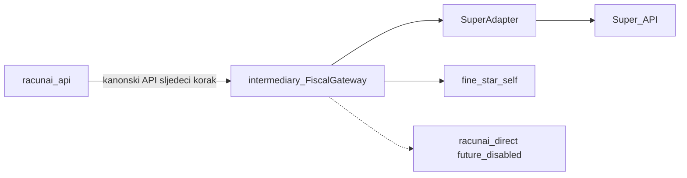

# ADR-0017 — Fiscal Gateway (Model A)

```text
Status: Accepted
Date: 2026-08-16
Type: Integration
Supersedes: —
Related: ADR-0010-domain-architecture.md, ADR-0011-architecture-freeze-v1.0.md,
         FISCAL_GATEWAY_CANONICAL_API.md, fiskalizacija-2.0/milestones.md,
         porezna/zahtjevi/posrednik/README.md,
         ADR-0018-django-eracun-traffic-migration.md
```

> **Amendment (ADR-0018):** `SuperAdapter` je implementiran i staging-verificiran. Migracija Django eRačun prometa nije dio ovog ADR-a; uređuje je [`ADR-0018-django-eracun-traffic-migration.md`](ADR-0018-django-eracun-traffic-migration.md). Odluke u §Decision ostaju neizmijenjene.

## Status

**Accepted** — `/opt/stacks/racunai.hr/intermediary` je jedinstveni Fiscal Gateway. Trenutno se implementira Model A (vanjski informacijski posrednik; Super je prvi, kroz `SuperAdapter`). Kanonski API v1: [`FISCAL_GATEWAY_CANONICAL_API.md`](FISCAL_GATEWAY_CANONICAL_API.md).

## Context

Odgovornosti eRačuna i fiskalizacije danas su raspršene:

- `api/app/super_integration/` zove Super API izravno (`SuperClient`); credentiali i `company_guid` žive u `SuperTenantConfig` (vezano uz tenant, ne uz OIB)
- `api/app/fiscal_gateway/` je Django app za DIRECT/AS4/CIS, ne jedinstveni gateway
- `intermediary/` je trenutno samo MPS FastAPI (Fine Star publisher)
- M1.7 i ROADMAP B3 još kažu „uklanjanje `super_integration`“
- REFERENCE_ARCHITECTURE Super označava kao privremeni connector
- Faza 2 (vlastiti posrednik za tuđe OIB-ove) je odgođena: ISO 27001, čl. 61. ZOF, upis na Popis informacijskih posrednika

Jedan racunAI tenant jednog dana može sadržavati više društava ili OIB-ova. Adresa zaprimanja eRačuna mijenja se kroz [FiskAplikaciju](https://porezna-uprava.gov.hr/hr/fiskaplikacija-8274/8274); nakon potvrde nove adrese novi eRačuni dolaze isključivo preko novog posrednika.

Ovaj ADR zaključava granicu i invarijante. Ne specificira kanonske endpointe ni OpenAPI.

## Decision

### 1. Jedinstveni Fiscal Gateway

`/opt/stacks/racunai.hr/intermediary` je jedini Fiscal Gateway.

Django `fiscal_gateway` i `super_integration` nisu gateway. Postaju klijenti / legacy koji se povlače iza kanonskog API-ja.

### 2. Model A sada; ostali načini ostaju definirani



| Način | Uloga | Stanje |
|-------|-------|--------|
| **Model A** | Vanjski informacijski posrednik. Super je prvi, isključivo kroz `SuperAdapter`. | Implementira se sada |
| **`fine_star_self`** | Pristupna točka „za sebe“ (čl. 63. ZOF), samo Fine Star OIB | Ostaje; fail-closed allow-lista |
| **`racunai_direct`** | Budući vlastiti posrednik | Onemogućen za tuđe OIB-ove do potvrde o sukladnosti i upisa na Popis informacijskih posrednika |

Dijeljeni MPS/AS4 kod između `fine_star_self` i `racunai_direct` ne znači jednaka ovlaštenja. `fine_star_self` ima fail-closed allow-listu samo za Fine Star OIB.

Nakon aktivacije vlastitog posrednika Model A ostaje podržan.

### 3. Granica prema Superu

Cilj: racunAI API nikada ne koristi Superov API izravno.

Postojeći `SuperClient` predstavlja dopušteno prijelazno stanje. Nakon prihvaćanja ovog ADR-a ne smije se širiti novim funkcijama, a uklanja se nakon uvođenja kanonskog API-ja i migracije prometa na `SuperAdapter`.

### 4. Ulazni i izlazni tokovi

- **Ulaz:** potpisani webhook → trajni inbox → pozadinski dohvat UBL-a
- **Izlaz:** slanje UBL-a → spremanje identifikatora → polling statusa
- **Reconciliation:** mora pronaći webhookove i promjene statusa koje smo propustili
- **Idempotentnost:** ponovljeni webhook, poll i reconciliation ne smiju duplicirati dokument ni knjiženje

**Invariant izlaznog slanja:** timeout ili nepoznat rezultat poziva posredniku nikada ne pokreće slijepo ponovno slanje UBL-a. Gateway prvo pokušava razriješiti prethodni pokušaj pomoću internog idempotency ključa, provider-identifikatora i reconciliationa. Interni pokušaj slanja mora dobiti stabilan identifikator prije prvog mrežnog poziva.

### 5. Pravni subjekt, ne tenant

Za svaki porezni subjekt odnosno OIB/participant identifier može postojati najviše jedan aktivni posrednik za zaprimanje eRačuna.

Konfiguracija i credentiali vežu se uz:

```text
legal_entity / taxpayer_subject + provider
```

ne samo uz `tenant + provider`.

### 6. Identiteti

- Superovi `companyGuid`, `invoiceGuid`, `messageId` i statusi ostaju **provider-identifikatori**
- racunAI koristi vlastite kanonske identifikatore i statuse
- Mapiranje provider ↔ kanonski ostaje u gatewayu, ne u Sales/Purchasing/Finance

### 7. Kontrolirana promjena posrednika

Promjena adaptera nije dovoljna za promjenu aktivne adrese zaprimanja.

- Korisnik mora potvrditi novu adresu kroz FiskAplikaciju
- Gateway ne označava novog posrednika aktivnim dok potvrda nije evidentirana
- Dokument ostaje trajno vezan uz posrednika preko kojeg je zaprimljen ili poslan
- Otvoreni dokumenti ne migriraju se automatski na novog posrednika
- Stari adapter ostaje dostupan za status, audit i reconciliation postojećih dokumenata
- Nakon potvrde nove adrese svi novi eRačuni dolaze isključivo preko novog posrednika

### 8. Dokazi, novac, credentiali

- Izvorni UBL, zahtjevi, odgovori i fiskalizacijske poruke čuvaju se neizmijenjeni
- Novac se obrađuje decimalno; Superov `double` nije računovodstveni izvor
- Credentiali se izoliraju po vezi `legal_entity / taxpayer_subject + provider` (ne globalni Super login u API-ju)

### 9. Provider statusi — fail-closed

- Uvijek se čuvaju providerov izvorni status, kod i tekst odgovora
- Kanonsko mapiranje je verzionirano
- Nepoznati novi provider status ne mapira se automatski u `SUCCESS`
- Nepoznati status postaje `UNKNOWN/REQUIRES_REVIEW`
- Adapter ne smije oglašavati funkciju koju posrednik stvarno ne podržava

### 10. Izvan opsega

Kanonski API v1 je specificiran u [`FISCAL_GATEWAY_CANONICAL_API.md`](FISCAL_GATEWAY_CANONICAL_API.md). Taj ugovor mora poštivati odluke iz ovog ADR-a. OpenAPI YAML i implementacija ostaju sljedeći korak.

## Consequences

### Prednosti

- Jedna granica prema svim posrednicima; Super nije poseban slučaj u API-ju
- Model A ostaje valjan i nakon vlastitog posrednika
- Promjena posrednika ne gubi audit ni otvorene dokumente
- Fail-closed statusi sprečavaju tiho knjiženje nepoznatih odgovora

### Rizici / trade-off

- `SuperClient` u API-ju ostaje dok ne postoji kanonski API — prijelazno, ne ciljno
- Konfiguracija po OIB-u zahtijeva model `legal_entity / taxpayer_subject` koji danas nije potpun
- FiskAplikacija potvrda je vanjski korak; gateway ne može sam „prebaciti“ zaprimanje

### Reinterpretacija M1.7

M1.7 više ne znači „maknuti Super kao posrednika“. Znači maknuti izravni Super klijent iz `racunai-api` nakon kanonskog API-ja i `SuperAdaptera`. Super ostaje prvi vanjski posrednik (Model A).

### Follow-up

- [x] Kanonski API `racunai-api` ↔ `intermediary` — [`FISCAL_GATEWAY_CANONICAL_API.md`](FISCAL_GATEWAY_CANONICAL_API.md)
- [x] `SuperAdapter` u `intermediary` — implementiran i staging-verificiran
- [ ] Migracija Django eRačun prometa i uklanjanje izravnog `SuperClient` poziva — [`ADR-0018-django-eracun-traffic-migration.md`](ADR-0018-django-eracun-traffic-migration.md)
- [ ] Konfiguracija i credentiali po `legal_entity / taxpayer_subject + provider`
- [ ] Evidencija FiskAplikacija potvrde prije aktivacije novog posrednika
