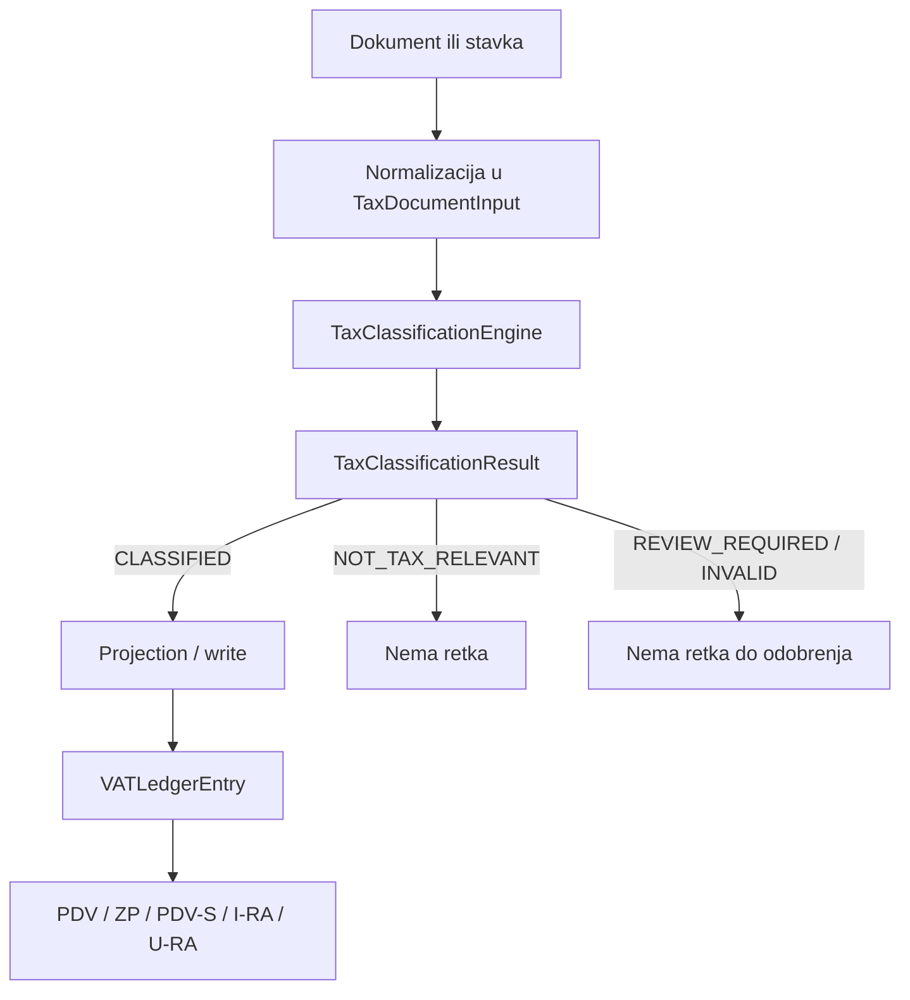

# ADR-0019 — Jedinstveni porezni filter i PDV evidencijski sloj

```text
Status: Proposed
Date: 2026-08-17
Type: Business
Supersedes: —
Related: ADR-0007-pdv-module.md, ADR-0010-domain-architecture.md, ADR-0014-tax-domain-completion.md, DATA_ARCHITECTURE.md, FORM_REGISTRY.md
```

## Status

**Proposed** — poslovni ugovor poreznog filtera je zaključan. Status ostaje Proposed dok se ne potvrdi implementacijska strategija i shadow/cutover plan. Ovaj ADR ne mijenja produkcijski PDV pipeline i ne uvodi Django modele.

## 1. Context

racunAI već ima projekcijsku osnovu: `generate_vat_ledger()` gradi `VATLedgerEntry`, a ADR-0007 zaključava `VATLedgerEntry → aggregate_vat_boxes → PdvPayload`. Ne gradimo novi porezni sustav od nule. Nedostaje jedinstven i eksplicitan klasifikacijski ugovor.

Danas klasifikacija živi u tri odvojena `if` lanca u [`accounting/services/vat.py`](../../api/app/accounting/services/vat.py):

| Lanac | Ulaz | Kako se bira box |
|-------|------|------------------|
| Invoice | `Invoice` / `InvoiceItem` | OSS postupak, pa EU 0 %, pa stopa 5/13/25 |
| Expense | header `Expense` | IOSS → 308; EU + 0 % PDV bez JE → 614; **sve ostalo → 303** |
| Journal | `JournalEntryLine` (`posted`) | šifra konta (`journal_line_to_box`, VIII.1) |

Audit (2026-08-17) potvrđuje ove rupe:

- **Tihi skipovi.** Nepoznata stopa, nemapirani konto ili nulti iznos završavaju s `continue`. Nema ishoda `CLASSIFIED` / `NOT_TAX_RELEVANT` / `REVIEW_REQUIRED` / `INVALID`.
- **Expense fallback 303.** Svaki odobreni/plaćeni trošak koji nije IOSS niti EU-placeholder ide u box 303, i kad izvedena stopa nije 25 %. Generičko pravilo guta nepoznatu kombinaciju.
- **Nezaštićen ledger.** `VATPeriod.status` (`open` / `closed` / `submitted`) se ne provjerava. Admin „Generiraj PDV knjige” zove `replace=True` i na predanom razdoblju. `VATReturn` je immutable nakon predaje; ledger nije.
- **Storno nestaje.** `JournalEntry.reverse()` zamjenjuje D/C. `journal_line_to_box` mapira samo dugovni pretporez. Nakon `replace=True` original (`reversed`) ispada iz upita, storno (C 1400) ne dobiva box — pretporez nestane umjesto da se stornira retkom.
- **Nema predujma.** `Payment` postoji, ali ledger ga ne čita.
- **Ručni override** je `is_manual=True` bez razloga, korisnika i ponovne validacije.
- **Idempotencija** vrijedi za zbrojeve pri `replace=True`, ne za ažuriranje promijenjenog izvora.

PDV i ZP već agregiraju samo iz `VATLedgerEntry`. PDV-S uzima iznose iz ledgera (207/612), ali EU PDV ID ponekad traži unatrag kroz `JournalEntryLine` → `Expense`.

## 2. Pravni kontekst

Primarni izvor: [NN 11/2026](https://narodne-novine.nn.hr/clanci/sluzbeni/full/2026_01_11_90.html), na snazi od 31. siječnja 2026.

- izbrisani su članci 164.–166. koji su propisivali sadržaj knjiga I-RA i U-RA
- uklonjene su reference na knjige i Obrasce I-RA/U-RA
- rok PDV prijave pomaknut je s 20. dana na **zadnji dan tekućeg mjeseca**

Zaključci ovog ADR-a:

- I-RA i U-RA **nisu** aktualne zakonski propisane knjige
- racunAI **ne** implementira službene obrasce I-RA/U-RA
- nazivi ostaju samo kao računovođama razumljivi **interni kontrolni pregledi**
- ukidanje propisanih knjiga ne ukida obvezu urednih evidencija
- RRiF je stručni izvor i kontni okvir, **nije** pravni SSOT niti službeno tumačenje
- razdoblja do 31. 12. 2025. mogu zadržati povijesni I-RA/U-RA kontekst; od 2026. nadalje: `I-RA — kontrolni pregled` / `U-RA — kontrolni pregled`

## 3. Decision

Svaki porezno relevantan dokument ili stavka prolazi kroz **jedan** `TaxClassificationEngine` prije nastanka porezne evidencije.



Granice odgovornosti:

| Sloj | Odgovornost |
|------|-------------|
| Izvorni dokument | Dokaz poslovnog događaja |
| Adapter | Punjenje `TaxDocumentInput`; filter ne čita ORM izravno |
| `TaxClassificationEngine` | Jedina klasifikacijska odluka; **ne piše u bazu** |
| Projection / write | Validira rezultat i tek tada ažurira `VATLedgerEntry` |
| Potrošači (PDV, ZP, PDV-S, kontrolni pregledi) | Čitaju projekciju; ne klasificiraju ponovo |

ADR-0007 ostaje važeći za `VATLedgerEntry → PdvPayload`. Ovaj ADR definira korak prije toga: `dokument → porezna odluka → VATLedgerEntry`.

Ovaj ADR **ne** odlučuje koja Django polja ili modeli postoje.

## 4. Ulazni ugovor — `TaxDocumentInput`

Jedinstveni normalizirani ulaz, neovisno dolazi li iz `InvoiceItem`, `Expense`, `JournalEntryLine`, budućeg predujma/payment događaja, ili storna/porezne korekcije.

| Polje / skupina | Obavezno | Značenje |
|-----------------|----------|----------|
| `source_kind` + `source_id` | da | Stabilni identitet retka (tenant, tip izvora, id dokumenta/stavke). Nije GFK na header `Invoice` kad je jedinica stavka. |
| `lifecycle_status` | da | Status izvornog dokumenta. Filter odlučuje smije li ući. |
| `event_kind` | da | `original` / `advance` / `reversal` / `correction` |
| `direction` | da | `output` / `input` / `corrective` |
| datumi | da, relevantni | Datum isprave; isporuke/usluge; primitka; plaćanja |
| `partner_snapshot` | da kad ima partnera | Naziv, država, OIB, PDV ID u trenutku klasifikacije |
| iznosi | da | Osnovica, stopa, PDV, valuta, tečaj, EUR vrijednosti |
| jurisdikcija + vrsta | da | RH / EU / treća zemlja; B2B / B2C; roba / usluga |
| `declared_procedure` | da | Deklarirani postupak. **Nije** ciljni PDV box. |
| pretporez činjenice | da na ulazu | Pravo i opseg odbitka (pun / djelomičan / nepriznat + postotak/razlog) |
| `originates_from` | da za storno/ispravak | Stabilna veza na originalni `source_id` |

Predujam koristi isti ugovor (`event_kind=advance`), čak i dok `Payment` još nije izvor u kodu.

## 5. Izlazni ugovor — `TaxClassificationResult`

Za svaki ulaz filter vraća **točno jedan** od četiri ishoda. Nema tihog `continue`.

| `outcome` | `rows` | Značenje | Projection / write |
|-----------|-------:|----------|--------------------|
| `CLASSIFIED` | najmanje 1 | Jednoznačno pravilo i barem jedan predloženi ledger redak | da, ako write gate prođe |
| `NOT_TAX_RELEVANT` | točno 0 | Valjan dokument bez poreznog učinka; mora imati razlog | ne |
| `REVIEW_REQUIRED` | točno 0 | Podaci stoje, ali nema jednoznačnog specifičnog pravila | ne prije odobrenja |
| `INVALID` | točno 0 | Nedostaju ili proturječni obvezni podaci | ne |

`CLASSIFIED` **ne smije** imati prazan `rows`. `CLASSIFIED(rows=[])` se preklapa s `NOT_TAX_RELEVANT` i sakriva nemapirano, namjerni nulti učinak i bug u pravilu.

`CLASSIFIED_NO_LEDGER_EFFECT` se **ne uvodi**. Ako se pojavi konkretan poslovni primjer porezno relevantnog slučaja bez `VATLedgerEntry`, tada zaseban ishod — ne prazan `CLASSIFIED`.

Uz `CLASSIFIED`, rezultat i svaki predloženi redak nose:

- porezno razdoblje i razlog izbora datuma
- PDV box (izveden, ne ulaz)
- osnovicu i PDV / pretporez
- priznati i nepriznati dio pretporeza
- `rule_code` i mapping verziju
- primjenjive izlaze: `pdv` / `zp` / `pdv_s` / `control_ira` / `control_ura`
- hash porezno relevantnih ulaza
- identitet izvora

Jedan `CLASSIFIED` može hraniti više izlaza (reverse charge → obveza + pretporez; EU isporuka → PDV + ZP).

## 6. Prioritet pravila

Filter izvršava korake u ovom redoslijedu. Raniji korak može završiti s ishodom i prekinuti lanac.

1. Lifecycle i zaključano razdoblje
2. Potpunost i konzistentnost ulaza
3. Storno / ispravak **prije** standardne klasifikacije
4. Porezna relevantnost
5. Jurisdikcija i status partnera
6. Vrsta transakcije
7. Posebni porezni postupak
8. Porezno razdoblje — po pravilu postupka, ne jednim univerzalnim datumom
9. Izračun iznosa i pretporeza
10. Mapiranje u ledger retke — `CLASSIFIED` samo ako postoji ≥1 redak
11. Cross-check i validacija rezultata
12. Tek zatim kontrolirani override

Ključno pravilo:

> Prvo odgovarajuće specifično pravilo pobjeđuje, ali generičko pravilo nikada ne smije progutati nepoznatu ili nepotpunu kombinaciju.

Posljedice za današnji kod:

- Expense fallback **„sve ostalo → 303”** postaje `REVIEW_REQUIRED` ili `INVALID`
- nepoznata stopa na Invoice (danas tihi skip) postaje `REVIEW_REQUIRED` ili `INVALID`
- JE linija bez mapiranog konta, ako je dokument označen kao porezno relevantan, postaje `REVIEW_REQUIRED` ili `INVALID`

Ciljni PDV box je rezultat, ne slobodno polje dokumenta.

## 7. Projection / write granica

> Filter ne zapisuje odmah u bazu. Najprije vraća `TaxClassificationResult`, a poseban projection/write korak validira rezultat i tek tada ažurira `VATLedgerEntry`.

To omogućuje:

- shadow klasifikaciju uz postojeći `generate_vat_ledger`
- diff starog i novog mappinga
- pregled `REVIEW_REQUIRED` rezultata
- zaštitu `submitted` razdoblja
- ponovno validiranje manual overridea
- test filtera bez ORM side-effecta

`VATLedgerEntry` ostaje kanonska, verzionirana i obnovljiva porezna projekcija. Isti ulazi + ista verzija pravila daju isti rezultat. Generiranje je idempotentno i bez duplikata. Svaki redak ima stabilnu vezu na izvor i `rule_code`. Ledger se ne uređuje kao paralelna ručna knjiga.

## 8. Lifecycle

`VATPeriod.status` (`open` / `closed` / `submitted`) je write gate.

- Filter **smije** vratiti shadow `TaxClassificationResult` i za `closed` / `submitted` razdoblje.
- Projection / write **ne** regenerira in-place predano ili zaključano razdoblje.
- Korekcija ide novim događajem/retkom ili novom return verzijom (ADR-0007 `VATReturn` 1:N).
- Izmjena Partnera ne mijenja zaključano razdoblje — potrošači čitaju `partner_snapshot` s projekcije, ne živi Partner.
- Nema ručnih izmjena generiranog XML-a ili `payload.json`.

## 9. Storno i ispravci

Storno i ispravak su eksplicitni ulazni događaji:

- `event_kind` u `{reversal, correction}`
- obavezan `originates_from` na originalni `source_id`

Ne smiju se pogađati iz zamijenjenih D/C strana. Gate A je dokazao da taj put briše pretporez umjesto da ga stornira.

`Invoice.status=cancelled` nije storno događaj. UBL `credit_note` nije izvor dok adapter ne proizvede `TaxDocumentInput` s `event_kind=reversal` ili `correction`.

## 10. Override

Kontrolirani override zahtijeva:

- ovlaštenu ulogu
- prethodnu i novu klasifikaciju
- obvezan razlog i dokaz gdje je potreban
- korisnika, timestamp i mapping verziju
- ponovno izvršavanje validacija i cross-checkova
- vidljivost u kontrolnom pregledu i verifikaciji returna

Override ne zaobilazi `closed` ili `submitted` razdoblje. `is_manual=True` bez audita nije dovoljan.

## 11. Izlazi

| Izlaz | Izvor | Pravilo |
|-------|-------|---------|
| PDV | `VATLedgerEntry` zbroj po `vat_box` | ADR-0007 gate; potrošač ne klasificira |
| ZP | ledger boxovi 101/103 | identitet primatelja s projekcije |
| PDV-S | ledger boxovi 207/612 | iznosi s ledgera; EU PDV ID mora biti na projekciji, ne lookup u `Expense` |
| I-RA kontrolni pregled | izlazni ledger retci | interni pregled s tragom do dokumenta/stavke |
| U-RA kontrolni pregled | ulazni ledger retci | interni pregled s priznatim i nepriznatim pretporezom |

Potrošači ne ponavljaju klasifikaciju i ne prepravljaju rezultat drugog izlaza.

## 12. Consequences

### Prednosti

- Jedno mjesto klasifikacije za sve vrste dokumenata.
- Četiri ishoda umjesto tihih skipova.
- Filter se može testirati i shadow-usporediti bez pisanja u ledger.
- Storno ostaje povezano s originalom.
- Predana razdoblja ostaju netaknuta.

### Rizici / trade-off

- Adapteri po izvoru moraju biti potpuni; filter ne smije „pogledati” ORM kao prečicu.
- Expense fallback 303 i tihi skipovi danas hrane Fine Star checkpoint testove — cutover mora ići uz ledger diff, ne big-bang.
- `REVIEW_REQUIRED` zahtijeva operativni UI koji još ne postoji.
- Ovaj ADR ne bira implementacijski raspored ni Django shemu.

### Follow-up

Implementacija ide **zasebnim planom** nakon prihvaćanja ADR-a:

- [ ] Shadow klasifikacija uz postojeći `generate_vat_ledger`
- [ ] Ledger diff starog i novog mappinga
- [ ] Adapteri: izlazni dokumenti → ulazni dokumenti → korekcije/RC → predujam
- [ ] Write gate za `closed` / `submitted`
- [ ] Cutover uz usporedni ledger diff
- [ ] Uskladiti admin labele i FORM_REGISTRY jezik s kontrolnim pregledima (konstante `LEDGER_I_RA` / `LEDGER_U_RA` ostaju interne)

### Obvezni scenariji (implementacijski plan / testovi)

1. Domaći izlazni račun 25 %
2. Domaći ulazni račun s punim pretporezom
3. Djelomično ili nepriznati pretporez
4. EU isporuka dobara → PDV + ZP
5. EU B2B usluga
6. Reverse charge → više povezanih ledger redaka
7. Oslobođeno ili izvan opsega → `NOT_TAX_RELEVANT` ili specifično pravilo
8. Predujam i konačni račun bez dvostrukog obračuna
9. Storno/ispravak s vezom na original
10. Ručna porezna JE; konto sam nije dovoljan
11. Dokument bez učinka → `NOT_TAX_RELEVANT`
12. Nepoznata kombinacija → `REVIEW_REQUIRED` ili `INVALID`, bez tihog fallbacka u 303

## Alternatives considered

| Odbačeno | Razlog |
|----------|--------|
| Novi porezni sustav od nule | Postojeći ledger i ADR-0007 pipeline već rade; treba ugovor, ne zamjena |
| I-RA/U-RA kao zakonske knjige | NN 11/2026 ukinuo propisani sadržaj; ostaju kontrolni pregledi |
| `CLASSIFIED` s praznim `rows` | Preklapa se s `NOT_TAX_RELEVANT` i sakriva bug |
| `CLASSIFIED_NO_LEDGER_EFFECT` unaprijed | Nema konkretnog poslovnog primjera |
| Klasifikacija i write u istom prolazu | Blokira shadow, diff, zaštitu predanih razdoblja i testove bez ORM-a |
| Storno iz zamijenjenih D/C | Audit: pretporez nestaje |
| Expense „sve ostalo → 303” | Generičko pravilo guta nepoznato |

## References

- [NN 11/2026](https://narodne-novine.nn.hr/clanci/sluzbeni/full/2026_01_11_90.html) — Pravilnik o izmjenama i dopunama Pravilnika o PDV-u
- [`ADR-0007-pdv-module.md`](ADR-0007-pdv-module.md) — `VATLedgerEntry → PdvPayload`
- [`FORM_REGISTRY.md`](../tax/FORM_REGISTRY.md) — obrasci vs kontrolni pregledi
- [`DATA_ARCHITECTURE.md`](DATA_ARCHITECTURE.md) — `VATLedgerEntry` kao projekcija
