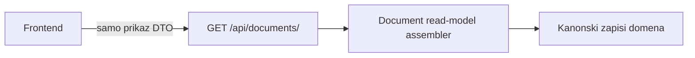

# ADR-0020 — Jedinstveni read model ulaznih i izlaznih računa

```text
Status: Proposed
Date: 2026-08-19
Type: Domain
Supersedes: —
Related: ADR-0010-domain-architecture.md, ADR-0008-submission-events.md, ADR-0009-submission-module-v1.md, ADR-0013-finance-domain-stabilization.md, ADR-0017-fiscal-gateway-model-a.md, ADR-0019-tax-classification-engine.md, DATA_ARCHITECTURE.md
```

## Status

**Proposed** — izvori istine, DTO semantika, konzistentnost presjeka, sigurnost i granice projekcije su zaključani. Status ostaje Proposed dok implementacija ne prođe acceptance matricu. Ovaj ADR **ne** mijenja write-putanje Sales/Purchasing/Finance/Tax/Banking i **ne** uvodi document-level snapshot u `VATReturn`.

Broj **0015 nije korišten**: ADR-0015 ostaje rezerviran za Sprint 4 retro (*Assets & Fiscal Platform Production*). ADR-0016+ ostaju sprint retroi.

## 1. Context

Operativni korisnik treba jedan pregled ulaznih i izlaznih računa: je li dokument plaćen, knjižen, u I-RA/U-RA, u vezi s predanim PDV obrascem, poslan kao eRačun, ima li privitak. Ti podaci žive u odvojenim domenama (ADR-0010):

- Sales — `Invoice`
- Purchasing — `Expense`
- Finance — `JournalEntry`, `SubledgerItem`, `SubledgerAllocation`
- Banking — `Payment`, `PaymentOrder`, `BankTransaction`
- Tax — `VATLedgerEntry`, `VATPeriod`, `VATReturn`, `SubmissionEvent`
- Integrations — `As4DocumentLink`, `SuperDocumentLink`, `FiscalSubmissionLog`, `IntegrationOutboxMessage`
- DMS-light — `ExpenseAttachment` i UBL XML na integration linkovima

Danas nema REST read modela. Django Admin pokazuje svaku domenu zasebno. Ako frontend sam spoji te izvore, nužno će pogrešno izjednačiti npr. `Invoice.status=paid` sa zatvorenim saldakontom, ili `VATPeriod.status=submitted` s dokazom da je baš taj račun u predanoj verziji obrasca.

`VATReturn.payload_snapshot` drži samo zbrojeve po boxovima; nema ID dokumenata. `VATLedgerEntry` nema FK na verziju obrasca. ADR-0008 veže `SubmissionEvent` na `VATReturn`, ne na račun. ADR-0019 ostaje SoT porezne klasifikacije; ovaj ADR je potrošač projekcije, ne novi filter.

## 2. Decision

Uvesti **jedinstveni read-only projekcijski sloj** s DTO-ima `DocumentSummary` (lista) i `DocumentDetail` (jedan dokument).



Granice:

- Assembler **čita** kanonske zapise i emitira statuse s provenance ugovorom. **Ne piše** u bazu (osim audit loga čitanja privitaka, ako postoji).
- Poslovna logika ostaje u domain servisima. Write akcije u budućnosti zovu te servise, ne read model.
- Frontend **ne** izvodi financijske ni porezne zaključke. Ne smije iz `null` napraviti afirmativni status.
- Ovo **nije** nova poslovna domena. Assembler živi u `domains/reporting/` kao read-only consumer Sales, Purchasing, Finance, Banking, Tax, Integration i DMS. Smije importirati modele/servise za čitanje; ne smije zvati write facade.
- Ovo **nije** document-level membership u predanom PDV obrascu. To je poseban budući Tax ADR. Dok ne postoji, polje ostaje `not_provable`.

## 3. Izvor istine

Klijent ne smije reimplementirati ovu tablicu.

| Prikaz | Izvor istine | Nije izvor | Ako zapisa nema |
|--------|----------------|------------|-----------------|
| Status dokumenta | `Invoice.status` / `Expense.status` | saldakonto, eRačun, PDV | dokument 404 |
| Operativni status | assembler, deterministički prioritet (§8) | React, novi DB enum | uvijek izračunat |
| Knjiženje | `JournalEntry` GFK na dokument | status dokumenta | `not_posted` |
| Fiskalno razdoblje | `FiscalPeriod` | `VATPeriod` | `not_recorded` |
| Plaćeno / otvoreno | `SubledgerItem` + `SubledgerAllocation` | `status=paid` na dokumentu | `no_subledger` / `not_recorded` |
| Bankovno usklađenje | `BankTransaction.match_status` | zatvoren saldakonto | `not_recorded` ili `not_applicable` |
| Nalog za plaćanje | `PaymentOrder` | — | `not_recorded` |
| Porezna evidencija | `VATLedgerEntry` GFK | `VATPeriod.status` | lifecycle `awaiting_ledger` ili `not_tax_active` |
| Status PDV obrasca (razdoblje) | `VATReturn` + `SubmissionEvent` | membership računa | `not_recorded` |
| Obuhvat računa u predanoj verziji | document-level dokaz u snapshotu predane verzije | `VATPeriod.status=submitted` | **uvijek `not_provable` u v1** |
| eRačun | `As4DocumentLink` / `SuperDocumentLink` | — | `not_recorded` |
| Fiskalizacija | `FiscalSubmissionLog` + `IntegrationOutboxMessage` | — | JIR `not_recorded`; ZKI `not_recorded` |
| Privitci | kolekcija `ExpenseAttachment`; izlazni PDF/UBL | pretpostavka jednog filea | prazna lista |
| Kontrole | katalog pravila u assembleru | UI `if` | prazna lista |
| Partner OIB / PDV ID / IBAN | `Partner`, `Partner.vat_number`, `PartnerBankAccount` | — | `not_recorded` |
| Valuta | `Expense.currency`; Invoice bez polja = EUR | HNB tečaj u read modelu | tečaj `not_recorded` |

**Zabranjeno** u klijentu i assembleru kao afirmacija: iz `VATPeriod.status`, `document.status` ili zbroja boxova zaključiti da je račun plaćen, knjižen ili uključen u predanu verziju obrasca.

## 4. Provenance DTO ugovor

Obična identitetska i tekstualna polja (`id`, `direction`, broj, naziv partnera) mogu biti goli skalari.

Sva **statusna i izvedena** polja koriste wrapper:

```json
{
  "value": null,
  "reason": "not_provable",
  "source": null
}
```

Kad je vrijednost poznata:

```json
{
  "value": "matched",
  "reason": null,
  "source": "bank_transaction"
}
```

Invarijante:

- `value == null` ⇔ `reason` je jedan od `not_recorded` | `not_provable` | `not_applicable`
- `value != null` ⇔ `reason == null` i `source` je obavezan
- Frontend mapira `not_recorded` → „nije evidentirano”, `not_provable` → „nije dokazivo”, `not_applicable` → „nije primjenjivo”
- Frontend **ne** smije `value: null` prikazati kao zeleni/potvrdni status

`document_in_submitted_return` u v1:

```json
{
  "value": null,
  "reason": "not_provable",
  "source": null
}
```

## 5. Konzistentnost presjeka

Svaki `DocumentDetail` mora predstavljati konzistentan presjek podataka. Assembler ne smije sastavljati jedan DTO iz međusobno vremenski različitih stanja bez označavanja.

Implementacija: jedan konzistentni database snapshot (PostgreSQL `REPEATABLE READ` / `transaction.atomic` s tim isolation levelom, ili ekvivalentan jedinstveni projekcijski upit). DTO i izvoz sadrže `as_of` (UTC datetime nastanka presjeka).

Za listu je prihvatljiva kratkotrajna eventualna konzistentnost **između redaka**. Svi podaci **jednog retka** moraju biti iz istog presjeka. KPI i izvoz koriste jedan `as_of` za cijeli filtrirani skup tog zahtjeva.

## 6. PDV lifecycle vs membership

PDV polja na dokumentu su odvojena:

1. **Lifecycle evidencije** (dokument ↔ `VATLedgerEntry`): nije porezno aktivan / čeka knjiženje / u I-RA ili U-RA / neusklađenost evidencije.
2. **Kontekst razdoblja** (`VATReturn` + `SubmissionEvent`): verzije nacrta, predane, superseded — **bez** tvrdnje da je ovaj račun u payloadu.
3. **Membership u predanoj verziji:** samo document-level dokaz. U v1 uvijek `not_provable`.

Ako razdoblje ima predani `VATReturn` s aktivnim `SubmissionEvent`, assembler emitira disclaimer:

> PDV razdoblje predano – obuhvat ovog računa nije pojedinačno potvrđen

Stanje „u predanom obrascu” se **ne emitira**. Test mora pasti ako se `document_in_submitted_return.value` ikad izvede iz `VATPeriod.status`.

Ispravljene verzije: prikazati periodni kontekst svih verzija (`VATReturn` + lanac `SubmissionEvent.supersedes_submission` / `superseded_by` samo ako su stvarno popunjeni). Bez membership tvrdnje.

PDV kontrola iznosa koristi **eksplicitnu mapping funkciju** prema smjeru dokumenta, `vat_procedure` i `VATLedgerEntry.entry_category`. Ne primjenjuje se jedan generički zbroj (neto = osnovica, PDV = PDV) na reverse charge, djelomični odbitak, EU, OSS ili više boxova. Nepodržani postupak vraća `not_provable`, ne mismatch.

Kontrola razdoblja: emitira se samo ako je **kanonski porezni datum** dokazivo spremljen za taj dokument i ne odgovara razdoblju ledger retka. Ako porezni datum nije evidentiran, kontrola se **ne emitira**. `issue_date` / `expense_date` nisu univerzalni porezni datum.

## 7. Plaćanje i banka

Mjerodavan je saldakonto, ne status dokumenta.

Zatvoren saldakonto bez `matched` bankovne transakcije **nije** nužno pogreška. Račun može biti zatvoren gotovinom, karticom, kompenzacijom, predujmom, knjižnim odobrenjem, internom alokacijom ili ručnim knjiženjem.

Kontrola:

- `settlement_evidence_missing` — zatvoren saldakonto **bez dokazivog načina zatvaranja** (nema alokacije, plaćanja, temeljnice zatvaranja niti bankovnog matcha).
- Status „plaćanje bez bankovne potvrde” samo kad se **očekuje** bankovno plaćanje (npr. `Payment.payment_method` / nalog / settlement `transfer` / `business_account`).
- Ako način zatvaranja nije poznat: `not_provable`, **bez** crvenog alarma `bank_unmatched`.

## 8. Operativni status — deterministički prioritet

Operativni badge je **sažetak**. Svi izvorni statusi (dokument, saldakonto, banka, eRačun, knjiženje, PDV) ostaju vidljivi. Prvi pogodak u listi pobjeđuje.

**Izlazni:**

1. otkazan/storniran
2. odbijen eRačun
3. plaćen (saldakonto `closed`)
4. djelomično plaćen
5. dospio (otvoren/djelomičan i `due_date < as_of.date`)
6. prihvaćen / dostavljen / poslan (eRačun)
7. izdan (`sent` bez eRačun dokaza)
8. nacrt

**Ulazni:**

1. odbijen / storniran
2. sporan (kontrola neusklađenosti plaćanja, ne nagađanje)
3. plaćen (saldakonto `closed`)
4. djelomično plaćen
5. dospio
6. spreman za plaćanje (odobren + otvoren saldakonto)
7. odobren
8. čeka odobrenje / u obradi
9. zaprimljen
10. nacrt

## 9. Kontrole (v1 katalog)

Assembler emitira samo kontrole koje su dokazive. Lažni alarmi su zabranjeni.

U v1:

- nedostaje partner ili OIB
- nedostaje datum dospijeća
- nedostaje PDF/XML (nema renderabilnog PDF-a / UBL / attachment)
- mogući duplikat (isti partner + izvorni broj + datum + iznos)
- iznos stavki ≠ header (samo izlazni, kad postoje stavke)
- PDV header ≠ zbroj stavki (izlazni)
- porezno aktivan a nema `VATLedgerEntry`
- PDV razdoblje retka ≠ kanonski porezni datum **ako je datum evidentiran**
- PDV mismatch prema mapping funkciji (§6); inače `not_provable`
- izdan/odobren a nije knjižen
- temeljnica nije uravnotežena
- dospio i nije plaćen (saldakonto)
- dokument `paid` a saldakonto nije `closed`
- `settlement_evidence_missing` (§7)
- IBAN naloga nije među **aktivnim** IBAN-ovima partnera; ako partner nema IBAN-ova → `not_recorded`, ne mismatch
- dokument ažuriran nakon knjiženja — **informacija**, ne financijski mismatch: „Dokument je ažuriran nakon knjiženja – sadržaj promjene nije dokaziv.” (`updated_at` vs JE datum; nema `posted_at` fingerprinta)
- eRačun `rejected` / `failed`
- outbox nije završio

**Nije** kontrola-greška:

- knjižena temeljnica čije je `FiscalPeriod` kasnije zatvoreno — to je informacija (`fiscal_locked: true`), ne nepravilnost
- odsutnost bankovne transakcije kad postoji drugi dokaz zatvaranja
- sekundarni aktivni IBAN partnera na nalogu

Write u zaključanom fiskalnom razdoblju nije tema ovog read-only ADR-a.

## 10. Lista: UNION, paginacija, KPI

`Invoice` i `Expense` su različite tablice. **Zabranjeno** je učitati sve retke obaju modela u memoriju radi sortiranja, paginacije ili KPI-ja.

Lista koristi baznu projekciju nad `UNION ALL` (ili ekvivalentan database-level oblik) koja omogućuje filtriranje, stabilno sortiranje i paginaciju **prije** dohvaćanja detaljnih relacija.

Stabilni redoslijed:

```text
document_date DESC, direction ASC, id DESC
```

- `document_date`: Invoice `issue_date`, Expense `expense_date`
- `direction`: `incoming` | `outgoing`
- obavezan tie-breaker `direction + id` (PK nije jedinstven preko unije)
- svi filteri primjenjuju se prije paginacije
- detaljne relacije (saldakonto, ledger, eRačun, banka) dohvaćaju se samo za ID-eve trenutne stranice, u istom snapshotu
- KPI se računa nad **cijelim** filtriranim skupom, ne stranicom; grupirano po valuti; bez zbrajanja valuta
- query budget: broj SQL upita za stranicu **ne raste linearno** s brojem prikazanih dokumenata (nema N+1)

## 11. Izvoz

CSV/XLSX:

- isti autorizacijski i tenant scope kao lista
- isti filter parser kao lista — bez duplicirane filter logike
- `as_of` vrijeme izvoza
- isti deterministički redoslijed kao lista
- sinkroni izvoz do konfiguriranog maksimuma (zadano 10 000 redaka); iznad praga 400 s jasnim ograničenjem **ili** async job (async nije obavezan u v1; sinkroni prag jest)
- formule i korisnički tekst: vrijednosti koje počinju s `=`, `+`, `-`, `@` moraju biti escaped (spreadsheet formula injection)
- privitci i osjetljivi URL-ovi se **ne** izvoze
- endpoint ne prihvaća proizvoljne stupce ni neprovjerene nazive polja — fiksni allowlist

## 12. Tenant, prava, privitci

- Tenant iz HTTP hosta (`TenantMiddleware`). API na `{slug}.racunai.hr`.
- JWT + `TenantMembership`. Uloga `viewer` smije čitati. Bez tenanta ili bez membershipa: **404**, bez otkrivanja postojanja dokumenta/privitka.
- Drugi tenant + poznati ID → 404.
- Viewer s tuđim `attachment_id` → 404.
- PDF i privitci samo preko JWT endpointa; bez javnih URL-ova postojećeg HTML previewa.
- Ulazni privitci: kolekcija, ne jedan file.

## 13. Granica v1 i evolucija

**U v1:** read-only lista, detalj, kontrole, sistemski pogledi, KPI po valuti, CSV/XLSX, aging iz postojećeg finance servisa.

**Nije u v1:** unos/izmjena; označavanje plaćenog; odobravanje; bankovni match write; slanje eRačuna; generiranje PDV knjige; predaja obrasca; nova polja na `Invoice`/`Expense`; document-level snapshot u `VATReturn`; promjena frozen PDV/Submission jezgre.

Buduće operativne akcije zovu postojeće domain servise. Read model se ne pretvara u write facade. Izvori istine iz §3 ostaju.

## 14. Consequences

### Prednosti

- Jedan ugovor statusa umjesto ad-hoc frontend zaključaka
- Pošten PDV prikaz dok membership ne postoji
- Reporting kao read-only consumer, bez nove poslovne domene
- Testabilan katalog kontrola i provenance

### Rizici / trade-off

- UNION ALL + hidracija relacija zahtijeva query budget testove
- `REPEATABLE READ` može biti skuplji; lista dopušta eventualnu konzistentnost među retcima
- Operativni badge je sažetak — korisnik mora vidjeti izvorne statuse
- Reporting importira više domena read-only; `DOMAIN_DEPENDENCY_MAP.md` treba amendment da to nije „obrnuti write tok”

### Follow-up

- [ ] Implementacija assembler + API (čeka izričiti GO)
- [ ] Amendment `DOMAIN_MAP.md` / `DOMAIN_DEPENDENCY_MAP.md`: Reporting smije read-only čitati Sales, Purchasing, Banking, Integration
- [ ] Poseban Tax ADR: document-level membership u verziji `VATReturn` / payload snapshot
- [ ] Ako se doda financijski fingerprint dokumenta, kontrola „ažurirano nakon knjiženja” može postati mismatch

## 15. Acceptance testovi

| Slučaj | Očekivanje |
|--------|------------|
| `Invoice.status=paid`, saldakonto otvoren | Plaćanje nije `paid`; kontrola neusklađenosti |
| Saldakonto zatvoren s dokazom zatvaranja (npr. alokacija/JE), nema banke | Nema `bank_unmatched` / crvenog alarma |
| Predano PDV razdoblje, nema document snapshot | `document_in_submitted_return.value=null`, `reason=not_provable` |
| Ispravljena PDV verzija | Periodni kontekst obje verzije, bez membership tvrdnje |
| Reverse charge / nepodržani postupak | Mapping pravilo ili `not_provable`, ne generički mismatch |
| Sekundarni aktivni IBAN na nalogu | Nema IBAN upozorenja |
| Partner bez IBAN-ova | `not_recorded`, ne mismatch |
| Dokumentu dodan privitak nakon knjiženja | Informacija, nije financijski mismatch |
| Knjižena temeljnica u kasnije zatvorenom razdoblju | Informacija (`fiscal_locked`), ne greška |
| Dva računa s istim datumom | Stabilna paginacija, bez duplikata/preskakanja |
| Drugi tenant pogodi poznati ID | 404 |
| Viewer preuzme tuđi attachment ID | 404 |
| Lista se promijeni tijekom izvoza | Jedan `as_of` presjek |
| CSV vrijednost počinje s `=`, `+`, `-` ili `@` | Escaped |
| 50 dokumenata na stranici | Nema N+1 rasta upita |
| Assembler emitira `in_submitted_return` iz `VATPeriod.status` | Test pada |
