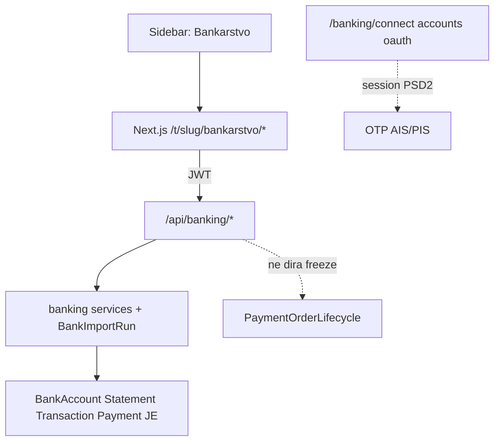

# ADR-0021 — Banking Operational UI and API Contract

```text
Status: Proposed
Date: 2026-08-19
Type: Domain
Supersedes: —
Related: ADR-0010-domain-architecture.md, ADR-0020-document-read-model.md, banking-v2.md, DATA_ARCHITECTURE.md, EVENTS.md, REFERENCE_ARCHITECTURE.md, docs/accounting/manual-journal-bank-matching.md
```

## Status

**Proposed** — meni Bankarstvo, matrica stranica→API→servis→ovlast, match 1:1, saldo provenance, `BankImportRun`, CSV blokada i PIS callback preduvjet su zaključani. Status ostaje Proposed dok implementacija ne prođe acceptance. Ovaj ADR **ne** superseda [`banking-v2.md`](banking-v2.md) (PaymentOrder / PaymentExecution lifecycle freeze ostaje). **Ne** mijenja ADR-0020 write granice; banking API je zaseban ugovor.

Broj **0015 nije korišten**: ADR-0015 ostaje rezerviran za Sprint 4 retro. ADR-0016+ ostaju sprint retroi.

## 1. Context

Operativni korisnik treba modul **Bankarstvo** u Next.js SPA: pregled računa i salda, uvoz CAMT izvoda, lista transakcija, usklađivanje s evidencijom i (kasnije) platni nalozi. Backend već ima:

- `payments.BankAccount`, `banking.BankStatement`, `banking.BankTransaction`
- CAMT.053 bulk import (`import_bank_statement_file`) i admin matching (`banking/reconciliation.py`)
- PSD2 AIS/PIS (`BankConnection`, `PaymentOrder`, `PaymentExecution`) — architecture freeze v2
- Session HTTP za OAuth/PIS (`/banking/connect/`, `/banking/accounts/`, callbacks) — **nije** JWT SPA ugovor

Nedostaje JWT tenant API i ugniježđeni UI. Bez ugovora frontend bi lako:

- izjednačio `match_status` sa zatvorenim saldakontom ili knjiženjem
- izložio PIS submit bez SCA/audit/tenant zaštite
- zbunio `/banking/accounts/` (OTP AIS) s listom poslovnih računa
- uveo samostalnu rutu `/racuni` koja se sudara s poslovnim računima/faktura

ADR-0020 već čita `BankTransaction.match_status` i `PaymentOrder` u document DTO-u; **ne** zamjenjuje listu izvoda ni match write.

## 2. Decision

Uvesti **Banking Operational UI and API Contract v1**: jedna sidebar stavka, ugniježđene rute, JWT API pod `/api/banking/…`, tanki write wrapperi nad postojećim servisima, novi `BankImportRun` za async uvoz.



### 2.1 Granice

- **Ne** mijenja `PaymentOrder.status` / `PaymentExecution.status` izvan lifecycle modula.
- **Ne** preimenovati niti uklanjati postojeće PSD2 session URL-ove.
- **Ne** uvoditi `Reconciliation` N:M agregat u v1.
- Intermediary `Reconciliation` (fiskalni catch-up) **nije** bankovno usklađivanje.
- SPA **ne** smije tiho uključiti `auto_create_payments=True` iz admin AIS synca.

## 3. Meni i rute

Sidebar: **jedna** stavka Bankarstvo → `/t/{slug}/bankarstvo`. Podnavigacija (kartice) unutar modula.

| Kartica | Ruta |
|---------|------|
| Pregled | `/t/{slug}/bankarstvo` |
| Računi | `/t/{slug}/bankarstvo/racuni` |
| Izvodi | `/t/{slug}/bankarstvo/izvodi` |
| Transakcije | `/t/{slug}/bankarstvo/transakcije` |
| Usklađivanje | `/t/{slug}/bankarstvo/uskladivanje` |
| Platni nalozi | `/t/{slug}/bankarstvo/nalozi` |

**Zabranjeno:** samostalno `/t/{slug}/racuni` (sudar s poslovnim značenjem računa/faktura).

### Semantika

| Pojam | Značenje |
|-------|----------|
| **Izvod** | Uvezeni bankovni dokument (`BankStatement`) za račun i razdoblje (CAMT ili AIS sintetika) |
| **Transakcija** | Stavka unutar izvoda (`BankTransaction`) |
| **Usklađivanje** | Veza stavke s `Payment` ili `JournalEntry` (`match_status`) — **nije** generičko knjiženje/zatvaranje saldakonta. Eksplicitni write `reconcile-open-item` (ADR-0025) smije delegirati Finance settlement pa match na JE; CAMT/suggest ne smiju. |

## 4. Opseg v1

| Uključeno (write/read kako u matrici) | Izvan v1 SPA |
|---------------------------------------|--------------|
| Pregled, Računi, Izvodi, Transakcije, Usklađivanje | PIS submit / SCA u SPA |
| CAMT import preko `BankImportRun` | Connect / consent u SPA (ostaje admin/session) |
| PSD2 sync enqueue (bez auto payments) | CSV / MT940 bulk import |
| Nalozi **read-only** lista | Partial / N:M match; match na Expense |
| | Automatsko knjiženje izvoda |

## 5. Matrica: meni → stranica → API → servis → ovlast

| Meni / kartica | Stranica | API | Servis / model | Ovlast |
|----------------|----------|-----|----------------|--------|
| Pregled | `/t/{slug}/bankarstvo` | `GET /api/banking/overview/` | Agregacija `BankAccount`, izvodi, unmatched tx, saldo DTO | view |
| Računi | `.../racuni` | `GET /api/banking/bank-accounts/` | `BankAccount` + `BankConnection` + saldo | view |
| Izvodi | `.../izvodi` | `GET /api/banking/statements/`, `GET .../statements/{id}/` | `BankStatement` | view |
| Uvoz | akcija na Izvodi | `POST /api/banking/statement-imports/` → **202**; `GET .../statement-imports/{id}/` | `BankImportRun` + `import_bank_statement_file` (CAMT) | write |
| Transakcije | `.../transakcije` | `GET /api/banking/transactions/` | `BankTransaction` (+ filteri) | view |
| Usklađivanje | `.../uskladivanje` | `POST .../transactions/{id}/match/`, `POST .../unmatch/` | `reconciliation` + 1:1 lock | write |
| PSD2 sync | akcija | `POST .../connections/{id}/sync/`, `GET .../sync-status/` | Celery + per-connection lock | write |
| Connect / consent | — | postojeći session `/banking/connect/` | `start_connect_flow` | owner; SPA connect izvan v1 |
| Nalozi | `.../nalozi` | `GET /api/banking/payment-orders/` | `PaymentOrder` read | view; **nema** POST submit |

**view** = owner / accountant / viewer. **write** = owner / accountant (osim connect = owner).

Match request body v1:

```json
{ "target_type": "payment" | "journal_entry", "target_id": 123 }
```

Suggest endpointi nisu u v1 matrici (admin `suggest_matches` ostaje). ADR-0020 `?view=bank_unmatched` ostaje dokumentni filter, ne zamjena za Usklađivanje.

## 6. RBAC

| Radnja | Owner | Accountant | Viewer |
|--------|:-----:|:----------:|:------:|
| Pregled / liste | da | da | da |
| Uvoz izvoda | da | da | ne |
| Usklađivanje (match/unmatch) | da | da | ne |
| PSD2 sync | da | da | ne |
| Povezivanje banke / consent | da | ne | ne |
| Kreiranje nacrta naloga | da | da | ne |
| Slanje PIS naloga banci | da | ne | ne |

Slanje PIS-a **nije** u v1 UI/API. Kreiranje nacrta nije u v1 SPA.

## 7. API ugovor

JWT + tenant kontekst (isti obrazac kao ADR-0020 document API). Nomenklatura **`bank-accounts`** izbjegava sudar s OTP `GET /banking/accounts/`.

| Metoda | Put | Napomena |
|--------|-----|----------|
| GET | `/api/banking/overview/` | KPI po računu/valuti; unmatched count |
| GET | `/api/banking/bank-accounts/` | Poslovni računi + saldo provenance |
| GET | `/api/banking/statements/` | Lista izvoda |
| GET | `/api/banking/statements/{id}/` | Detalj + sažetak stavki |
| POST | `/api/banking/statement-imports/` | Upload; **202** + `import_run_id`; CSV → 422 |
| GET | `/api/banking/statement-imports/{id}/` | Status async uvoza |
| GET | `/api/banking/transactions/` | Filteri: račun, izvod, match_status, datum |
| POST | `/api/banking/transactions/{id}/match/` | Vidi §9 |
| POST | `/api/banking/transactions/{id}/unmatch/` | Vidi §9 |
| POST | `/api/banking/connections/{id}/sync/` | **202** + job id; vidi §11 |
| GET | `/api/banking/connections/{id}/sync-status/` | Status joba |
| GET | `/api/banking/payment-orders/` | Read-only v1 |

Postojeći session URL-ovi ostaju: `/banking/connect/`, `/banking/accounts/`, `/oauth/callback/`, `/oauth/payment-callback/`, `/banking/payments/<id>/initiate/`.

## 8. BankImportRun

`BankStatement` nije dovoljan za operativni audit uvoza. Uvesti model (ime: `BankImportRun` ili `BankStatementImport`) s najmanje:

- `tenant`, `actor` (user)
- `source`, `format` (npr. `camt053`)
- `content_sha256`
- `started_at`, `finished_at`
- counts: accepted / duplicate / rejected
- strukturirane greške
- `status`: `queued` / `running` / `succeeded` / `failed`

Veliki CAMT: async obrada; klijent polla `GET statement-imports/{id}/`. Originalna datoteka smije se čuvati uz run (implementacijski detalj); `BankStatement` i dalje nema obavezan `FileField` u ovom ADR-u.

### CSV / MT940

`detect_format` već prepoznaje `csv` i `mt940`, ali bulk `IMPORTERS` ima samo `camt053`. **CSV i MT940 bulk ostaju blokirani** u v1 API-ju (422) dok se ne implementira:

1. Preferirani bankovni `external_id` kad postoji.
2. Inače stabilan fingerprint:  
   `tenant + bank_account + booking_date + value_date + amount + currency + reference + counterparty_iban + normalized_description + source_row_index`  
   (`source_row_index` = redni broj retka u datoteci, 1-based, obavezan za CSV bez `external_id`).
3. Legitimne dvojne jednake stavke razlikuju se preko `source_row_index`; bez njega import se odbija umjesto tihog spajanja.

## 9. Usklađivanje — invarijante

Tri **odvojena** stanja (API i UI ih ne smiju miješati):

| Stanje | Izvor |
|--------|-------|
| Usklađeno s evidencijom | `BankTransaction.match_status` + FK |
| Knjiženo | `JournalEntry` / posting servis |
| Zatvoren saldakonto | `SubledgerItem` + `SubledgerAllocation` |

### 9.1 Opća pravila

- Cilj: najviše jedan — `Payment` **ili** `JournalEntry` (međusobno isključivo).
- Isti `tenant` na svim objektima.
- Valuta mora odgovarati.
- v1 **bez** partial: iznos potpuno jednak.
- Atomska transakcija; `select_for_update` na `BankTransaction` **i** na ciljni `Payment` ili `JournalEntry`.
- Već `matched` → prvo `unmatch`, pa novi match.
- `unmatch` uklanja **samo** bankovne FK-ove / `match_status`; **ne** briše knjiženje ni `SubledgerAllocation`.
- Match na proknjiženu temeljnicu **ne mijenja** temeljnicu.

### 9.2 Strogi 1:1 s Payment

- Jedna `BankTransaction` → najviše jedan `Payment`.
- Jedan `Payment` → najviše jedna `BankTransaction`.
- Partial, zbirno i N:M **izvan** ovog ADR-a.
- Nakon `unmatch` isti `Payment` ponovno je dostupan.
- DB: uvjetni unique constraint na nepraznom `matched_payment_id`. Analogno za `matched_journal_entry_id` (1:1 s JE).
- **Prije migracije** obavezan audit postojećih dvostrukih povezivanja; duplikate razriješiti ručno/datafixom.
- Servisna validacija ostaje uz constraint.

### 9.3 Dokumenti i saldakonto

- Uplata kupca: lanac `Payment.related_invoice` → `post_invoice_payment` → `allocate_payment` smije se koristiti **nakon** matcha samo ako poslovni tok to već radi; match sam po sebi ne zatvara saldakonto.
- Expense / ulazni račun: **nema** simetričnog lanca. UI **ne nudi** „poveži s ulaznim računom“ u v1.
- Dokumenti bez dokazivog saldakonta ostaju neusklađeni/nepotvrđeni (provenance kao ADR-0020).

## 10. Saldo provenance

Overview i Računi vraćaju saldo **po računu i valuti**. Zabranjeno zbrajanje različitih valuta bez tečajne konverzije (v1: bez konverzije).

Svaki saldo DTO:

| Polje | Opis |
|-------|------|
| `balance_type` | `booked` / `available` / `statement-closing` |
| `amount` | Decimal string |
| `currency` | ISO 4217 |
| `as_of` | datum/vrijeme |
| `source` | `psd2` / `statement` |
| `is_stale` | bool |

## 11. PSD2 sync

`POST .../connections/{id}/sync/`:

- tenant-scoped lookup veze
- **jedan** aktivan sync po vezi (lock / idempotency key); ponovljeni klik ne pokreće paralelni job
- odgovor **202** + identifikator posla
- status: `queued` / `running` / `succeeded` / `failed`
- `started_at`, `finished_at`, `last_error`
- rezultat: broj novih i dupliciranih transakcija
- **bez** `auto_create_payments=True`

## 12. PIS — security preduvjet

`GET /oauth/payment-callback/` danas može dohvatiti `PaymentOrder` po PK **bez** tenant filtera. To je **blocker** prije bilo kakvog PIS write UI/API-ja.

Obavezno prije izlaganja submita:

- kriptografski vezan state / correlation kontekst
- provjera `connection` ↔ `order` ↔ `tenant`

Dok blocker nije zatvoren: Nalozi ostaju read-only; nema SPA submit endpointa.

## 13. Odnos prema postojećim dokumentima

| Dokument | Odnos |
|----------|-------|
| [`banking-v2.md`](banking-v2.md) | Ostaje SoT PIS lifecycle; ovaj ADR ga ne otvara |
| ADR-0020 | Potrošač `bank.match_status` / `PaymentOrder` na dokumentima; ne lista izvoda |
| `DATA_ARCHITECTURE.md` | Treba uskladiti: `match_status` je `unmatched`/`suggested`/`matched` (ne `ignored`); nema FK `BankTransaction`→`PaymentOrder` |
| `manual-journal-bank-matching.md` | v1 1:1 ostaje; N:M Reconciliation ostaje budući ADR |

## 14. Consequences

### Prednosti

- Jedna navigacijska stavka bez sudara s „računima“
- SPA dobiva eksplicitan JWT ugovor odvojen od OTP session URL-ova
- Match, knjiženje i saldakonto ostaju razdvojeni
- PIS write ne curi u v1 prije security fixa
- Async uvoz i sync sprječavaju timeout i dvostruke jobove

### Rizici / trade-off

- CSV/MT940 i Expense matching odgođeni — Fine Star CAMT/AIS pokriveni, ostali formati ne
- Nalozi read-only mogu zbunjivati dok submit nije spreman; UI mora jasno reći da je pregled
- Unique na `matched_payment` zahtijeva data audit prije migracije
- Novi model `BankImportRun` i sync-job stanje povećavaju površinu implementacije

### Follow-up

- [ ] Data audit duplikata `matched_payment` / `matched_journal_entry` prije unique migracije
- [ ] Implementirati JWT `/api/banking/*` i Next.js Bankarstvo UI po matrici
- [ ] `BankImportRun` + async CAMT import
- [ ] Conditional unique constraints + service locks
- [ ] Popravak tenant/correlation na `/oauth/payment-callback/` (blocker za PIS write)
- [ ] Ažurirati `DATA_ARCHITECTURE.md` (statusi matcha; ukloniti lažni PaymentOrder FK)
- [ ] Nakon acceptance → ADR status **Accepted**
- [ ] Budući ADR: CSV fingerprint + row index; Expense match; N:M Reconciliation; PIS SPA submit
