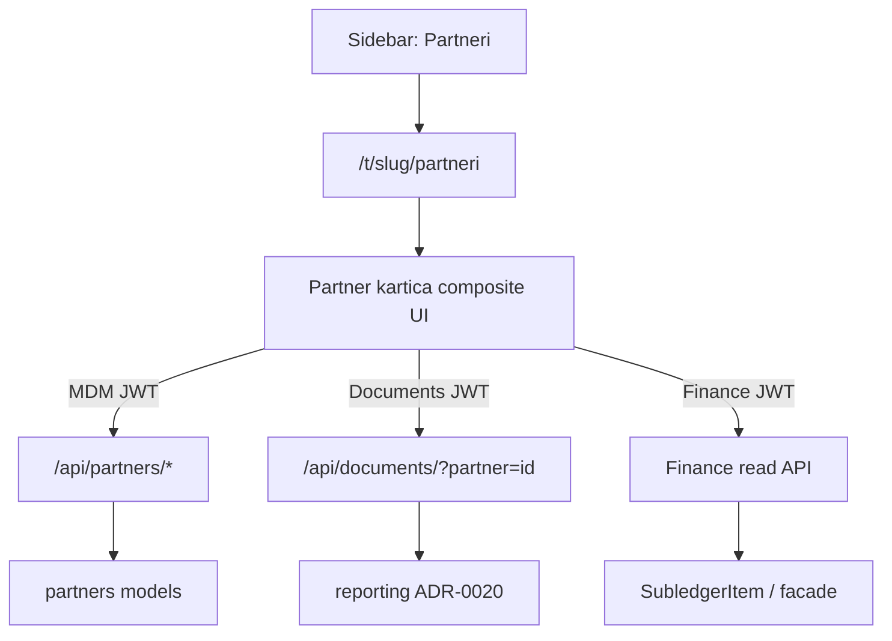

# ADR-0022 — Partner Management & MDM API v1

```text
Status: Accepted
Date: 2026-08-19
Type: Domain
Supersedes: —
Related: ADR-0010-domain-architecture.md, ADR-0013-finance-domain-stabilization.md, ADR-0019-tax-classification-engine.md, ADR-0020-document-read-model.md, DATA_ARCHITECTURE.md, DOMAIN_MAP.md, REFERENCE_ARCHITECTURE.md
```

## Status

**Accepted** — Partner kartica kao composite UI, MDM-only `/api/partners/`, status semantika, lifecycle bez DELETE, nested IBAN/primary invarijante, eksplicitne Finance HTTP putanje i Documents ownership su zaključani. Implementacija je **zaseban** korak (nije dio ovog ADR mergea). Ovaj ADR **ne** superseda ADR-0013 (TD-001 kanonski Partner ostaje). **Ne** mijenja ADR-0019 snapshot semantiku niti ADR-0020 write granice.

Broj **0015 nije korišten**: ADR-0015 ostaje rezerviran za Sprint 4 retro. ADR-0016+ ostaju sprint retroi.

## 1. Context

Operativni korisnik treba modul **Partneri** u Next.js SPA: lista counterpartyja, kartica partnera s kontaktima i IBAN-ima, te u kontekstu partnera pregled dokumenata i saldakonta. Backend već ima:

- `partners.Partner` kao kanonski MDM (ADR-0013 / TD-001) — `partner_type` customer/supplier/both/other
- `PartnerContact`, `PartnerBankAccount` kao podentiteti
- FK potrošače: `Invoice.company_to`, `Expense.supplier`, `AnalyticAccount.partner`, `SubledgerItem.partner`
- Document read model s filterom `?partner=` (ADR-0020)
- Finance facade / `SubledgerItem` kao SSOT otvorenih AR/AP stavki
- Django admin CRUD; **nema** JWT Partner API-ja

Nedostaje operativni ugovor. Bez njega frontend bi lako:

- razlomio MDM na top-level Kupci / Dobavljači / Kontakti / IBAN-i
- napravio golemi `/api/partners/{id}/…` proxy za Documents, Finance i Banking
- dopustio hard delete partnera s poslovnom poviješću
- denormalizirao AR/AP na Partner model ili uveo FX u Partner sloj
- prikazao prazne „uskoro“ tabove (Plaćanja, Aktivnost)

CRM (leadovi, pipeline) ostaje Faza 2 prema DOMAIN_MAP — ovaj ADR ga ne uvodi.

## 2. Decision

Uvesti **Partner Management & MDM API v1**: jedna sidebar stavka, ugniježđena kartica partnera, JWT MDM API pod `/api/partners/…`, composite UI koji Documents i Finance poziva na njihovim API-jima.



### 2.1 Središnje pravilo

> **Partner kartica je composite UI nad više domena; `partners.Partner` je SSOT samo za MDM podatke. Otvaranje funkcije unutar Partner UI-ja ne prenosi ownership Documents, Finance ili Banking pod Partner API.**

Frontend ruta ≠ backend ownership. `/api/partners/` ne smije postati god-endpoint.

### 2.2 Granice

- **Ne** uvoditi zasebne `Customer` / `Supplier` modele (ADR-0013 ostaje).
- **Ne** izlagati `DELETE` na Partneru u v1.
- **Ne** dodavati partners alias za documents ili subledger (`/api/partners/{id}/documents/`, `/api/partners/{id}/subledger/`).
- **Ne** denormalizirati financijsko stanje na Partner model.
- **Ne** uvoditi FX / tečajnu konverziju u Partner API.
- **Ne** uvoditi CRM, DMS, više adresa (`PartnerAddress`), Plaćanja/Aktivnost UI u v1 navigaciji.
- Model `PartnerType` **nije** dio API v1; kanon je `Partner.partner_type` CharField.

## 3. Meni i rute

Sidebar: **jedna** stavka Partneri → `/t/{slug}/partneri`. Podnavigacija počinje tek na kartici konkretnog partnera.

### 3.1 Lista

**Default** `GET /api/partners/` vraća samo partnere sa `status=active`.

| Filter (UI / API) | Semantika |
|-------------------|-----------|
| (default) | samo `status=active` |
| `filter=all` / Svi | svi statusi, uključujući `inactive` i `blocked` |
| Kupci | `partner_type` ∈ {`customer`, `both`} (uz default `active`, osim ako se kombinira s `filter=all` ili eksplicitnim `status`) |
| Dobavljači | `partner_type` ∈ {`supplier`, `both`} (isto) |
| Kupci i dobavljači | `partner_type` = `both` (isto) |
| Neaktivni | `status` ∈ {`inactive`, `blocked`} |

Ostali filteri kombiniraju `partner_type` i `status` **bez** stvaranja novih resursa. Dodatno: search po nazivu / OIB / šifri.

### 3.2 Kartica — vidljiva navigacija v1

| Kartica | Ruta |
|---------|------|
| Pregled | `/t/{slug}/partneri/{id}` |
| Kontakti | `/t/{slug}/partneri/{id}/kontakti` |
| Bankovni računi | `/t/{slug}/partneri/{id}/bankovni-racuni` |
| Dokumenti | `/t/{slug}/partneri/{id}/dokumenti` |
| Saldakonto | `/t/{slug}/partneri/{id}/saldakonto` |

**Zabranjeno u v1 UI navigaciji:** tabovi Plaćanja i Aktivnost (i bilo koji „uskoro“ placeholder).

### 3.3 Rezervirane buduće rute (nije u meniju)

```text
/t/{slug}/partneri/{id}/placanja
/t/{slug}/partneri/{id}/aktivnost
```

Kasnije bez promjene identiteta Partnera: Datoteke, CRM.

## 4. Opseg v1

| Uključeno | Izvan v1 |
|-----------|----------|
| Lista + filteri; Pregled MDM; Kontakti CRUD; Bankovni računi CRUD | `DELETE` Partner; fizički cleanup |
| Status `active` / `inactive` / `blocked` (+ `prospect` u modelu) | CRM semantika za `prospect` |
| Fin strip preko `GET /api/finance/partners/{id}/financial-summary/` | FX u Partner sloju; denormalizirani AR/AP na Partner |
| Dokumenti preko ADR-0020 `?partner=` | Partners documents alias |
| Saldakonto preko `GET /api/finance/partners/{id}/subledger/` | Partners subledger proxy |
| Jedna kanonska adresa na Partner | `PartnerAddress`; više tipova adresa |
| | Plaćanja / Aktivnost UI; DMS; AI enrichment; ugovori |

## 5. Matrica: meni → stranica → API → servis → ovlast

| Meni / kartica | Stranica | API | Servis / model | Ovlast |
|----------------|----------|-----|----------------|--------|
| Lista | `/t/{slug}/partneri` | `GET /api/partners/` | `partners.Partner` | view |
| Novi partner | akcija na listi | `POST /api/partners/` | Partner create + tenant | write |
| Pregled (MDM) | `.../partneri/{id}` | `GET/PATCH /api/partners/{id}/` | Partner | view / write |
| Pregled (fin strip) | isto | `GET /api/finance/partners/{id}/financial-summary/` | `SubledgerItem` / finance facade | view |
| Kontakti | `.../kontakti` | nested contacts | `PartnerContact` | view / write |
| Bankovni računi | `.../bankovni-racuni` | nested bank-accounts | `PartnerBankAccount` | view / write |
| Dokumenti | `.../dokumenti` | `GET /api/documents/?partner={id}` | reporting document list (ADR-0020) | view |
| Saldakonto | `.../saldakonto` | `GET /api/finance/partners/{id}/subledger/` | finance subledger / aging | view |

**view** = owner / accountant / viewer. **write** = owner / accountant.

Finance putanje su **Finance ownership**; Partner UI ih samo konzumira. Ne smiju živjeti pod `/api/partners/`.

## 6. RBAC

| Radnja | Owner | Accountant | Viewer |
|--------|:-----:|:----------:|:------:|
| Lista / detalj / nested read | da | da | da |
| POST/PATCH Partner | da | da | ne |
| POST/PATCH/DELETE kontakt | da | da | ne |
| POST/PATCH/DELETE bankovni račun | da | da | ne |
| Financial summary / documents / subledger read | da | da | da |
| DELETE Partner | — | — | — (nije izloženo) |

Tenant A nikada ne čita ni mijenja Partner / nested resurse tenanta B (isti obrazac 404 kao reporting/banking).

## 7. Status semantika

| Status | Značenje |
|--------|----------|
| `active` | Normalno korištenje; smije se birati za **nove** poslovne dokumente |
| `inactive` | Više se ne koristi za nove dokumente; povijest ostaje dostupna |
| `blocked` | Namjerno blokiran za nove dokumente zbog poslovnog razloga; povijest dostupna |
| `prospect` | Ostaje u modelu; v1 **ne** proširuje CRM semantiku |

`inactive` i `blocked` ostaju vidljivi na starim računima, saldakontu, dokumentima i izvještajima.

**Enforcement v1:** UI pickeri za **nove** Invoice / Expense dokumente **obavezno** ne nude `inactive` ni `blocked` partnere. Backend zabrana kreiranja novih poslovnih dokumenata s `inactive`/`blocked` partnerom je **follow-up**, osim ako je već prirodno pokrivena postojećim servisnim slojem. Povijesni dokumenti i projekcije ostaju dostupni.

## 8. Lifecycle

- Partner API v1 **ne izlaže** `DELETE /api/partners/{id}/`.
- Operativno povlačenje: `PATCH` → `status`: `inactive` | `blocked`.
- Fizičko brisanje / cleanup pogrešno kreiranog partnera = **izvan v1** (zaseban kasniji postupak).
- Nested `DELETE` za `PartnerContact` i `PartnerBankAccount` **jest** u v1.

## 9. MDM API ugovor

JWT + tenant kontekst (isti obrazac kao ADR-0020 / ADR-0021). Resource ID = **integer Django PK**.

| Metoda | Put | Napomena |
|--------|-----|----------|
| GET | `/api/partners/` | Lista; **default** `status=active`; `filter=all` = svi statusi |
| POST | `/api/partners/` | Create |
| GET | `/api/partners/{id}/` | Detail |
| PATCH | `/api/partners/{id}/` | Update — **nema DELETE** |
| GET | `/api/partners/{id}/contacts/` | Lista kontakata |
| POST | `/api/partners/{id}/contacts/` | Create kontakt |
| PATCH | `/api/partners/{id}/contacts/{cid}/` | Update |
| DELETE | `/api/partners/{id}/contacts/{cid}/` | Delete kontakt |
| GET | `/api/partners/{id}/bank-accounts/` | Lista računa |
| POST | `/api/partners/{id}/bank-accounts/` | Create |
| PATCH | `/api/partners/{id}/bank-accounts/{aid}/` | Update |
| DELETE | `/api/partners/{id}/bank-accounts/{aid}/` | Delete račun |

**Nije** pod `/api/partners/`: documents, subledger, financial-summary, plaćanja.

### 9.1 Adresa i polja v1

Jedna kanonska adresa na `Partner` (postojeća polja: `address`, `city`, `postal_code`, `country`). Identitet: `partner_code`, `name`, `short_name`, `partner_type`, `status`, `tax_number` (OIB), `vat_number`, `registration_number` (MB/MBS), kontakt polja, `payment_terms`, `credit_limit`, `discount_percentage`, napomene. `PartnerAddress` izvan v1.

### 9.2 OIB konflikt

Postojeći DB constraint `unique_partner_tax_per_tenant`. Duplikat na POST/PATCH → **409 Conflict**:

```json
{
  "code": "partner_tax_number_conflict",
  "field": "tax_number"
}
```

Enforcement: **DB unique constraint** (IntegrityError → 409), ne samo serializer `exists()` — race-safe za paralelne POST-ove.

### 9.3 IBAN i primary invarijante

- Normalizirani IBAN **ne smije biti dupliciran unutar istog partnera**. Tenant-wide IBAN unique **nije** zaključan u v1.
- Duplikat na POST/PATCH → **409 Conflict**:

```json
{
  "code": "partner_iban_conflict",
  "field": "iban"
}
```

- Enforcement: **DB unique constraint** (ili ekvivalentna transakcijska zaštita) po `(partner, normalized_iban)` — IntegrityError → 409; ne samo serializer validation (race-safe za paralelne zahtjeve).
- Najviše **jedan** `is_primary` bankovni račun po partneru.
- Najviše **jedan** `is_primary` kontakt po partneru (globalni primary; primary po `contact_type` = eventualni follow-up).
- Promjena primary-ja **atomska** (jedna DB transakcija: novi primary on, stari off).

### 9.4 Snapshot vs živi Partner

PATCH živog Partnera **ne** mijenja povijesne porezne/dokumentne snapshotove (`PartnerSnapshot`, ADR-0019). Potrošači zaključanih razdoblja čitaju snapshot, ne živi master.

## 10. Composite UI — Documents i Finance

| UI potreba | Backend (ownership) |
|------------|---------------------|
| Dokumenti partnera | `GET /api/documents/?partner={id}` (ADR-0020) — **bez** partners aliasa |
| Saldakonto | `GET /api/finance/partners/{id}/subledger/` — Finance ownership |
| Fin strip na Pregledu | `GET /api/finance/partners/{id}/financial-summary/` — Finance ownership |

### 10.1 Financial summary DTO

Read-only projekcija iz `SubledgerItem` / finance facade. **Ne** sprema se na Partner.

| Polje | Semantika |
|-------|-----------|
| `receivables_open` | Otvorena potraživanja (AR) |
| `payables_open` | Otvorene obveze (AP) |
| `receivables_overdue` | Dospjela potraživanja |
| `payables_overdue` | Dospjele obveze |
| `net_balance` | `receivables_open - payables_open`; **pozitivan** = partner duguje nama |
| `currency` | ISO 4217 kad je single-currency odgovor |
| `as_of_date` | Datum/rez na koji je sažetak izračunat |

Jedan zajednički `overdue` **nije** dopušten — mora se razlikovati AR vs AP dospijeće.

### 10.2 Multi-currency

Partner modul **ne** uvodi FX. Agregacija samo usporedivih iznosa prema postojećoj Finance računovodstvenoj valuti. Ako Finance facade nema kanonsku konverziju, DTO vraća **aggregate po valuti** (niz stavki po `currency`). Valutna pravila ostaju u Finance domeni.

## 11. Odnos prema postojećim dokumentima

| Dokument | Odnos |
|----------|-------|
| ADR-0013 / TD-001 | Kanonski `partners.Partner` potvrđen; ovaj ADR proširuje operativni MDM + UI |
| ADR-0019 | `PartnerSnapshot` ostaje; živi PATCH ne dira povijest |
| ADR-0020 | Documents filter `partner=`; Partner UI potrošač, ne vlasnik |
| DATA_ARCHITECTURE § Partner | Identitet + kontakti + bankovni računi; adresa v1 ostaje flat |
| DOMAIN_MAP | MDM L2; CRM Faza 2 ostaje izvan ovog ADR-a |

## 12. Consequences

### Prednosti

- Jedna navigacijska stavka bez razbijanja MDM-a na Kupce/Dobavljače
- `/api/partners/` ostaje tanak MDM ugovor; Documents/Finance zadržavaju ownership
- Nema DELETE race/reference grananja u v1
- Jasna status semantika za pickere i povijesne projekcije
- Financial strip bez denormalizacije i bez Partner FX-a
- Kartica spremna za kasnije tabove bez promjene identiteta Partnera

### Rizici / trade-off

- Finance summary/subledger HTTP endpointi možda još ne postoje — treba ih uvesti u Finance, ne kao partners proxy
- `prospect` ostaje u modelu bez CRM UI-ja — rizik zabune dok CRM nije Faza 2
- Nested DELETE kontakata/IBAN-a može utjecati na bankovno usklađivanje ako se IBAN koristi u match pravilima — UI mora upozoriti gdje je relevantno
- Jedna flat adresa ograničava dostavu/fakturiranje dok nema `PartnerAddress`

### Follow-up

- [ ] Implementirati JWT `/api/partners/*` (MDM only) + OpenAPI
- [ ] Implementirati `GET /api/finance/partners/{id}/financial-summary/` i `…/subledger/`
- [ ] Next.js Partneri lista + kartica (5 tabova) po matrici
- [ ] DB/servis: IBAN unique per partner → `partner_iban_conflict`; atomski primary; OIB → `partner_tax_number_conflict`
- [ ] UI pickeri: isključiti `inactive`/`blocked` za nove Invoice/Expense
- [ ] Follow-up: backend enforcement inactive/blocked na create dokumenata (ako nije već u servisu)
- [ ] Budući: Plaćanja / Aktivnost tabovi; `PartnerAddress`; CRM; Partner cleanup/DELETE; primary po `contact_type`; audit activity API

## 13. Acceptance testovi

- [ ] Partner API v1 **ne** izlaže `DELETE` na `/api/partners/{id}/`
- [ ] Tenant A ne može čitati/mijenjati Partner ni nested resurse tenanta B
- [ ] Viewer ne može POST/PATCH Partner ni nested resurse
- [ ] Default `GET /api/partners/` vraća samo `status=active`; `filter=all` uključuje `inactive`/`blocked`
- [ ] Duplicate OIB → deterministički `409` s `code: partner_tax_number_conflict` (DB constraint, ne samo `exists()`)
- [ ] IBAN duplikat unutar istog partnera → `409` s `code: partner_iban_conflict` (constraint/transaction, race-safe)
- [ ] Promjena primary IBAN-a ostavlja točno jedan primary (atomski)
- [ ] UI pickeri ne nude `inactive`/`blocked` za nove Invoice/Expense; povijesne projekcije ostaju dostupne
- [ ] Financial summary read-only preko `GET /api/finance/partners/{id}/financial-summary/`; ne mutira Partner; multi-currency bez Partner FX-a
- [ ] PATCH Partnera ne mijenja povijesne snapshote
- [ ] Tab Dokumenti zove `GET /api/documents/?partner=`; nema partners documents aliasa
- [ ] Tab Saldakonto zove `GET /api/finance/partners/{id}/subledger/`; nema partners subledger proxyja
- [ ] UI navigacija v1 nema Plaćanja / Aktivnost placeholdere
