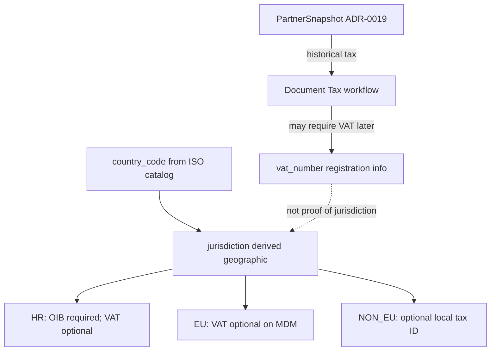

# ADR-0023 — Partner Geographic Jurisdiction (HR / EU / NON_EU)

```text
Status: Accepted
Date: 2026-08-19
Type: Domain
Supersedes: —
Related: ADR-0013-finance-domain-stabilization.md, ADR-0019-tax-classification-engine.md, ADR-0022-partner-management-mdm-api.md, DATA_ARCHITECTURE.md, DOMAIN_MAP.md
```

## Status

**Accepted** — geografska jurisdikcija partnera (`country_code` → `HR` | `EU` | `NON_EU`), odvajanje od PDV registracije (`vat_number`), write SSOT za državu, normalizacija prije unique i migracijska pravila su zaključani. Implementacija (API/app) slijedi eksplicitni GO uz ovaj Acceptance.

Ovaj ADR **ne** superseda ADR-0022 (Partner Management ostaje). **Ne** mijenja ADR-0019 snapshot semantiku. **Ne** refaktorira Tax/PDV engine u istom sliceu.

Broj **0015 nije korišten**: ADR-0015 ostaje rezerviran za Sprint 4 retro. ADR-0016+ ostaju sprint retroi.

## 1. Context

ADR-0022 i TD-001 (ADR-0013) zaključavaju jedan kanonski `partners.Partner` kao counterparty. Operativni MDM API i UI već postoje, ali model i ugovor i dalje tretiraju `tax_number` semantički kao „OIB“, a `country` kao slobodni tekst (default `"Hrvatska"`).

To blokira čiste internacionalne partnere i miješa:

- **gdje partner pripada** (geografija / članstvo u EU)
- **je li PDV-registriran** (VAT ID)

Postojeći Tax/PDV sloj (`is_eu_customer` / `is_eu_supplier`) već heuristički gleda `country` stringove i VAT prefikse. Bez kanonskog `country_code` MDM i Tax ostaju na dualnoj, lomljivoj semantici.

Bez ugovora bi implementacija lako:

- uvela `DomaćiPartner` / `InozemniPartner` modele
- zaključala „EU ⇒ VAT ID obavezan“ na Partner MDM-u (netočno za fizičke osobe / ne-PDV subjekte)
- ostavila `country` i `country_code` kao dual write SSOT
- ubacila pseudo-kod `XX` ili auto-HR za ambiguous legacy retke
- pretvorila današnji `jurisdiction` u porezni tretman povijesnih dokumenata

## 2. Decision

Uvesti **Partner Geographic Jurisdiction** nad postojećim `partners.Partner`:



### 2.1 Normativna rečenica

> **`country_code` određuje geografsku jurisdikciju partnera; prisutnost ili odsutnost VAT ID-a određuje poreznu registracijsku informaciju. Jurisdikcija sama po sebi ne dokazuje PDV status niti porezni tretman pojedine transakcije.**

### 2.2 Granice

- **Ne** uvoditi zasebne `DomaćiPartner` / `InozemniPartner` (ili Customer/Supplier) modele.
- **Ne** tretirati `jurisdiction` kao dokaz PDV registracije.
- **Ne** zahtijevati `vat_number` za sve EU partnere na MDM razini.
- **Ne** refaktorirati Tax/PDV/`is_eu_customer` u istom implementacijskom sliceu kao ovaj ADR (follow-up).
- **Ne** koristiti `XX` (ili sličan) kao pseudo ISO državu.
- **Ne** automatski postavljati `country_code=HR` samo zato što `tax_number` izgleda kao OIB.

## 3. Identitet i polja

| Pojam | Semantika |
|-------|-----------|
| `country_code` | ISO 3166-1 alpha-2 iz **kanonskog kataloga** u `shared/countries` (ne samo „dva slova“) |
| `country` | Legacy DB polje; nakon cutovera **nije** nezavisno API write-polje |
| Display naziv | Derivira se iz `country_code` + katalog |
| `jurisdiction` | Read-only derivacija: `HR` \| `EU` \| `NON_EU` |
| `tax_number` | Generički lokalni tax ID; za HR = OIB. API/OpenAPI **ne** zove polje „OIB“ |
| `vat_number` | PDV/VAT registracijski identifikator (HR ili EU) |

### 3.1 Derivacija jurisdikcije

```text
if country_code == 'HR'           → HR
elif is_eu_country(country_code)  → EU   # EU set bez HR u EU grani
else                              → NON_EU
```

`jurisdiction` znači **trenutnu MDM/geografsku klasifikaciju**, ne povijesni porezni tretman. Promjene EU članstva u budućnosti mijenjaju živog Partnera; zaključani dokumenti ostaju na `PartnerSnapshot` (ADR-0019). Tax engine **ne smije** nekritički odlučivati tretman starog dokumenta samo prema današnjem `Partner.jurisdiction`.

### 3.2 Write SSOT za državu

Partners API (ADR-0022) nakon cutovera:

- prima i mijenja **samo `country_code`**
- odbija nezavisni write `country` (ignorira ili 400 — implementacija bira jednu strategiju i drži je konzistentnom; preferencija: **400** ako klijent pošalje `country` kao write polje)
- vraća `country_code`, `jurisdiction`, te display naziv (deriviran ili legacy `country` read-only tijekom prijelaza)

## 4. MDM validacija (ne dokumentni workflow)

| Jurisdikcija | `tax_number` | `vat_number` |
|--------------|--------------|--------------|
| **HR** | **Obavezan** — normalizirani OIB (11 znamenki) | Opcionalan; ako postoji → kanonski `HR` + isti OIB |
| **EU** | Opcionalan lokalni ID | **Opcionalan** na Partneru; ako postoji → kanoniziran; prefix mora odgovarati `country_code` |
| **NON_EU** | Opcionalan lokalni tax ID (ne odbacivati jer nije EU VAT) | EU VAT format nije očekivan; nevaljani EU format → 400 |

Dokumentni / Tax / PDV-S / ZP / RC workflow **smije** zahtijevati VAT ID prije knjiženja ili generiranja obrasca. To **nije** Partner MDM constraint.

### 4.1 Stabilni error code-ovi (400)

| Code | Kada |
|------|------|
| `partner_oib_required` | HR bez OIB-a |
| `partner_oib_invalid` | HR s neispravnim OIB-om (nakon normalizacije) |
| `partner_vat_country_mismatch` | VAT prefix ≠ `country_code` (EU) ili HR VAT ≠ `HR`+OIB |
| `partner_vat_invalid` | Nevaljani VAT format gdje je polje poslano |
| `partner_country_invalid` | `country_code` nije u kanonskom ISO katalogu |

## 5. Normalizacija i unique

Prije persistencije / unique check:

- HR `tax_number` (OIB): samo znamenke (`normalize_oib`)
- `vat_number`: uppercase, bez razmaka (`HR123…` / `hr 123…` → ista vrijednost)
- `country_code`: uppercase ISO2 iz kataloga

**Unique (tenant-scoped, conditional non-empty):**

- `tax_number` — unique kad je popunjen (sprječava duplikate zapisane vrijednosti; poslovna semantika za HR je OIB)
- `vat_number` — unique kad je popunjen, **za sve jurisdikcije** (uključujući hrvatski `HR+OIB`)

`IntegrityError` → **409**:

```json
{ "code": "partner_tax_number_conflict", "field": "tax_number" }
```

```json
{ "code": "partner_vat_number_conflict", "field": "vat_number" }
```

Bez normalizacije-prije-save DB constraint **nije** dovoljan (različiti stringovi istog ID-a).

## 6. Migracija `country_code`

1. Dodati **nullable** `country_code`
2. Deterministički backfill poznatih `country` vrijednosti → ISO2
3. Ambiguous retke izdvojiti za **pregled** (report/log) — **ne** `XX`, **ne** auto-HR samo zbog OIB-like `tax_number` (OIB-like smije biti signal u reportu, ne odluka)
4. Tek kad nema ambiguous redaka → `NOT NULL`

API cutover (odbijanje write `country`) smije ići tek kad je `country_code` NOT NULL za operativne partnere (ili uz eksplicitni migrate-gate u impl planu).

## 7. Filteri (usklađeno s ADR-0022)

- Query: `jurisdiction=HR|EU|NON_EU`
- `jurisdiction` i `status` su **ortogonalni**
- Default lista i dalje `status=active` (ADR-0022)
- UI „Svi“ (jurisdikcija) = sve jurisdikcije; **ne** znači inactive/blocked
- ADR-0022 `filter=all` (status) ostaje zasebno
- `?jurisdiction=EU` **nikad** ne uključuje HR

UI lista (nakon impl): **Svi | Hrvatska | EU | Ostale zemlje** uz postojeće status/type filtere.

Kartica: labele OIB / VAT ID / Tax ID ovisno o `jurisdiction` — ne tvrdi „OIB“ za ne-HR partnere.

## 8. Odnos prema postojećim dokumentima

| Dokument | Odnos |
|----------|-------|
| ADR-0022 | Proširuje MDM polja/filtere; lifecycle, DELETE zabrana, nested CRUD, Finance/Documents ownership ostaju |
| ADR-0019 | Snapshot štiti povijest; živi `jurisdiction` nije SoT za stari dokument |
| ADR-0013 / TD-001 | Jedan Partner potvrđen |
| Tax/PDV mapping | Heuristika `is_eu_*` ostaje do zasebnog follow-upa na `country_code` |

## 9. Consequences

### Prednosti

- Jedan MDM entitet za HR/EU/treće zemlje
- Jasna granica geografija vs PDV registracija
- Race-safe unique uz normalizaciju
- Bez dual write SSOT-a `country` / `country_code`
- UI i dokumentni tokovi mogu kasnije zahtijevati VAT bez lažnog MDM hard-require

### Rizici / trade-off

- Legacy `country` backfill zahtijeva ručni pregled ambiguous redaka
- Do Tax follow-upa MDM i PDV heuristika mogu privremeno divergirati
- EU partner bez VAT ID-a je valjan u MDM-u, ali neki dokumentni tokovi će ga kasnije odbiti — UI mora jasno razlikovati „nije na kartici“ vs „nije valjan za ovaj dokument“

### Follow-up

- [x] Nakon Acceptance → ADR status **Accepted**
- [x] API: `country_code` migracija, katalog, normalize, uniques, filter, OpenAPI (GO)
- [x] App: jurisdiction filteri + forme/labele (GO)
- [ ] Tax: `is_eu_customer` / `is_eu_supplier` na `country_code`
- [ ] VIES (izvan ovog ADR-a)
- [ ] Ukloniti legacy `country` write/path kad više nije potreban

## 10. Acceptance testovi

- [ ] Nema `DomaćiPartner` / `InozemniPartner` modela
- [ ] HR bez OIB → `400` `partner_oib_required`
- [ ] HR s neispravnim OIB → `400` `partner_oib_invalid` (ili ekvivalent stabilnog code-a)
- [ ] EU bez VAT ID → Partner se **smije** spremiti
- [ ] EU s VAT ID-em druge države → `400` `partner_vat_country_mismatch`
- [ ] Dva formata istog VAT ID-a → drugi `409` `partner_vat_number_conflict`
- [ ] Nepoznat / izvan kataloga ISO → `400` `partner_country_invalid`
- [ ] `country` se više ne može nezavisno mijenjati kroz API
- [ ] Ambiguous legacy `country` ne dobiva `XX` niti auto-HR
- [ ] `?jurisdiction=EU` nikad ne uključuje HR
- [ ] „Svi“ (jurisdikcija) + default lista = aktivni partneri svih jurisdikcija
- [ ] Tax/PDV engine se u sliceu ovog ADR-a **ne** refaktorira
- [ ] Cross-tenant / role 404 (ADR-0022) ostaje
- [ ] PATCH Partnera ne mijenja povijesne snapshote
