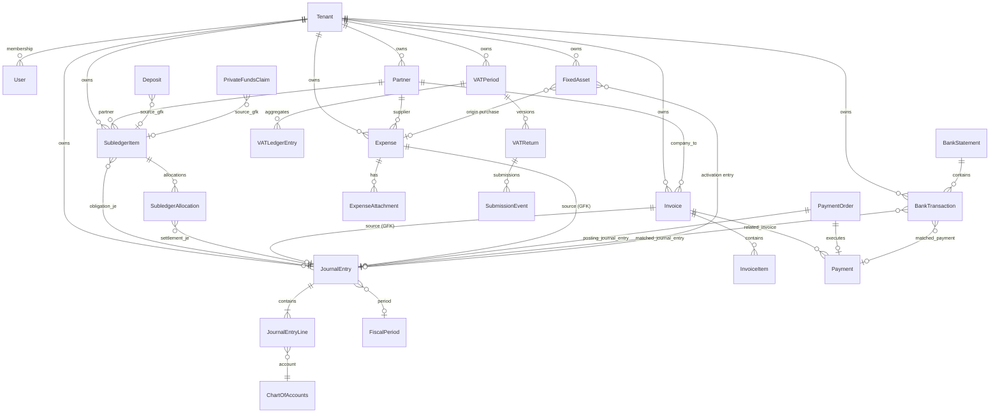

# Data Architecture — racunAI ERP

Ključni entiteti i veze. Domene: [`DOMAIN_MAP.md`](DOMAIN_MAP.md). Django app lokacije u zagradi.

---

## ER dijagram (ključni entiteti)



---

## Entiteti

### 1. Tenant (`tenants.Tenant`)

| Polje | Tip | Opis |
|-------|-----|------|
| name | CharField | Naziv tvrtke |
| slug | SlugField | URL identifikator |
| domain | CharField | Custom domain |
| is_active | BooleanField | Aktivan tenant |

**Veze:** sve ostale entitete posjeduje preko `TenantMixin`. Korisnici pristupaju preko `TenantMembership` (role: owner, accountant, viewer).

### 2. Partner (`partners.Partner`)

| Polje | Tip | Opis |
|-------|-----|------|
| partner_code | CharField | Šifra partnera |
| name | CharField | Naziv |
| partner_type | Choice | customer / supplier / both / other |
| tax_number | CharField | OIB |
| vat_number | CharField | PDV broj |

**Veze:** `Invoice.company_to`, `Expense.supplier`, `PartnerContact`, `PartnerBankAccount`, `AnalyticAccount`. TD-001 riješen — kanonski MDM; `expenses.Supplier` deprecated (tablica zadržana za rollback).

### 3. Invoice (`invoices.Invoice`)

| Polje | Tip | Opis |
|-------|-----|------|
| invoice_number | CharField | Broj računa (unique per tenant) |
| status | Choice | draft / sent / paid / overdue / cancelled |
| company_to | FK → Partner | Primatelj |
| issue_date, due_date | DateField | Datumi |
| subtotal, tax_amount, total_amount | DecimalField | Iznosi |

**Veze:** `InvoiceItem` (1:N), `Payment.related_invoice`, `JournalEntry` (GFK source). Auto-posting preko Django signala → `post_document('invoice_issued')`.

### 4. Expense (`expenses.Expense`)

| Polje | Tip | Opis |
|-------|-----|------|
| expense_number | CharField | Broj troška |
| status | Choice | draft / submitted / approved / paid / rejected |
| supplier | FK → Partner | Dobavljač (`partner_type` supplier/both) |
| total_amount | DecimalField | Ukupan iznos |
| vat_deductible | BooleanField | PDV odbitak |

**Veze:** `ExpenseAttachment`, `ExpensePayer`, `JournalEntry` (GFK source). Auto-posting: `post_document('expense_approved')`.

### 5. Payment (`payments.Payment`)

| Polje | Tip | Opis |
|-------|-----|------|
| amount | DecimalField | Iznos |
| status | Choice | pending / completed / failed |
| related_invoice | FK → Invoice | Povezani račun |
| payment_date | DateField | Datum plaćanja |

**Veze:** `PaymentOrder` (banking), `BankTransaction.matched_payment`. Legacy model — planirano spajanje s `banking.PaymentOrder` (TD-003).

### 6. JournalEntry (`accounting.JournalEntry`)

| Polje | Tip | Opis |
|-------|-----|------|
| entry_number | CharField | Broj temeljnice |
| entry_date | DateField | Datum knjiženja |
| status | Choice | draft / posted / reversed |
| source | GenericFK | Invoice, Expense, PaymentOrder, … |
| fiscal_period | FK → FiscalPeriod | Razdoblje |

**Veze:** `JournalEntryLine` (1:N), `ChartOfAccounts` preko linija. Immutable nakon `posted` — samo storno.

### 7. VATLedgerEntry (`accounting.VATLedgerEntry`)

| Polje | Tip | Opis |
|-------|-----|------|
| vat_period | FK → VATPeriod | PDV razdoblje |
| vat_box | CharField | Box kod (201, 202, …) |
| base_amount, vat_amount | DecimalField | Osnovica i PDV |
| source_type | CharField | invoice / expense / journal |

**Veze:** danas se generira iz `generate_vat_ledger()` → agregira se u `build_pdv_payload()`. Append-only unutar razdoblja. Kanonski je obnovljiva porezna projekcija (ADR-0019); potrošači (PDV, ZP, PDV-S, I-RA/U-RA kontrolni pregledi) ne klasificiraju izvorni dokument ponovo.

### 8. VATReturn (`accounting.VATReturn`)

| Polje | Tip | Opis |
|-------|-----|------|
| vat_period | FK → VATPeriod | Razdoblje |
| version | PositiveIntegerField | Verzija (1:N po razdoblju) |
| status | Choice | draft / submitted / imported |
| payload_json | JSONField | Kanonski PdvPayload |
| unsigned_xml | TextField | Izvedeni XML |

**Veze:** `SubmissionEvent` (GFK document), `VATPeriod`. Immutable nakon submission.

### 9. BankTransaction (`banking.BankTransaction`)

| Polje | Tip | Opis |
|-------|-----|------|
| transaction_date | DateField | Datum transakcije |
| amount | DecimalField | Iznos |
| transaction_type | Choice | debit / credit |
| match_status | Choice | unmatched / suggested / matched |
| matched_payment | FK → Payment | Legacy/suggest put (1:1) |
| matched_journal_entry | FK → JournalEntry | Primarni reconcile put (1:1) |

**Veze:** `BankStatement` (parent), `PaymentOrder` (PIS).

**Matching (dva puta):**

1. **Legacy/suggest:** `match_transaction()` → `matched_payment` ili `matched_journal_entry` bez zatvaranja saldakonta.
2. **Eksplicitni reconcile (ADR-0025):** `POST .../reconcile-open-item/` → Finance `settle_open_item_from_bank()` → `SubledgerAllocation` + smanjenje `SubledgerItem.open_amount` → `matched_journal_entry` na settlement JE.

`unmatch` briše samo bank FK; **ne** stornira JE ni otvara saldakont ([`ADR-0025`](ADR-0025-bank-reconcile-open-item.md)).

### 9b. SubledgerItem (`accounting.SubledgerItem`)

| Polje | Tip | Opis |
|-------|-----|------|
| partner | FK → Partner | Kupac/dobavljač |
| direction | Choice | receivable / payable |
| source | GenericFK | Invoice, Expense, Deposit, PrivateFundsClaim |
| journal_entry | FK → JournalEntry | Temeljnica koja je otvorila stavku |
| original_amount | DecimalField | Početni iznos obveze/potraživanja |
| open_amount | DecimalField | **SSOT** za neplaćeni saldo |
| status | Choice | open / partial / closed / cancelled |
| due_date | DateField | Dospijeće (aging) |

**Veze:** `SubledgerAllocation` (1:N settlementa). Kreiranje: `post_document` hooks ([`ADR-0013`](ADR-0013-finance-domain-stabilization.md)). Alokacija: `allocate_payment()` / bank reconcile.

### 9c. SubledgerAllocation (`accounting.SubledgerAllocation`)

| Polje | Tip | Opis |
|-------|-----|------|
| subledger_item | FK → SubledgerItem | Otvorena stavka |
| journal_entry | FK → JournalEntry | Settlement temeljnica (unique per JE) |
| amount | DecimalField | Primijenjeni iznos |

### 10. FixedAsset (`accounting.FixedAsset`)

| Polje | Tip | Opis |
|-------|-----|------|
| name | CharField | Naziv imovine |
| vin | CharField | VIN (unique per tenant) |
| inventory_number | CharField | Inventurni broj |
| acquisition_cost | DecimalField | Nabavna vrijednost |
| status | Choice | in_preparation / active / disposed |
| origin | Choice | purchase / opening_balance |
| useful_life_months | PositiveSmallIntegerField | Trajnost za amortizaciju |
| depreciation_method | Choice | linear |
| residual_value | DecimalField | Ostatak vrijednosti |
| in_service_date | DateField | Datum aktivacije |

**Veze:** `JournalEntry` (purchase, activation, disposal), `ChartOfAccounts` (4 konta), `DepreciationSchedule` (1:N po razdoblju).

### 10b. DepreciationSchedule (`accounting.DepreciationSchedule`)

| Polje | Tip | Opis |
|-------|-----|------|
| fixed_asset | FK → FixedAsset | Imovina |
| year, month | PositiveSmallIntegerField | Razdoblje |
| amount | DecimalField | Iznos amortizacije |
| journal_entry | FK → JournalEntry | Knjižena temeljnica |

**Unique:** `(fixed_asset, year, month)` — idempotentnost periodičnog runa.

### 11. User (`auth.User` + `accounts.UserProfile`)

| Polje | Tip | Opis |
|-------|-----|------|
| username, email | standard Django | Korisnički podaci |
| is_superuser | BooleanField | Admin pristup |

**Veze:** `TenantMembership` (role per tenant), `UserProfile`, audit polja (`created_by`, `posted_by`) na poslovnim entitetima.

---

## Cross-cutting entiteti

| Entitet | App | Svrha |
|---------|-----|-------|
| `SubmissionEvent` | accounting | Append-only audit predaje poreznih obrazaca (ADR-0009) |
| `AuditLog` | accounts | Opći audit trag |
| `IntegrationAuditLog` | integrations | Audit integracijskih poziva |
| `CompanySettings` | settings | Postavke tvrtke (OIB, PDV status, logo) |
| `ChartOfAccounts` | accounting | RRIF kontni plan |
| `TaxRate` | settings | Stope PDV-a |
| `FiscalPeriod` | accounting | Otvorena/zatvorena razdoblja |

---

## Multi-tenant izolacija

Svi poslovni entiteti nasljeđuju `TenantMixin`:

```python
class TenantMixin(models.Model):
    tenant = models.ForeignKey('tenants.Tenant', on_delete=models.CASCADE)
    objects = TenantManager()  # automatski filtrira po aktivnom tenantu
```

Nema globalnih upita na poslovne podatke bez eksplicitnog `all_objects` managera.

---

## Operativni UI — granice (2026-08)

Read model i SSOT nisu isto. SPA slojevi:

| Ekran | API | SSOT za „otvoreno" | Napomena |
|-------|-----|-------------------|----------|
| `/dokumenti` | `GET /api/documents/` | `SubledgerItem` (provenance u DTO) | Tenant-wide operativni hub — [`ADR-0020`](ADR-0020-document-read-model.md) |
| `/partneri/{id}/saldakonto` | `GET /api/finance/partners/{id}/subledger/` | `SubledgerItem` | Partner-centric dubina — [`ADR-0022`](ADR-0022-partner-management-mdm-api.md) |
| `/bankarstvo/uskladivanje` | Banking reconcile write | `SubledgerAllocation` + `BankTransaction.match` | Jedini write za bankovno zatvaranje — [`ADR-0025`](ADR-0025-bank-reconcile-open-item.md) |
| `/saldakonti` (legacy URL) | — | — | Redirect na `/dokumenti` — **nema** zasebnog modula u nav ([`FAZA3_SALDAKONTI_SPEC.md`](FAZA3_SALDAKONTI_SPEC.md) rev. 2) |

`Invoice.status=paid` / `Expense.status=paid` **nisu** SSOT za plaćanje. Operativni badge i kontrole koriste saldakont provenance ([`ADR-0020`](ADR-0020-document-read-model.md) §7–8).

---

## Konvencije

| Konvencija | Pravilo |
|------------|---------|
| Novac | `DecimalField(max_digits=15, decimal_places=2)` — nikad float |
| Datumi | `DateField` za poslovne datume, `DateTimeField` za audit |
| Verzioniranje | PDV obrasci: 1:N po razdoblju; submission: append-only |
| Izvor knjiženja | GenericFK na `JournalEntry.source` |
| Unique constraints | Uvijek per-tenant (`unique_*_per_tenant`) |
