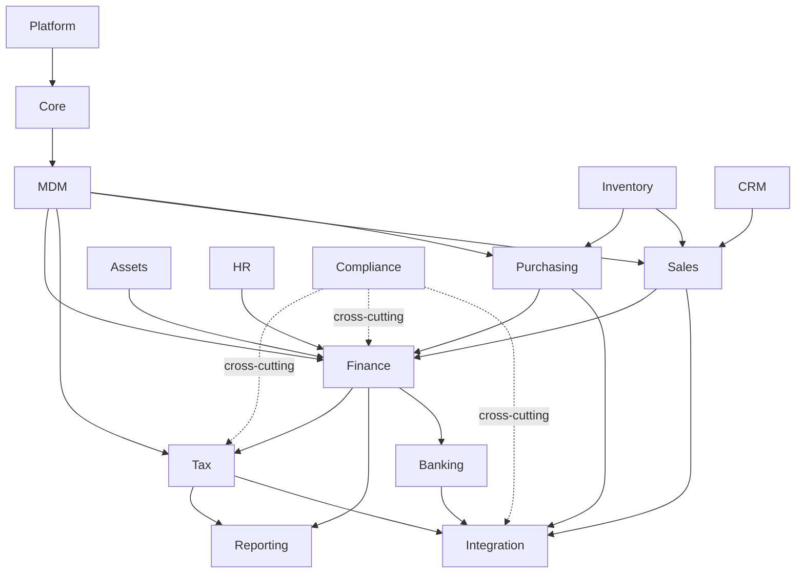

# Domain Dependency Map — racunAI ERP

Dozvoljene ovisnosti između domena. Developer view: [`DOMAIN_MAP.md`](DOMAIN_MAP.md).

**Zabranjeno:** kružne ovisnosti, Tax → Sales, Reporting write u Finance (obrnuti write tok). Reporting smije **čitati** Sales/Purchasing/Finance/Banking/Tax/Integration (ADR-0020).

---

## Dijagram

---

## Tablica dozvoljenih ovisnosti

| Od | Prema | Tip | Mehanizam |
|----|-------|-----|-----------|
| Platform | Core | direktni import | facade API |
| Core | MDM | direktni import | shared šifrarnici |
| MDM | Finance, Tax, Sales, Purchasing | direktni import | Partner, TaxRate, ChartOfAccounts |
| Sales | Finance | event | `InvoiceIssued` → posting |
| Purchasing | Finance | event | `ExpenseApproved` → posting |
| Finance | Tax | direktni import | VATLedgerEntry generiranje |
| Reporting | Finance, Tax, Sales, Purchasing, Banking, Integration | read-only import | Document read model (ADR-0020); GL/PDV izvještaji |
| Sales | Integration | direktni import | eRačun outbound |
| Purchasing | Integration | direktni import | inbound AS4 → expense |
| Tax | Integration | direktni import | submission, fiskalizacija |
| Finance | Banking | event | `PaymentExecuted` → knjiženje |
| Banking | Integration | direktni import | OTP PSD2 connector |
| Assets | Finance | event | `AssetActivated`, `DepreciationCalculated` → posting |
| Assets | Purchasing | direktni import | `create_fixed_asset_from_purchase()` |
| Inventory | Purchasing | direktni import | nabava → zaliha |
| Inventory | Sales | direktni import | prodaja → smanjenje zalihe |
| HR | Finance | event | plaće → knjiženje |
| HR | Tax | DTO / facade | JOPPD builder (planned candidate v1.5) — Tax ne importira HR modele direktno |
| CRM | Sales | direktni import | partner → račun |
| Compliance | Tax, Finance, Integration | cross-cutting | audit hookovi, SubmissionEvent |

---

## Zabranjene ovisnosti

| Od | Prema | Razlog |
|----|-------|--------|
| Tax | Sales | Tax ne smije znati za prodajne dokumente — koristi VATLedger |
| Tax | HR (direktni import) | JOPPD builder prima DTO; ne ORM model |
| Reporting | Finance (write) | Reporting je read-only consumer; čitanje je dozvoljeno (ADR-0020) |
| Finance | Sales (direktni import) | Side effects preko eventa, ne direktnog importa |
| Finance | Purchasing (direktni import) | Side effects preko eventa |
| bilo koja | bilo koja (kružna) | Sprječava spaghetti arhitekturu |

---

## Cross-cutting odgovornosti

| Odgovornost | Domene koje pokriva | Mehanizam |
|-------------|---------------------|-----------|
| **Compliance** | Tax, Finance, Integration | Audit log, SubmissionEvent, immutable accounting |
| **MDM** | Sve poslovne domene | Centralni šifrarnici (Partner, TaxRate, ChartOfAccounts) |
| **Platform** | Sve domene | Auth, RBAC, tenant isolation, Celery infra |

Cross-cutting odgovornosti nisu Django appovi — implementirane su kao servisi, mixinovi i audit hookovi unutar postojećih appova.

---

## Event-based vs direct import

| Scenarij | Preporučeni mehanizam |
|----------|----------------------|
| Side effect (knjiženje nakon računa) | Event bus (`events/`) |
| Read-only agregacija (PDV iz VATLedger) | Direktni import servisa |
| Cross-domain lookup (Partner na računu) | MDM model direktno |
| Audit trag (submission) | Compliance hook (SubmissionEvent) |

Vidi [`EVENTS.md`](EVENTS.md) za katalog događaja.
