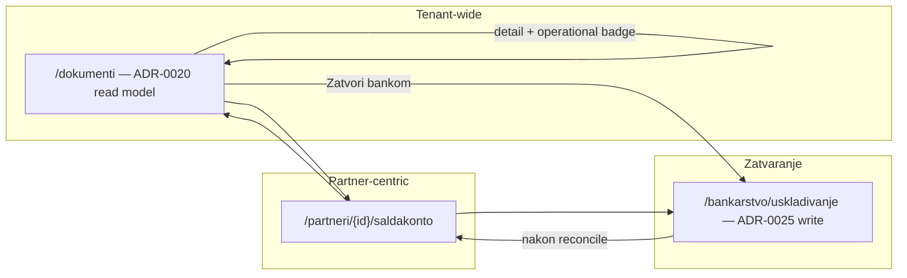

# Faza 3 — Finance operativni workflow (spec diff, rev. 2)

```text
Status: Implemented / Accepted (Faza 3a)
Date: 2026-08-22
Accepted: 2026-08-22 — app develop @ 9d088df (62/62 lokalnih testova)
Revised: 2026-08-22 — odustaje od vraćanja modula „Saldakonti"; Documents ostaje jedini tenant-wide operativni ekran (ADR-0020)
Type: Product + API contract
Related: ADR-0013, ADR-0020, ADR-0021, ADR-0022, ADR-0025
Supersedes: rev. 1 FAZA3_SALDAKONTI_SPEC (nav + /saldakonti/* rute) — odbijeno
Faza 3b: opcionalni backlog (aging widget) — nije otvorena
```

## 0. Revizija odluke

**Ranije (rev. 1):** vratiti `/t/{slug}/saldakonti` kao zasebni Finance modul s nav stavkom.

**Sada (rev. 2):** to **ne radimo**. Tim je već zaključio:

- ADR-0020 — jedinstveni document read model je operativni pregled
- `nav.test.ts` eksplicitno: `APP_NAV` **ne** sadrži `saldakonti`
- `/saldakonti` → redirect na `/dokumenti` ([`saldakonti/page.tsx`](../../app/src/app/t/[slug]/saldakonti/page.tsx))
- `DocumentKpi` već prikazuje potraživanja/obveze iz `SubledgerItem`
- `SYSTEM_VIEWS` pokriva neplaćene, djelomično plaćene, dospjele, bank_unmatched…

**Partner-centric** ostaje na **`/partneri/{id}/saldakonto`** — to nije zasebni modul, nego kartica partnera (ADR-0022).

Faza 3 = **dovršiti workflow u Documents + Partner + Banking**, ne vraćati treći navigacijski modul.

---

## 1. Scope lock

### U scope

- Poboljšati **Documents** kao jedini tenant-wide operativni hub (read model ADR-0020)
- Ojačati **Partner saldakonto** tab kao partner-centric drill-down
- Povezati **Banking reconcile** (ADR-0025) kao korisničku akciju iz dokumenta/partnera
- Legacy URL `/saldakonti?...` → mapirati na `/dokumenti?...` (ne graditi novi modul)
- Ažurirati hardcoded linkove (`saldakonti?direction=...` → `dokumenti?view=...`)
- Read API gapovi **samo** ako Documents ili Partner ekran ne mogu koristiti postojeći `/api/documents/` ili `/api/finance/partners/{id}/subledger/`

### Izvan scope

| Stavka | Razlog |
|--------|--------|
| Nav stavka „Saldakonti" | Svjesno uklonjena; ADR-0020 |
| Rute `/saldakonti/*` (hub, stavke, partneri) | Duplikat Documents |
| Novi accounting modeli / SSOT | `SubledgerItem.open_amount` ostaje |
| Posting / Tax / Submission | Frozen |
| Dupliciranje reconcile write u Financeu | ADR-0025 u Banking |
| `unmatch` → storno | Zaseban gate |
| N:M alokacije | Sprint 5+ |

---

## 2. Tri operativne točke (gdje korisnik radi)



| Točka | Uloga | SSOT prikaz |
|-------|-------|-------------|
| **Dokumenti** | Svi dokumenti + operativni filteri + KPI | `operational_status`, `subledger`, `open_amount` iz read modela |
| **Partner saldakonto** | Otvorene stavke jednog partnera + aging bucket | Finance API `GET .../partners/{id}/subledger/` |
| **Banking usklađivanje** | Jedini write za bankovno zatvaranje | ADR-0025 |

---

## 3. Što Documents već pokriva (ne duplicirati)

| Potreba | Već postoji |
|---------|-------------|
| Otvorena potraživanja/obveze (tenant KPI) | `DocumentKpi` — `open_receivables`, `open_payables` |
| Neplaćeni izlazni | `view=unpaid_outgoing` |
| Djelomično plaćeni | `view=partially_paid` |
| Dospjeli izlazni | `view=overdue_outgoing` |
| Spremni za plaćanje (ulazni) | `view=incoming_ready_to_pay` |
| Banka neusklađena | `view=bank_unmatched` |
| Subledger provenance po redu | `subledger`, `open_amount`, `aging_bucket` u listi |
| Operativni badge (ne `document.status`) | ADR-0020 §8 — saldakonto > dokument |
| Filter po partneru | `partner` query param u `DocumentListFilters` |

**Zaključak:** tenant-wide „saldakont lista" **jest** Documents s odgovarajućim `view` + KPI, ne zasebna ruta.

---

## 4. Stvarni gapovi (što Faza 3 rješava)

### 4.1 UX / informacijska arhitektura

| Gap | Rješenje |
|-----|----------|
| Legacy linkovi na `/saldakonti?direction=incoming` | Prebaciti na `/dokumenti?direction=incoming&view=incoming_ready_to_pay` (ili samo `direction`) |
| `DocumentsSubnav` nema finance-presets | Dodati finance-oriented tabove u subnav (vidi §4.2) |
| Partner saldakonto bez linka na dokument | Link na `/dokumenti/ulazni|izlazni/{id}` |
| Partner saldakonto bez „Zatvori bankom" | Deep link na banking uskladivanje |
| Document detail bez jasnog CTA za bank close kad `subledger=open` | CTA „Zatvori bankom" na detail panelu |
| Nakon reconcile nema povratka u kontekst | Toast + link na dokument ili partner saldakonto |
| `PartnerSubledgerPanel` dev note u UI | Ukloniti |

### 4.2 Documents subnav — predložena proširenja

Trenutno: Svi | Ulazni | Izlazni | Zahtijeva pažnju ([`DocumentsSubnav`](../../app/src/components/documents/DocumentsSubnav.tsx)).

**Dodati** (mapiranje na postojeće `SYSTEM_VIEWS` — bez novog API-ja):

| Tab label | Query |
|-----------|-------|
| Otvorena potraživanja | `direction=outgoing&view=unpaid_outgoing` |
| Otvorene obveze | `direction=incoming&view=incoming_ready_to_pay` |
| Djelomično plaćeno | `view=partially_paid` |
| Dospjelo | `view=overdue_outgoing` |

Alternativa: jedan dropdown „Operativni pregledi" umjesto više tabova — manje šuma u subnavu.

**Ne dodavati:** zasebnu „Saldakonti" stavku u glavni nav.

### 4.3 Partner-centric

| Gap | Rješenje |
|-----|----------|
| Partner lista nema AR/AP sažetak | Opcionalno: kolona ili badge iz `GET .../financial-summary/` (batch ili per-row) |
| Partner saldakonto read-only bez akcija | Link dokument + „Zatvori bankom" |
| Nema tenant-wide „po partnerima" aging tablice | **Opcionalno Faza 3b:** `GET /api/finance/subledger/aging/` za widget na Documents hubu ili Partner listi — **ne** zasebni modul |

### 4.4 Banking integracija (samo linkovi)

**Tok A — Document detail → Banking**

Kad `subledger.state` ∈ `{open, partial}` i smjer odgovara:
- Izlazni: link `/bankarstvo/uskladivanje?match_status=unmatched&subledger_item={item_id}` (ako postoji u detail DTO)
- Ulazni: isto

**Tok B — Partner saldakonto → Banking**

„Zatvori bankom" na redu → isti deep link.

**Tok C — Banking → natrag**

Nakon `reconcileOpenItem`: toast + link na izvorni dokument (`source_type` + `source_id` iz kandidata).

**Write:** isključivo postojeći ADR-0025 endpointi. Frontend highlight kandidata iz URL `subledger_item` — bez Banking API diffa ako candidates već vraća stavku.

### 4.5 Legacy `/saldakonti` redirect

**Zadržati** redirect rutu (bookmark kompatibilnost), ali **poboljšati mapiranje**:

| `/saldakonti?...` | `/dokumenti?...` |
|-------------------|------------------|
| `direction=incoming` | `direction=incoming` |
| `direction=outgoing` | `direction=outgoing` |
| `direction=deposit` | `direction=deposit` |
| `view=attention` | `view=attention` |
| ostalo | prenesi `search`, `page`, `status`, datume |

Implementacija: zamijeniti `dokumentiRedirectUrl` s `saldakontiToDokumentiUrl()` koja radi smisleno mapiranje (već djelomično postoji).

---

## 5. Read API — minimalni diff

### Princip

Prvo koristiti postojeće:
- `GET /api/documents/` — lista + KPI + views
- `GET /api/documents/{direction}/{id}/` — detail + `subledger_context`
- `GET /api/finance/partners/{id}/subledger/`
- `GET /api/finance/partners/{id}/financial-summary/`

### Novi endpointi — samo ako Faza 3b zahtijeva

| Endpoint | Potreba | Alternativa |
|----------|---------|-------------|
| `GET /api/finance/subledger/aging/` | Tenant aging po partneru (widget) | Sumirati iz Documents KPI + partner lista |
| `GET /api/finance/subledger/` | Tenant-wide item lista | **Ne treba** — Documents lista je ekvivalent |
| `GET /api/finance/subledger/summary/` | KPI strip | **Ne treba** — `DocumentKpi` već ima AR/AP |

**Faza 3a (preporuka):** nula novih Finance read endpointa ako Documents subnav + linkovi pokriju workflow.

**Faza 3b (opcionalno):** `GET /api/finance/subledger/aging/` za „Top dospjelih partnera" widget na `/dokumenti` — read-only, bez nove rute.

### Document read model proširenja (ako treba)

Provjeriti ima li `DocumentDetail` već `subledger_context.item_id` za deep link na banking. Ako ne — **dodati u assembler** (read-only, ne novi model):

```json
"subledger_context": {
  "item_id": 42,
  "open_amount": "1500.00",
  ...
}
```

To je jedini prihvatljivi „API diff" u Reporting domeni — ne Finance write.

---

## 6. Datoteke (implementacijska faza)

| Datoteka | Akcija |
|----------|--------|
| `DocumentsSubnav.tsx` | Finance operativni tabovi / dropdown |
| `DocumentDetailPanel.tsx` | CTA „Zatvori bankom" |
| `IncomingExpenseDetail.tsx` | Linkovi `/saldakonti` → `/dokumenti?...` |
| `InvoiceReview.tsx` | isto |
| `PartnerSubledgerPanel.tsx` | dokument link + banking CTA; extract shared row helper ako treba |
| `TransactionList.tsx` | highlight `subledger_item` iz URL; post-reconcile toast |
| `documentListQuery.ts` | `saldakontiToDokumentiUrl()` |
| `saldakonti/page.tsx` | redirect s mapiranjem (ostaje) |
| `nav.ts` | **bez promjene** — nema saldakonti |

**Ne kreirati:** `SaldakontHub`, `SaldakontSubnav`, `/saldakonti/stavke`, Finance tenant subledger list API.

---

## 7. Acceptance kriteriji (Faza 3a)

### Funkcionalno

- [x] Glavni nav: samo **Dokumenti** (ne Saldakonti)
- [x] `/saldakonti?...` redirecta na smislen `/dokumenti?...`
- [x] Svi hardcoded `/saldakonti` linkovi u appu ažurirani
- [x] Documents subnav ili dropdown pokriva otvorena potraživanja/obveze/djelomično/dospjelo
- [x] Document detail: CTA za bank close kad subledger otvoren
- [x] Partner saldakonto: link na dokument + CTA bank close
- [x] Banking reconcile: deep link + povratak nakon uspjeha
- [x] `nav.test.ts` i dalje: `not.toContain('saldakonti')`

### Arhitekturno

- [x] Nema novih Django modela
- [x] Nema novog SSOT-a
- [x] Documents ostaje read-model; write samo kroz Banking/Finance postojeće putanje
- [x] Tax/Submission netaknut

---

## 8. Odnos prema ADR-0013 „partner-centric Finance"

ADR-0013 definira `SubledgerItem` kao SSOT — to ostaje u backendu.

**Partner-centric u UI** ne znači zasebni globalni modul. Znači:

1. **Tenant pregled** → Documents (svi dokumenti, finance viewovi, KPI iz subledgera)
2. **Partner dubina** → `/partneri/{id}/saldakonto` + financial summary
3. **Zatvaranje** → Banking

To je konzistentno s odlukom „sve u Documents" + partner kartica.

---

## 9. Redoslijed implementacije

1. Mapiranje legacy URL + cleanup linkova
2. Documents subnav / operativni presets
3. Document detail + Partner panel banking CTA
4. Banking highlight + post-reconcile navigacija
5. (Opcionalno 3b) aging widget + `GET .../subledger/aging/`

---

## 10. Gate

**PASS rev. 2** (2026-08-22) = prihvaćamo da se **ne vraća** modul Saldakonti; Faza 3 je **Documents + Partner + Banking workflow**, ne novi nav.

**Faza 3a Implemented / Accepted** (2026-08-22) — `racunai-hr/app:develop` @ `9d088df`:

| Slice | SHA | Opis |
|-------|-----|------|
| 1 | `93543b6` | Legacy `/saldakonti` URL cleanup + redirect |
| 2 | `b15ec56` | Documents operativni subnav (`SYSTEM_VIEWS`) |
| 3 | `6beec23` + `22e9680` | Document detail banking CTA (izlazni + ulazni) |
| 4 | `b27d487` | Banking reconcile deep-link + post-reconcile povratak |
| Partner | `9d088df` | Partner saldakonto dokument link + „Zatvori bankom" |

Acceptance: **62/62** lokalnih testova (9 datoteka); GitHub status checkovi nisu dostupni za ovaj repo.

**Faza 3b** (aging widget + `GET /api/finance/subledger/aging/`) ostaje opcionalni backlog — nije otvorena.
