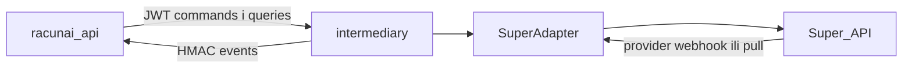

# Fiscal Gateway — kanonski API v1

Ugovor između `racunai-api` i `intermediary`. Invarijante: [`ADR-0017-fiscal-gateway-model-a.md`](ADR-0017-fiscal-gateway-model-a.md).

```text
Status: Accepted (spec v1)
Date: 2026-08-16
Type: Integration contract
Related: ADR-0017, ADR-0018
```

> **Amendment (2026-08-17, ADR-0018):** zaseban verzionirani outbound-provider. `inbound-binding` ostaje samo adresa zaprimanja. Dokument stampan na `outbound_provider_config_id` / generaciju / `provider_account_key`; dispatch ne čita trenutačni OIB config. Nema `GET /v1/providers` liste. Django `outbound_route` nije dio ovog ugovora.

Ovo je ljudski čitljiva specifikacija i skica strojnog ugovora. Nije OpenAPI YAML, nije implementacija, nije shema baze.

---

## 1. Granica



- Kanonski API je samo `racunai-api` ↔ `intermediary`.
- Superovi pathovi, `companyGuid`, `invoiceGuid`, `messageId`, statusni integeri i `double` iznosi ne smiju izaći u ovaj ugovor. Ostaju u `provider_refs` / `provider_status`.
- Provider webhook Super → gateway je interni adapter ugovor. Superov princip potpisanih, idempotentnih webhookova ([dokumentacija](https://api.super.hr/docs/webhook-integracija.html)) informira event ugovor, ali se ne prepisuje 1:1.
- `fine_star_self` koristi iste endpointe; routing je po bindingu.
- `racunai_direct` u v1 je onemogućen: `CAPABILITY_NOT_SUPPORTED`.
- Postojeći `SuperClient` u API-ju je prijelazno stanje ([ADR-0017 §3](ADR-0017-fiscal-gateway-model-a.md)). Ovaj ugovor ga zamjenjuje; ne širi se novim Super pozivima.

Base path: `/v1`. JSON UTF-8. Iznosi samo decimal string (`"123.45"`), nikad JSON number.

---

## 2. Identiteti

`document_id` je globalno jedinstven UUID/ULID. Svaki dokument ima nepromjenjivi trojac:

```json
{
  "taxpayer_oib": "36619131370",
  "direction": "OUTBOUND",
  "document_id": "0198f0a2-7c1d-7b3e-b4a1-2c9d8e7f6a50"
}
```

Jednom stvoren dokument ne smije promijeniti `taxpayer_oib`, `direction` ni `bound_provider`. `tenant_id` je opcionalan audit atribut; nije ključ bindinga ni identiteta dokumenta.

| Identifikator | Izdavatelj | Pravilo |
|---------------|------------|---------|
| `document_id` | racunAI | globalni UUID/ULID |
| `attempt_id` | gateway | dodijeljen **prije** prvog mrežnog poziva posredniku |
| `idempotency_key` | racunAI | header na svakoj naredbi; vidi §7 |
| `payment_id` | racunAI | stabilan identitet jedne prijave naplate |
| `event_id` | gateway | jednokratna obrada na API strani |
| `reconciliation_id` | gateway | asinkroni posao |
| `provider_refs` | provider | `company_guid`, `invoice_guid`, `message_id` |

Autorizacija subjekta: gateway ne vjeruje `taxpayer_oib` samo zato što je u JSON-u. Pozivajući servis mora imati pravo djelovati za taj subjekt. Inače `UNAUTHORIZED_SUBJECT`.

---

## 3. Statusi — neovisne osi

Jedan `canonical_status` je zabranjen. Mapiranje provider → osa je verzionirano (`mapping_version`). Nepoznat provider status na bilo kojoj osi postaje `UNKNOWN` (`REQUIRES_REVIEW`). Nikad se automatski ne mapira u `DELIVERED`, `ACCEPTED` ili `PAID`.

Svaka os, kad ima izvor, nosi:

```json
{
  "value": "DELIVERED",
  "mapping_version": "super-exchange-v1",
  "provider_status": {
    "code": "60",
    "text": "Delivered"
  }
}
```

U skicama ispod, radi čitljivosti, osi su prikazane kao skalari. Odgovor resursa koristi objekt osi.

### 3.1 Outbound

| Osa | Vrijednosti |
|-----|-------------|
| `exchange_status` | `QUEUED`, `SUBMITTING`, `SUBMITTED`, `DELIVERED`, `FAILED`, `UNKNOWN` |
| `fiscalization_status` | `PENDING`, `ACCEPTED`, `REJECTED`, `FAILED`, `UNKNOWN` |
| `recipient_status` | `PENDING`, `ACCEPTED`, `REJECTED`, `UNKNOWN` |
| `payment_status` | `UNPAID`, `PARTIALLY_PAID`, `PAID`, `UNKNOWN` |

```json
{
  "exchange_status": "DELIVERED",
  "fiscalization_status": "ACCEPTED",
  "recipient_status": "PENDING",
  "payment_status": "PARTIALLY_PAID"
}
```

### 3.2 Inbound

| Osa | Značenje | Vrijednosti |
|-----|----------|-------------|
| `intake_status` | zaprimanje dokumenta | `RECEIVED`, `AVAILABLE`, `FAILED`, `UNKNOWN` |
| `intake_fiscalization_status` | fiskalizacija zaprimanja | `PENDING`, `ACCEPTED`, `REJECTED`, `FAILED`, `UNKNOWN` |
| `internal_workflow_status` | interna obrada u racunAI-ju | vidi §3.3 |
| `e_reporting_status` | zakonsko eIzvještavanje | `NONE`, `PENDING`, `SUBMITTED`, `ACCEPTED`, `REJECTED`, `FAILED`, `UNKNOWN` |

Interni workflow **nema** vanjskog zakonskog učinka sam po sebi.

### 3.3 Interni workflow vs eIzvještavanje

Zabranjen je `POST .../accept|reject`.

| Endpoint | Učinak |
|----------|--------|
| `POST /v1/inbound/documents/{document_id}/workflow-status` | interni status; ne šalje poruku Poreznoj |
| `POST /v1/inbound/documents/{document_id}/e-reporting/rejection` | eksplicitno zakonsko odbijanje / eIzvještavanje |

`internal_workflow_status` v1: `RECEIVED`, `APPROVED`, `CLEARED`, `POSTED`, `UNKNOWN`.

Interno `APPROVED`, `CLEARED` ili `POSTED` ne smije pokrenuti eIzvještavanje.

---

## 4. UBL

Minimalni `document_type`: `INVOICE`, `CREDIT_NOTE`.

Resursi se zovu `documents`, ne `invoices`. Izvorni UBL se čuva neizmijenjen. GET evidence vraća URI + hash, ne „popravljeni“ XML.

---

## 5. Autentikacija i audit

### 5.1 API → gateway

Kratkotrajni JWT. Nije dovoljan goli statički bearer po okolini.

Obavezni claimovi: `iss`, `aud`, `exp`, `jti`. Rotacija ključeva je obavezna.

Scopeovi:

| Scope | Namjena |
|-------|---------|
| `gateway.read` | GET dokumenti, evidence, capabilities, inbound-binding, outbound-provider, reconciliation |
| `gateway.write` | slanje, naplata, workflow, e-reporting, lookup, pokretanje reconciliationa |
| `gateway.admin` | inbound-binding, FiskAplikacija potvrda, outbound-provider, credentiali |

Svaki zahtjev nosi `X-Request-Id`. Audit bilježi `iss`/`sub`, operaciju, `taxpayer_oib` i `X-Request-Id`.

### 5.2 Gateway → API (eventi)

HMAC-SHA256 nad **raw** bodyjem.

| Header | Svrha |
|--------|-------|
| `X-Racunai-Signature` | HMAC |
| `X-Racunai-Timestamp` | Unix timestamp; tolerancija (preporuka ±5 min) |
| `X-Racunai-Key-Id` | rotacija ključa |
| `X-Racunai-Webhook-Id` | identitet isporuke; replay zaštita |

Usporedba potpisa je constant-time. Isti `event_id` i isti `X-Racunai-Webhook-Id` obrađuju se samo jednom.

### 5.3 Credentiali posrednika

Write-only na `inbound-binding` i na `outbound-provider`. GET nikad ne vraća tajne. Isti `credential_ref` smije se dijeliti između ulaza i izlaza; statusi ostaju neovisni.

---

## 6. Binding i FiskAplikacija

Jedan `ACTIVE` inbound provider po `taxpayer_oib`. Promjena adaptera nije dovoljna za promjenu adrese zaprimanja ([ADR-0017 §7](ADR-0017-fiscal-gateway-model-a.md)).

| Status bindinga | Značenje |
|-----------------|----------|
| `PENDING_CONFIRMATION` | predloženo; nije aktivno za nove ulazne |
| `ACTIVE` | fail-closed aktivacija nakon evidentirane potvrde |
| `SUPERSEDED` | zamijenjen novim aktivnim bindingom |
| `DISABLED` | namjerno ugašen |

`PUT /v1/taxpayers/{oib}/inbound-binding` sprema predloženu konfiguraciju u `PENDING_CONFIRMATION`.

`POST /v1/taxpayers/{oib}/inbound-binding/fiskaplikacija-confirmation` nije gola tvrdnja API-ja. Mora spremiti:

- način potvrde
- tko ju je evidentirao
- kada
- vanjski dokaz / referencu ako postoji

Aktivacija je fail-closed: bez potpune evidencije binding ostaje `PENDING_CONFIRMATION`.

Dokument ostaje trajno na `bound_provider` s kojeg je zaprimljen ili poslan. Stari adapter ostaje za status, audit i reconciliation.

Ovaj resurs **nije** izlazna routing odluka ([ADR-0018 §2](ADR-0018-django-eracun-traffic-migration.md)). `BINDING_NOT_ACTIVE` vrijedi za ulazne naredbe i za aktivaciju zaprimanja. Ne smije biti preduvjet `POST /v1/outbound/documents`.

### 6.1 Outbound provider configuration

Nije inbound binding i nije Django `outbound_route`. Konfiguracija je **verzionirana**: svaki PUT koji mijenja provider, credential ili status stvara novu generaciju. Stara postaje `SUPERSEDED`. Povijesni redovi se ne prepisuju.

| Status | Značenje |
|--------|----------|
| `CONFIGURED` | aktualna; `credential_ref` spremljen; tajne nisu u GET-u |
| `DISABLED` | aktualna, namjerno ugašena; blokira nove dokumente i neposlane attemptove te generacije |
| `SUPERSEDED` | povijesna; dokumenti ostaju vezani uz nju |

Invarijante: unique `(taxpayer_oib, generation)`; najviše jedna aktualna (`CONFIGURED` ili `DISABLED`) po OIB-u; `generation` monotono raste; `CONFIGURED` zahtijeva neprazan `credential_ref`.

`GET` vraća aktualnu konfiguraciju: `id`, `generation`, `provider`, `status`, `provider_account_key`, `outbound_readiness`, `change_reason`. Nikad `credential_ref`, password ni resolver payload (ni u erroru, eventu, ni idempotency bodyju).

`POST /v1/outbound/documents` stampan na dokumentu:

- `outbound_provider_config_id`
- `outbound_provider_generation`
- `bound_provider`
- `provider_account_key` (npr. Super `company_guid`; nije tajna)

Inbound `binding_id` nije potreban. Dispatch, payment, status poll i reconciliation koriste **samo** stampanu generaciju. Promjena aktualnog OIB configa, credentiala ili inbound bindinga ne smije promijeniti provider account već stampanog dokumenta.

Nema aktualne `CONFIGURED` + `ready` konfiguracije: `409 PROVIDER_NOT_CONFIGURED` **prije** persista dokumenta/attempta. Taj 409 **ne** rezervira send `Idempotency-Key`. Nakon ispravnog PUT-a klijent smije ponoviti isti ključ. Ako su dokument ili attempt već stvoreni, ključ je trajno vezan.

`DISABLED` ne preusmjerava postojeće dokumente. Pending attempt ostaje na svojoj generaciji; dispatch vraća `BLOCKED_PROVIDER_DISABLED` i ne zove posrednika. Ako tajna stampane generacije više nije dostupna: `BLOCKED_CREDENTIAL_UNAVAILABLE`. Nema fallbacka na inbound binding.

---

## 7. Idempotentnost

`Idempotency-Key` je obavezan na svakoj naredbi s vanjskim ili trajnim učinkom:

- slanje dokumenta
- prijava naplate
- e-reporting odbijanje
- `workflow-status` ako ima vanjski učinak
- `PUT` inbound-bindinga, outbound-providera i FiskAplikacija potvrda
- pokretanje reconciliationa

Pravilo:

> Isti ključ i isti kanonski payload vraćaju isti rezultat. Isti ključ s različitim payloadom vraća `409 IDEMPOTENCY_CONFLICT`.

Kanonski hash payloada: stabilan redoslijed JSON ključeva, bez nebitnih razlika (whitespace, redoslijed objekata).

Timeout ili nepoznat rezultat: klijent radi `GET` po `document_id`, `payment_id`, `reconciliation_id` ili `Idempotency-Key`. Ne šalje novi POST s novim ključem.

`PROVIDER_NOT_CONFIGURED` prije persista dokumenta ne sprema se pod send `Idempotency-Key`.

Gateway ne šalje ništa posredniku dok `attempt_id` nije zapisan. Timeout prema posredniku nikad ne pokreće slijepo ponovno slanje UBL-a ([ADR-0017 §4](ADR-0017-fiscal-gateway-model-a.md)).

---

## 8. Error envelope

```json
{
  "error": {
    "code": "PROVIDER_UNAVAILABLE",
    "message": "Provider is temporarily unavailable.",
    "retryable": true,
    "request_id": "0198f0a2-9aa1-7c2b-88d0-4e1f2a3b4c5d"
  }
}
```

| Kod | HTTP | retryable |
|-----|------|-----------|
| `INVALID_REQUEST` | 400 | ne |
| `INVALID_UBL` | 400 | ne |
| `UNAUTHORIZED_SUBJECT` | 403 | ne |
| `BINDING_NOT_ACTIVE` | 409 | ne |
| `PROVIDER_NOT_CONFIGURED` | 409 | ne |
| `CAPABILITY_NOT_SUPPORTED` | 409 | ne |
| `IDEMPOTENCY_CONFLICT` | 409 | ne |
| `DOCUMENT_NOT_FOUND` | 404 | ne |
| `PROVIDER_UNAVAILABLE` | 503 | da |
| `AMBIGUOUS_PROVIDER_RESULT` | 409 | ne |
| `REQUIRES_REVIEW` | 409 | ne |

`BINDING_NOT_ACTIVE` vrijedi samo za inbound / FiskAplikacija. `PROVIDER_NOT_CONFIGURED` je lokalni blok **prije** persista i HTTP-a prema posredniku. Nije `AMBIGUOUS_PROVIDER_RESULT` i ne mapira se u Django `sent`. Nakon persista, blok stampane generacije ide u `processing.reason`: `BLOCKED_PROVIDER_DISABLED` ili `BLOCKED_CREDENTIAL_UNAVAILABLE`.

`AMBIGUOUS_PROVIDER_RESULT` i `REQUIRES_REVIEW` ostavljaju dokument na `UNKNOWN` osi; klijent ne smije pretpostaviti uspjeh.

---

## 9. Resursi — API → gateway

Sve naredbe (`POST`/`PUT`) zahtijevaju `Idempotency-Key` osim ako je u tablici navedeno drugačije. GET ne zahtijeva ključ.

| Metoda | Put | Scope | Namjena |
|--------|-----|-------|---------|
| `GET` | `/v1/providers/{provider}/capabilities` | read | adapter ne smije oglasiti što posrednik ne radi; opcionalno `?taxpayer_oib=` |
| `GET` | `/v1/taxpayers/{oib}/inbound-binding` | read | trenutni i povijesni inbound binding; bez tajni |
| `PUT` | `/v1/taxpayers/{oib}/inbound-binding` | admin | predloži inbound provider + credentiali → `PENDING_CONFIRMATION` |
| `POST` | `/v1/taxpayers/{oib}/inbound-binding/fiskaplikacija-confirmation` | admin | evidentiraj potvrdu; fail-closed aktivacija zaprimanja |
| `GET` | `/v1/taxpayers/{oib}/outbound-provider` | read | aktualna outbound konfiguracija + readiness; bez tajni |
| `PUT` | `/v1/taxpayers/{oib}/outbound-provider` | admin | nova generacija (`CONFIGURED` ili `DISABLED`) |
| `POST` | `/v1/participants/lookup` | write | shema + identifier + vrsta dokumenta/usluge |
| `POST` | `/v1/outbound/documents` | write | predaj UBL |
| `GET` | `/v1/outbound/documents/{document_id}` | read | osi statusa + `provider_refs` |
| `POST` | `/v1/outbound/documents/{document_id}/payments` | write | prijava naplate |
| `GET` | `/v1/taxpayers/{oib}/inbound/documents?cursor=&limit=` | read | lista; stabilan cursor |
| `GET` | `/v1/inbound/documents/{document_id}` | read | osi statusa |
| `GET` | `/v1/inbound/documents/{document_id}/ubl` | read | izvorni UBL |
| `GET` | `/v1/inbound/documents/{document_id}/evidence` | read | URI + hash dokaza |
| `POST` | `/v1/inbound/documents/{document_id}/workflow-status` | write | interni workflow |
| `POST` | `/v1/inbound/documents/{document_id}/e-reporting/rejection` | write | zakonsko odbijanje |
| `POST` | `/v1/taxpayers/{oib}/reconciliations` | write | `202` asinkroni posao |
| `GET` | `/v1/reconciliations/{reconciliation_id}` | read | status posla |

`racunai_direct` na bilo kojoj naredbi za tuđi OIB: `CAPABILITY_NOT_SUPPORTED`.

### 9.1 Capabilities

Nema `GET /v1/providers` liste. Readiness po OIB-u: `GET /v1/providers/{provider}/capabilities?taxpayer_oib=`.

```json
{
  "provider": "super",
  "document_types": ["INVOICE", "CREDIT_NOTE"],
  "supports": {
    "outbound_send": true,
    "outbound_payment": true,
    "inbound_intake": true,
    "inbound_e_reporting_rejection": true,
    "inbound_workflow_status": true,
    "participant_lookup": true
  },
  "outbound_readiness": {
    "configured": true,
    "credential_available": true,
    "provider_account_resolved": true,
    "ready": true
  },
  "inbound_readiness": {
    "active_binding": false
  }
}
```

Bez `taxpayer_oib` polja readiness ostaju `false`. `ready` je true samo kad su `configured`, `credential_available` i `provider_account_resolved` istodobno true. Django `READY` (ADR-0018) smije ovisiti samo o `supports.outbound_send` i `outbound_readiness.ready`. `inbound_readiness.active_binding` je informativno i **nije** uvjet izlaznog slanja.

### 9.1a Outbound provider

```http
PUT /v1/taxpayers/36619131370/outbound-provider
Idempotency-Key: 0198f0a2-ob-0001
```

```json
{
  "provider": "super",
  "credential_ref": "super-fine-star-stage",
  "status": "CONFIGURED",
  "change_reason": "Initial staging configuration"
}
```

Disable:

```json
{
  "status": "DISABLED",
  "change_reason": "Credential rotation"
}
```

GET odgovor (bez tajne):

```json
{
  "id": "0198f0a2-cfg-0001",
  "taxpayer_oib": "36619131370",
  "provider": "super",
  "generation": 1,
  "status": "CONFIGURED",
  "provider_account_key": "company-guid-a",
  "change_reason": "Initial staging configuration",
  "outbound_readiness": {
    "configured": true,
    "credential_available": true,
    "provider_account_resolved": true,
    "ready": true
  }
}
```

### 9.2 Lookup sudionika

Sam OIB nije dovoljan. MPS dostupnost može ovisiti o tipu dokumenta.

```json
{
  "scheme": "iso6523-actorid-upis",
  "identifier": "9934:12345678901",
  "document_type": "INVOICE",
  "service": "eracun"
}
```

### 9.3 Slanje outbound dokumenta

```http
POST /v1/outbound/documents
Idempotency-Key: 0198f0a2-send-0001
X-Request-Id: 0198f0a2-req-0001
```

```json
{
  "document_id": "0198f0a2-7c1d-7b3e-b4a1-2c9d8e7f6a50",
  "taxpayer_oib": "36619131370",
  "direction": "OUTBOUND",
  "document_type": "INVOICE",
  "ubl": "<Invoice xmlns=\"urn:oasis:names:specification:ubl:schema:xsd:Invoice-2\">...</Invoice>"
}
```

Preduvjet: aktualni outbound-provider `CONFIGURED` i `outbound_readiness.ready`. Inbound FiskAplikacija binding **nije** preduvjet. Dokument se stampan na tu generaciju. HTTP `202` s `exchange_status=QUEUED` ili `SUBMITTING` nije dokaz vanjske predaje.

Odgovor `202`:

```json
{
  "document_id": "0198f0a2-7c1d-7b3e-b4a1-2c9d8e7f6a50",
  "taxpayer_oib": "36619131370",
  "direction": "OUTBOUND",
  "bound_provider": "super",
  "attempt_id": "0198f0a2-att-0001",
  "document_type": "INVOICE",
  "exchange_status": "QUEUED",
  "fiscalization_status": "PENDING",
  "recipient_status": "PENDING",
  "payment_status": "UNPAID",
  "provider_refs": {}
}
```

### 9.4 Naplata

```json
{
  "payment_id": "0198f0a2-pay-0001",
  "paid_at": "2026-08-16T12:00:00Z",
  "amount": "123.45",
  "currency": "EUR",
  "payment_method": "BANK_TRANSFER",
  "settlement": "PARTIAL"
}
```

`settlement`: `PARTIAL` | `FULL`. `payment_id` je stabilan i idempotentan.

HTTP `2xx` **nije** dokaz prihvaćanja kod Porezne. Odgovor nosi `fiscalization_status` naplate: `PENDING`, `ACCEPTED`, `REJECTED`, `FAILED`, `UNKNOWN`.

### 9.5 Inbound lista — cursor

Zabranjen je `since=` timestamp. Cursor predstavlja stabilan gateway redoslijed, ne vrijeme izdavanja ili zaprimanja kod posrednika.

```http
GET /v1/taxpayers/36619131370/inbound/documents?cursor=gwy_0198f0a2&limit=50
```

```json
{
  "items": [],
  "next_cursor": "gwy_0198f0a3",
  "has_more": false
}
```

### 9.6 Workflow i e-reporting

```json
{
  "internal_workflow_status": "APPROVED"
}
```

```json
{
  "reason_code": "REJECTED_BY_RECIPIENT",
  "reason_text": "Stavke ne odgovaraju narudžbi"
}
```

### 9.7 Reconciliation

```http
POST /v1/taxpayers/36619131370/reconciliations
```

→ `202`

```json
{
  "reconciliation_id": "0198f0a2-rec-0001",
  "taxpayer_oib": "36619131370",
  "status": "QUEUED"
}
```

`GET /v1/reconciliations/{reconciliation_id}` — `QUEUED`, `RUNNING`, `COMPLETED`, `COMPLETED_WITH_ERRORS`, `FAILED`.

Posao nadoknađuje propuštene webhookove i promjene statusa. Ponovljeni reconciliation ne duplicira dokumente, naplate ni fiskalizacijske poruke.

---

## 10. Eventi — gateway → API

```http
POST {callback}/v1/fiscal-gateway/events
```

```json
{
  "event_id": "0198f0a2-evt-0011",
  "event_type": "outbound.fiscalization_status_changed",
  "event_version": 1,
  "sequence": 17,
  "taxpayer_oib": "36619131370",
  "document_id": "0198f0a2-7c1d-7b3e-b4a1-2c9d8e7f6a50",
  "occurred_at": "2026-08-16T12:00:01Z",
  "observed_at": "2026-08-16T12:00:03Z"
}
```

Pravila:

- `sequence` vrijedi unutar jednog `document_id`, ne globalno
- Eventi mogu doći ponovljeno i izvan redoslijeda
- Svaki `event_id` obradi se samo jednom
- API brzo vraća `2xx`, zatim obrađuje
- Gateway retrya dok ne dobije `2xx` (eksponencijalni backoff)
- Dokument na gatewayu je izvor istine; event je signal
- Reconciliation mora moći rekonstruirati stanje bez ijednog eventa

Event tipovi prate osi. Nema `canonical_status_changed`.

| `event_type` |
|--------------|
| `outbound.exchange_status_changed` |
| `outbound.fiscalization_status_changed` |
| `outbound.recipient_status_changed` |
| `outbound.payment_status_changed` |
| `inbound.intake_received` |
| `inbound.intake_available` |
| `inbound.intake_fiscalization_status_changed` |
| `inbound.e_reporting_status_changed` |

`inbound.internal_workflow_status` se ne emitira iz gatewaya kao zakonski event; to je naredba API → gateway.

---

## 11. Dokazi

`GET .../evidence` vraća popis neizmijenjenih artefakata:

```json
{
  "items": [
    {
      "kind": "ubl",
      "sha256": "...",
      "uri": "/v1/inbound/documents/{document_id}/ubl"
    },
    {
      "kind": "provider_request",
      "sha256": "...",
      "uri": "..."
    },
    {
      "kind": "provider_response",
      "sha256": "...",
      "uri": "..."
    },
    {
      "kind": "fiscal_message",
      "sha256": "...",
      "uri": "..."
    }
  ]
}
```

---

## 12. Izvan opsega v1

- SuperAdapter i Super webhook potpis
- Django klijent i uklanjanje `SuperClient`
- ERP model `legal_entity` (ugovor zahtijeva `taxpayer_oib` + autorizaciju subjekta)
- CIS kao zasebni transport (osa `fiscalization_status` postoji; CIS endpointi nisu v1 resursi)
- Uključivanje `racunai_direct` za tuđe OIB-ove
- OpenAPI YAML
