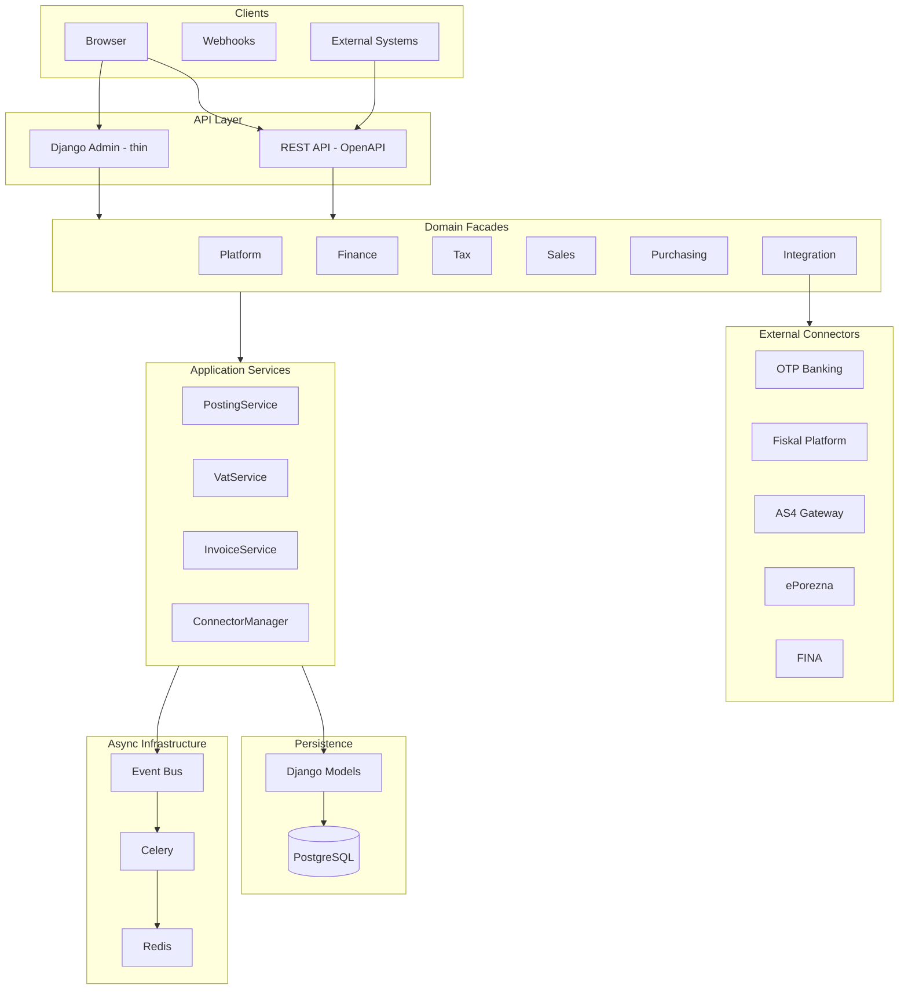

# Reference Architecture — racunAI ERP

Pregled cijelog sustava: slojevi, async infrastruktura i vanjski connectori. Domene: [`DOMAIN_MAP.md`](DOMAIN_MAP.md). Principi: [`ARCHITECTURE_PRINCIPLES.md`](ARCHITECTURE_PRINCIPLES.md).

> **Amendment (ADR-0017):** Jedinstveni Fiscal Gateway je `intermediary`. Super je prvi vanjski posrednik (Model A), ne privremeni connector. DIRECT je razdvojen na `fine_star_self` (aktivno, samo Fine Star OIB) i `racunai_direct` (future/disabled za tuđe OIB-ove). Detalji: [`ADR-0017-fiscal-gateway-model-a.md`](ADR-0017-fiscal-gateway-model-a.md).

---

## Dijagram



---

## Slojevi

### 1. Clients

| Klijent | Ulaz | Opis |
|---------|------|------|
| Browser | Django Admin, budući operativni frontend | Primarni korisnički ulaz (trenutno admin-centric) |
| Webhooks | REST API | AS4 inbound, bank callbacks |
| External Systems | REST API | eRačun, fiskalizacija, budući integracijski partneri |

### 2. API Layer

| Komponenta | Tehnologija | Odgovornost |
|------------|-------------|-------------|
| REST API | Django REST Framework + OpenAPI | Javni API, JWT auth, webhook endpointi |
| Django Admin | Django Admin (thin) | Operativni alat za računovođe — delegira na servise |

Admin i API ne sadrže poslovnu logiku — pozivaju domain facades ili application services.

### 3. Domain Facades

Javni API po domeni (`domains/*/`), privremeno mapiran na postojeće Django app servise:

| Facade | Ključni servisi |
|--------|-----------------|
| Platform | Auth, RBAC, tenant middleware, feature flags |
| Finance | Posting, GL, saldakonti, izvještaji |
| Tax | PDV pipeline, PDV-S, ledger, submission facade; SSOT [`docs/tax/FORM_REGISTRY.md`](../tax/FORM_REGISTRY.md) |
| Sales | Invoice lifecycle, eRačun outbound |
| Purchasing | Expense lifecycle, OCR (buduće) |
| Integration | ConnectorManager, UBL, AS4, fiskalizacija |

### 4. Application Services

Implementacija poslovne logike. Primjeri u produkciji:

| Servis | Lokacija | Domena |
|--------|----------|--------|
| `PostingService` | `accounting/services/posting.py` | Finance |
| `build_pdv_payload` | `accounting/services/tax_forms/pdv/` | Tax |
| `SubmissionService` | `accounting/services/submission/service.py` | Tax/Workflow |
| `IntegrationManager` | `integrations/` | Integration |
| `PaymentOrderLifecycle` | `banking/services/payment_order_lifecycle.py` | Banking |

### 5. Persistence

| Komponenta | Opis |
|------------|------|
| Django Models | ORM modeli s `TenantMixin`, relacije, osnovna validacija |
| PostgreSQL + PostGIS | Primarna baza, multi-tenant podaci |

Detalji entiteta: [`DATA_ARCHITECTURE.md`](DATA_ARCHITECTURE.md).

### 6. Async Infrastructure

| Komponenta | Uloga |
|------------|-------|
| **Event Bus** (`events/`) | Sync in-process dispatcher — `publish()` / `register_handler()` |
| **Celery** | Async taskovi: bank sync, fiskalizacija outbox, PDF generiranje |
| **Redis** | Celery broker + result backend |
| **django-celery-beat** | Scheduled taskovi (periodični bank sync, outbox retry) |

Event bus je trenutno in-process (nije distributed). Celery taskovi se pokreću iz handlera ili direktno iz servisa.

### 7. External Connectors

| Connector | Tip | Status | App |
|-----------|-----|--------|-----|
| OTP | Banking AIS/PIS | implemented (sandbox) | `banking` |
| SUPER (Model A) | eRačun | implemented — cilj: `SuperAdapter` u `intermediary`; `super_integration` prijelazno | `intermediary` / `super_integration` |
| `fine_star_self` | eRačun / AS4 | implemented — fail-closed allow-lista Fine Star OIB | `intermediary` / `fiscal_gateway` |
| `racunai_direct` | eRačun / AS4 | future / disabled za tuđe OIB-ove | `intermediary` |
| CIS | Fiskalizacija | demo | `fiscal_gateway` → `intermediary` |
| ePorezna | Tax submission | manual only | backlog |

Detalji: `CONNECTORS.md` (P1).

---

## Ključni tokovi

### Knjiženje računa

```
Invoice (Sales) → PostingService (Finance) → JournalEntry → VATLedgerEntry (Tax)
```

### PDV predaja

```
VATPeriod → aggregate_vat_boxes → PdvPayload → VATReturn → SubmissionService → SubmissionEvent
```

### Bankovno plaćanje (PIS)

```
PaymentOrder (Banking) → OTP API → PaymentExecuted (Event) → handle_payment_executed (Finance) → JournalEntry
```

### eRačun inbound

```
AS4 Webhook → fiscal_gateway → UBL parse → Expense (Purchasing) → Posting (Finance)
```

---

## Deployment (sažetak)

| Komponenta | Container |
|------------|-----------|
| Django (web) | `finestar_erp` |
| Celery worker | `finestar_erp` (worker process) |
| Celery beat | `finestar_erp` (beat process) |
| PostgreSQL + PostGIS | `postgis` |
| Redis | compose stack |
| Traefik | reverse proxy + TLS |

Detalji: `DEPLOYMENT.md` (P1).
