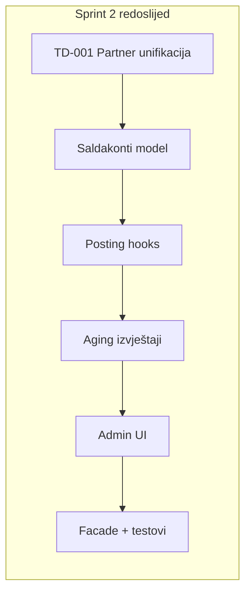

# Sprint 2 — plan implementacije

> **Izvor:** Cursor plan `sprint_2_implementation_86062fbd` · ažurirano **2026-07-09**  
> Nastavak prema [`ROADMAP.md`](ROADMAP.md): zatvoriti preostali Sprint 1 korak (GitHub milestones), zatim isporučiti Sprint 2 — Partner unifikacija (TD-001) i saldakonti. Import početnog stanja ostaje odgođen do dostave računovodstvene dokumentacije.

## Checklist napretka

> **Cursor todos (Run in new chat):** [`.cursor/plans/sprint_2_implementation.plan.md`](../../.cursor/plans/sprint_2_implementation.plan.md)

- [x] **Faza A** — GitHub milestones → todo `github-milestones` ([#19–#25](https://github.com/avrcanio/racunai.hr/issues?q=is%3Aissue+Sprint+2))
- [x] **B1** — TD-001 Partner/Supplier unifikacija → todo `td001-partner-unification`
- [x] **B2–B3** — `SubledgerItem` model + posting hooks → todo `subledger-model`
- [x] **B4** — Partner aging izvještaj → todo `aging-reports`
- [x] **B5** — Admin UI → todo `admin-ui`
- [x] **B6** — Facade + testovi + docs → todo `finance-facade-tests`
- [x] **Faza D** — ADR-0013 → todo `adr-0013-close`

---

## Trenutno stanje (2026-07-09)

Prema [`ROADMAP.md`](ROADMAP.md) i [`ADR-0013`](ADR-0013-finance-domain-stabilization.md):

| Korak | Status |
|-------|--------|
| P0 dokumenti | ✅ |
| `domains/` + `shared/` scaffolding | ✅ |
| GitHub milestones + Sprint 2 issuei | ✅ milestonei `Meta: Architecture`, `Finance`, `MDM`, `Core/Purchasing`; issuei [#19–#25](https://github.com/avrcanio/racunai.hr/issues?q=is%3Aissue+Sprint+2) |
| Sprint 2 implementacija | ✅ **završeno** (B1–B6 + ADR-0013) |
| Sljedeći korak | Sprint 3 — XSD gate → ZP → PDV 610+ ([`SPRINT_3_ZP_XSD_GATE.md`](SPRINT_3_ZP_XSD_GATE.md)) |

**North Star KPI:** ~10% → **~15%** (saldakonti + unified partneri; opening balance odgođeno).

**MASTER_CHECKLIST** ([`MASTER_CHECKLIST.md`](MASTER_CHECKLIST.md)) — Sprint 2 stavke:

- #13 Saldakonti — `[x]`
- #14 Početno stanje — `[ ]` → **odgođeno** (nema računovodstvene dokumentacije)
- #42 Supplier unifikacija (TD-001) — `[x]`

**Sprint 2 zatvoren:** [`ADR-0013`](ADR-0013-finance-domain-stabilization.md)

---

## Faza A — Zatvaranje Sprint 1 (Meta)

**Cilj:** Formalni tracker prije koda Sprint 2.

### GitHub milestones

Kreirati milestone po [ROADMAP.md § GitHub Milestones](ROADMAP.md) — prioritet za Sprint 2:

| Milestone | Issuei (primjer) |
|-----------|------------------|
| `Meta: Architecture` | ADR-0013 placeholder, import lint error mode (Sprint 3) |
| `Finance` | Saldakonti model + posting hooks; aging izvještaj; admin UI |
| `MDM` | TD-001 Partner/Supplier unifikacija |
| `Core` / `Purchasing` | Expense FK migracija, F1/inbound path update |

### Sprint 2–5 issuei

Svaki issue mora referencirati **stvarne putanje** iz scaffoldinga (ADR-0012 odluka #4):

- `domains/finance/services/` — novi subledger servisi
- `accounting/models.py`, `accounting/services/posting.py`
- `partners/models.py`, `expenses/models.py`
- [`DATA_ARCHITECTURE.md`](DATA_ARCHITECTURE.md) — ažurirati TD-001 status

**DoD Faze A:** Milestones + issuei za Sprint 2 otvoreni; ADR-0012 follow-up `[ ] GitHub milestones` označen gotovim.

### GitHub tracker (2026-07-09)

| Milestone | # | Issuei |
|-----------|---|--------|
| `Meta: Architecture` | 2 | [#24 ADR-0013](https://github.com/avrcanio/racunai.hr/issues/24), [#25 import lint error mode (S3)](https://github.com/avrcanio/racunai.hr/issues/25) |
| `MDM` | 4 | [#19 TD-001 Partner unifikacija](https://github.com/avrcanio/racunai.hr/issues/19) |
| `Core/Purchasing` | 5 | [#20 Expense FK + F1/inbound](https://github.com/avrcanio/racunai.hr/issues/20) |
| `Finance` | 3 | [#21 SubledgerItem + hooks](https://github.com/avrcanio/racunai.hr/issues/21), [#22 aging + admin](https://github.com/avrcanio/racunai.hr/issues/22), [#23 facade + testovi](https://github.com/avrcanio/racunai.hr/issues/23) |

---

## Faza B — Sprint 2 implementacija

### B1. Partner unifikacija (TD-001) — prvo

**Zašto prvo:** Saldakonti je per-counterparty; dupli `Partner`/`Supplier` model duplicirao bi open-item logiku i aging.

**Trenutno stanje:**

- [`partners.Partner`](../../erp/app/partners/models.py) — kanonski MDM (`partner_type`: customer/supplier/both)
- [`expenses.Supplier`](../../erp/app/expenses/models.py) — duplikat (TD-001 u [`DATA_ARCHITECTURE.md`](DATA_ARCHITECTURE.md))
- [`AnalyticAccount`](../../erp/app/accounting/models.py) — odvojeni FK `partner` i `supplier`
- [`analytics.py`](../../erp/app/accounting/services/analytics.py) — `get_or_create_analytic_for_partner` (1201) i `_for_supplier` (2201)
- [`supplier_resolver.py`](../../erp/app/expenses/services/supplier_resolver.py) — privremeni most Partner→Supplier po OIB-u

**Implementacija:**

1. **Data migration** — `Supplier` → `Partner` (match po OIB, fallback po imenu); kreirati `Partner` s `partner_type='supplier'` gdje nedostaje
2. **`Expense.supplier`** — promijeniti FK s `expenses.Supplier` na `partners.Partner`
3. **`AnalyticAccount`** — ukloniti `supplier` FK; koristiti samo `partner` + `counterparty_type` (partner/supplier/both mapira se na 1201/2201 prema `partner_type`)
4. **Refaktor servisa:**
   - Spojiti `get_or_create_analytic_for_supplier` u partner varijantu s parametrom synthetic_code (`1201` vs `2201`)
   - Zamijeniti `supplier_resolver.py` → `partner_resolver.py` (find/create by OIB)
   - Ažurirati: F1 import, `supplier_seed.py`, PDV-S aggregate (`MANUAL_SUPPLIER_MAP`), admin registracije
5. **Deprecate** `expenses.Supplier` model — soft delete (keep table 1 sprint za rollback) ili hard drop nakon migracije + testova
6. **Dokumentacija:** TD-001 → resolved u DATA_ARCHITECTURE; MASTER_CHECKLIST #42 → `[x]`

**Testovi:** migracija dedupe, expense posting s unified partner, analytic account kreiranje za supplier-type partner.

---

### B2–B3. Saldakonti — model + posting hooks

**Postojeći temelj (ne reinventirati):**

- Analitička konta po partneru već postoje ([`analytics.py`](../../erp/app/accounting/services/analytics.py))
- Djelomične uplate: [`post_invoice_payment`](../../erp/app/accounting/services/posting.py) + `Payment.related_invoice`
- Bank matching: [`banking/reconciliation.py`](../../erp/app/banking/reconciliation.py)

**Novi model — `SubledgerItem` (ili `OpenItem`):**

| Polje | Opis |
|-------|------|
| tenant | FK |
| partner | FK → Partner |
| direction | receivable / payable |
| source_content_type + source_object_id | Invoice / Expense / Manual JE |
| journal_entry | FK — izvorna temeljnica |
| original_amount | Decimal |
| open_amount | Decimal (remaining) |
| due_date | Date (za aging) |
| status | open / partial / closed |
| closed_at | nullable |

**Posting hooks** (u [`posting.py`](../../erp/app/accounting/services/posting.py)):

- `post_document('invoice_issued')` → kreiraj receivable open item
- `post_document('expense_approved')` → kreiraj payable open item
- `post_invoice_payment` → smanji `open_amount`, status partial/closed; podržati alokacije
- Expense payment flow (analogno invoice payment)
- Storno temeljnice → zatvori/poništi povezani open item

**Alokacije (v1):** 1 payment → 1 invoice/expense (postojeći model); proširenje na N:M ostaje za Sprint 5 (workflow).

---

### B4. Aging izvještaji

Proširiti [`accounting/services/reports.py`](../../erp/app/accounting/services/reports.py):

- **Partner aging** — bucketi: current, 1–30, 31–60, 61–90, 90+ dana
- **Open AR/AP lista** — partner, dokument, iznos, dospijeće, otvoreni iznos
- Export XLSX (isti pattern kao Bilanca/RDG)

Admin read-only view ili management command `report_subledger_aging --tenant`.

---

### B5. Admin UI (minimalno)

- Django admin: `SubledgerItem` list/filter (partner, status, direction, overdue)
- Inline na Invoice/Expense: povezani open items + preostali iznos
- Link na aging izvještaj

Operativni frontend shell — Sprint 5; ovdje samo admin.

---

### B6. Facade + testovi + docs

- Ekstrahirati u [`domains/finance/services/`](../../erp/app/domains/finance/services/__init__.py):
  - `create_subledger_item`, `allocate_payment`, `get_partner_aging`
- Re-export kroz [`domains/finance/facade.py`](../../erp/app/domains/finance/facade.py)
- Testovi: open item lifecycle, partial payment, aging buckets, storno
- Ažurirati [`DOMAIN_MAP.md`](DOMAIN_MAP.md): Finance L3 → „s saldakontom"; MDM L1 → L2
- **`MASTER_CHECKLIST` #13 → `[x]`**

---

### B7. Privremena knjiženja (`resolution_status`) — opcionalno u Sprint 2

Planirano u [`manual-journal-bank-matching.md`](../accounting/manual-journal-bank-matching.md) § `resolution_status` (OPEN/RESOLVED). Nije blocker za saldakonti, ali olakšava razrješenje suspense stavki prije opening balance importa.

**Preporuka:** mali PR unutar Sprint 2 ako ostane kapacitet; inače Sprint 3.

---

## Faza C — Odgođeno: Početno stanje import

Prema odluci: **ne implementirati u Sprint 2**.

Kada dokumentacija stigne (GitHub issue #1):

- Definirati CSV/XLSX format (GL salda + partner salda)
- Management command `import_opening_balances`
- Seed subledger open items iz partner salda
- Razrješenje privremenih knjiženja (suspense → 1201/2201)

Ovisi o: TD-001 ✅ + saldakonti ✅.

---

## Faza D — Sprint zatvaranje ✅

- [**ADR-0013**](ADR-0013-finance-domain-stabilization.md) — Finance Domain Stabilization (retrospective)
- Ažurirano: [`MASTER_CHECKLIST.md`](MASTER_CHECKLIST.md), [`ROADMAP.md`](ROADMAP.md)
- North Star KPI: ~10% → **~15%**

---

## Pregled Sprint 3–5 (sljedeći valovi)

| Sprint | Fokus | Ključni deliverables |
|--------|-------|---------------------|
| **Sprint 3** | Tax completion ✅ | ZP → PDV 610+ → reverse charge → OSS — [`ADR-0014`](ADR-0014-tax-domain-completion.md) |
| **Sprint 4** | Assets + fiskalizacija | Amortizacija, M1.6–M1.8 fiskalizacija produkcija; ADR-0015 |
| **Sprint 5** | Operativa | Workflow, DMS light, OCR, frontend shell; ADR-0016 |

Sprint 3 **ne počinje** dok Sprint 2 Finance/MDM nije zatvoren — PDV 610+ koristi iste counterparty izvore.

---

## Rizici i mitigacije

| Rizik | Mitigacija |
|-------|------------|
| TD-001 migracija kvari postojeće Expense/PDV-S podatke | Backup + reversible migration; test na `test_finestar_erp_db` |
| Saldakonti duplicira logiku s `Payment.related_invoice` | Open item kao SSOT; Payment alokacija ažurira open item |
| Scope creep (N:M alokacije, frontend) | v1 = 1:1; admin only; N:M → Sprint 5 |
| Opening balance bez docs | Eksplicitno out of scope Sprint 2 |

---

## Preporučeni PR redoslijed

1. `meta: GitHub milestones + Sprint 2 issues`
2. `feat(mdm): TD-001 Partner/Supplier unifikacija + data migration`
3. `feat(finance): SubledgerItem model + posting hooks`
4. `feat(finance): aging report + admin`
5. `feat(finance): domains/finance facade re-exports + tests`
6. `docs: ADR-0013 + checklist updates`
