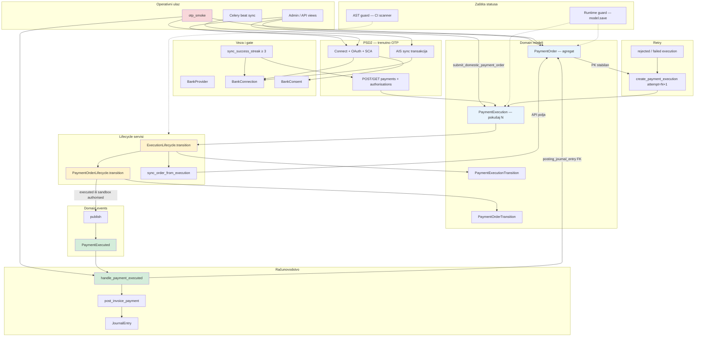

# Banking v2 — arhitektura PSD2 / PIS / knjiženja

```text
Status: Stable (Architecture Frozen)
Version: 2.0
Last updated: 2026-07-04

This document is the authoritative reference for the Banking v2 architecture.
```

Opisuje cijeli banking sloj nakon Faze 4 (PR1–PR4): od PSD2 veze do temeljnice.

Povezani operativni vodiči:

- [OTP sandbox runbook](../banking/otp-sandbox-test-runbook.md)
- [PIS readiness checklist](../banking/otp-pis-readiness.md)
- [OTP compliance checklist](../banking/otp-readiness.md)
- [Ručno usklađivanje banka ↔ temeljnica](../accounting/manual-journal-bank-matching.md)

---

## Pregled sustava

Banking v2 dijeli odgovornosti na tri sloja:

| Sloj | Odgovornost | Ne smije znati za |
|------|-------------|-------------------|
| **PSD2 provider** (`banking/otp/`, budući provideri) | HTTP, Berlin Group API, mapiranje statusa | Glavna knjiga, `JournalEntry` |
| **Banking domain** (`PaymentOrder`, `PaymentExecution`, lifecycle) | Poslovni nalog, pokušaji, audit, retry | Knjiženje (osim denormalizacije agregata) |
| **Accounting** (`events/`, `payment_posting`) | `Payment` → `Invoice` → `JournalEntry` | OTP API, SCA redirect |

Knjiženje **nikad** ne ide preko Django `post_save` signala na `Payment` u PIS toku — eksplicitni handler na `PaymentExecuted` događaju.

---

## Dijagram cijelog sustava



**Legenda:** plavo = domain modeli · žuto = lifecycle · zeleno = events/posting · crveno = operativni smoke.

---

## PaymentOrder — poslovni agregat

**Datoteka:** `erp/app/banking/provider_models.py`  
**Servisni ulaz:** `banking/services/pis_orders.py`

`PaymentOrder` je **stabilni poslovni identitet** naloga za plaćanje. PK i `correlation_id` ne mijenjaju se pri retry-u.

| Polje | Uloga |
|-------|-------|
| `connection`, `payment` | PSD2 veza + opcionalni ERP `Payment` |
| `status` | Agregatni status zadnjeg izvršenja — **samo** preko `PaymentOrderLifecycle` |
| `debtor_iban`, `creditor_*`, `amount`, `currency`, `reference` | Poslovni sadržaj naloga |
| `otp_payment_id`, `authorization_id`, `sca_redirect_url`, `payment_product`, `last_error` | Denormalizacija s `PaymentExecution` (agregat zadnjeg pokušaja) |
| `correlation_id` | Stabilni trag naloga (UUID, immutable) |
| `posting_journal_entry`, `posted_at` | Idempotentni guard knjiženja (PR2) |

Statusi:

`draft` → `submitted` → `sca_required` → `authorised` → `accepted` → `executed`  
Terminalni: `executed`, `rejected`, `failed`. Retry ide novim `PaymentExecution`, ne resetom PK-a.

---

## PaymentExecution — tehnički pokušaj

**Datoteka:** `erp/app/banking/provider_models.py`  
**Helperi:** `banking/services/payment_executions.py`

Od PR3 nadalje API pozivi rade na **execution**, ne direktno na orderu.

| Polje | Uloga |
|-------|-------|
| `order`, `attempt` | FK + redni broj pokušaja (unique per order) |
| `status` | Status ovog pokušaja — **samo** preko `ExecutionLifecycle` |
| `provider_payment_id` | OTP `paymentId` (bivši `otp_payment_id` na orderu) |
| `authorization_id`, `sca_redirect_url` | SCA tok |
| `correlation_id` | Trag **ovog** pokušaja (vidi dolje) |
| `parent_order_correlation_id` | Immutable snapshot `order.correlation_id` pri stvaranju |

**Pravilo sinkronizacije:**

```
Execution ──sync_order_from_execution()──► Order   (API polja)
Execution ──ExecutionLifecycle──────────► Order   (status, preko PaymentOrderLifecycle)
```

Nikad obrnuto. Order ne upravlja execution statusom.

---

## Lifecycle servisi

### PaymentOrderLifecycle

**Datoteka:** `banking/services/payment_order_lifecycle.py`

Jedino mjesto za `PaymentOrder.status = …`.

Svaki stvarni prijelaz:

1. Validira `ALLOWED_TRANSITIONS`
2. Persistira status (unutar runtime guard konteksta)
3. Append-only red u `PaymentOrderTransition` (`sequence`, `actor`, `metadata`)
4. Logira `order.pk`, `from→to`, `actor`, `correlation_id`
5. Po uvjetu emitira `PaymentExecuted`

**Idempotentnost:** isti `new_status == order.status` → no-op (bez save, audit, eventa). Polling može sigurno ponavljati `transition()`.

**Actor konstante:** `submit`, `otp_callback`, `otp_polling`, `admin_action`, `system`, `celery`.

### ExecutionLifecycle

**Datoteka:** `banking/services/payment_execution_lifecycle.py`

Isti obrazac kao Order lifecycle. Nakon promjene execution statusa **kaskadno** poziva `PaymentOrderLifecycle.transition()` s istim `actor`/`metadata`.

Mapiranje pozivatelja:

| Pozivatelj | Actor |
|------------|-------|
| `submit_domestic_payment_order` | `submit` |
| `poll_payment_order_status` | `otp_polling` |
| `handle_payment_sca_callback` | `otp_callback` |
| Admin akcija | `admin_action` |
| Periodični status check (budući) | `celery` |

---

## Domain Events

**Paket:** `erp/app/events/`

| Modul | Sadržaj |
|-------|---------|
| `dispatcher.py` | `publish()`, `register_handler()` — sync v1, spreman za Celery delegaciju |
| `payment.py` | `PaymentExecuted` dataclass |

Registracija handlera u `accounting/apps.py` `ready()` — accounting **ne importa** `banking.otp`.

### Kada se emitira `PaymentExecuted`

| Uvjet | Emit? |
|-------|-------|
| `to_status == executed` (stvarni prijelaz) | Da |
| Sandbox + `PIS_SANDBOX_ALLOW_POSTING_ON_AUTHORISED=true` + `to_status == authorised` | Da (samo sandbox E2E) |
| Ponovljeni poll na istom statusu | Ne (idempotentni no-op) |

Payload: `tenant_id`, `payment_order_id`, `payment_id`, `bank_connection_id`, `provider_code`, `amount`, `currency`, `execution_date`, `bank_reference`, `correlation_id`.

---

## Posting service

**Datoteka:** `accounting/services/payment_posting.py`

```
handle_payment_executed(event)
  ├─ PaymentOrder.get(pk=event.payment_order_id)
  ├─ ako posting_journal_entry_id → return (idempotentno, PR2)
  ├─ ako nema payment FK → log + return
  ├─ Payment.status = completed
  ├─ Invoice.status = paid (ako postoji)
  ├─ post_invoice_payment(tenant, invoice, payment, system_user)
  └─ order.posting_journal_entry + posted_at (tek ako entry is not None)
```

**Dvostruki guard:**

1. `post_invoice_payment()` — `source_content_type` + marker `[invoice_paid:payment-{pk}]`
2. `PaymentOrder.posting_journal_entry` FK — drugi `publish(PaymentExecuted)` ne knjiži ponovo

Ne koristi `auto_post_payment` signal — eksplicitna orkestracija izbjegava chicken-and-egg (`invoice` mora biti `paid` prije knjiženja).

---

## Correlation IDs

Tri razine identifikacije — namjerno odvojene:

| ID | Scope | Pravilo |
|----|-------|---------|
| `PaymentOrder.correlation_id` | Cijeli poslovni nalog | Generira se pri stvaranju drafta; **nikad se ne prepisuje** |
| `PaymentExecution.correlation_id` | Jedan bankovni pokušaj | attempt 1 = nasljeđuje order ID; attempt ≥ 2 = **novi UUID** |
| `PaymentExecution.parent_order_correlation_id` | Audit / SQL export | Immutable snapshot order ID-a u trenutku stvaranja executiona |

Koristi se u:

- HTTP headerima prema banci (`build_client(correlation_id=…)`)
- `PaymentOrderTransition.correlation_id` / `PaymentExecutionTransition.correlation_id`
- Logovima lifecycle servisa
- `PaymentExecuted.correlation_id`

Za incident analizu: filtriraj `actor=otp_polling` vs `actor=otp_callback` u transition tablicama.

---

## Retry

Retry **ne resetira** `PaymentOrder` PK niti `correlation_id`.

```
Order (rejected|failed) ──submit_domestic_payment_order()──►
  create_payment_execution(attempt=N+1) ──► novi API poziv s novim execution.correlation_id
```

Dozvoljeni order statusi za ponovno slanje: `draft`, `rejected`, `failed` (`SUBMITTABLE_ORDER_STATUSES`).

Na execution razini terminalni `rejected`/`failed` **nemaju** prijelaz natrag u `submitted` — retry uvijek kreira **novi** execution red.

Agregatni order status prati zadnji execution preko kaskade lifecycle-a.

---

## otp_smoke — operativni entry point

**Datoteke:** `banking/services/otp_smoke.py`, `banking/management/commands/otp_smoke.py`

Jedan command za sandbox readiness cijelog lanca:

```
healthcheck → AIS → PIS → posting
```

| Korak | Provjerava |
|-------|------------|
| `healthcheck` | Certifikat, credentials, PIS preduvjeti |
| `ais` | OAuth, consent, accounts, transactions |
| `pis` | PIS gate, testni nalog (opcionalno `--submit-test-payment`) |
| `posting` | `PaymentExecuted` → `JournalEntry` (opcionalno `--order-id`) |

Primjer:

```bash
docker compose exec django python manage.py otp_smoke --tenant otp-company-no1
docker compose exec django python manage.py otp_smoke \
  --tenant otp-company-no1 --submit-test-payment --order-id 2
docker compose exec django python manage.py otp_smoke --from=posting --order-id 2
```

Regression u CI: `.github/workflows/pis-posting-ci.yml`.

---

## Zaštita statusa (runtime + AST)

### Runtime guard

`PaymentOrder.save()` i `PaymentExecution.save()` bacaju iznimku ako se `status` mijenja izvan lifecycle konteksta (`lifecycle_status_change()` context manager).

### AST guard

**Paket:** `erp/app/lifecycle_guard/`

| Komponenta | Uloga |
|----------|-------|
| `config.py` | Registry: `PaymentOrder.status`, `PaymentExecution.status` |
| `ast_scanner.py` | Skenira `banking/` paket; zabranjuje direktne assignmente izvan dozvoljenih modula |

Dozvoljeni moduli za assignment:

- `banking/services/payment_order_lifecycle.py`
- `banking/services/payment_execution_lifecycle.py`

Testovi: `lifecycle_guard/tests/test_ast_scanner.py`.

---

## PSD2 tokovi izvan PIS-a (kontekst)

Banking v2 uključuje i sljedeće — **nisu** predmet architecture freeze lifecycle-a, ali su dio istog modula:

| Tok | Ključne datoteke |
|-----|------------------|
| Connect (OAuth + SCA) | `banking/services/connect.py`, `banking/views.py` |
| AIS sync | `banking/tasks.py`, `banking/otp/ais.py` |
| Izvodi (CAMT/CSV) | `banking/importers/`, `banking/services/import_statements.py` |
| Usklađivanje transakcija | `banking/reconciliation.py` |

PIS gate: `BankConnection.is_pis_ready()` zahtijeva `connected` + aktivni consent + `sync_success_streak ≥ 3`.

---

## Architecture freeze

Sljedeći moduli i modeli su **zamrznuti** nakon Faze 4 (PR1–PR4). Promjene su dopuštene samo u sljedećim kategorijama:

| Kategorija | Primjer |
|------------|---------|
| **Bugfix** | Pogrešan prijelaz, race u idempotentnosti, logging |
| **Regulatorna prilagodba** | Berlin Group / PSD2 promjena obveznog polja |
| **Nova banka** | Novi `BankProvider`, adapter uz isti lifecycle/events ugovor |

### Zamrznuto — ne refaktorirati

| Komponenta | Lokacija |
|------------|----------|
| `PaymentOrder` model (polja, statusi, guard) | `banking/provider_models.py` |
| `PaymentExecution` model | `banking/provider_models.py` |
| `PaymentOrderLifecycle`, `ALLOWED_TRANSITIONS` | `banking/services/payment_order_lifecycle.py` |
| `ExecutionLifecycle`, `ALLOWED_TRANSITIONS` | `banking/services/payment_execution_lifecycle.py` |
| Domain events (`publish`, `PaymentExecuted`) | `erp/app/events/` |
| Runtime status guard | `payment_order_status_guard.py`, `payment_execution_status_guard.py` |
| AST guard (registry + scanner) | `erp/app/lifecycle_guard/` |
| Posting service | `accounting/services/payment_posting.py` |
| `otp_smoke` orchestrator | `banking/services/otp_smoke.py` |

### Namjerno izvan freeze-a (proširenja)

- Novi bankovni provideri (`banking/providers/` — kad se dodaju)
- Celery delegacija u `publish()` — bez promjene handlera
- Automatsko knjiženje bankovnih izvoda (sljedeća faza)
- UI/admin poboljšanja koja ne mijenjaju lifecycle ugovor

### Pravila za code review

1. Nema `order.status =` / `execution.status =` izvan lifecycle modula (AST guard + runtime guard).
2. Banking ne importa `accounting` (osim FK definicija u modelima).
3. Accounting ne importa `banking.otp`.
4. Knjiženje PIS-a ide isključivo `PaymentExecuted` → `handle_payment_executed`.
5. Retry = novi `PaymentExecution`, ne brisanje/migracija `PaymentOrder` PK-a.

---

## Ključne datoteke (brzi index)

```
erp/app/
├── events/
│   ├── dispatcher.py
│   └── payment.py
├── lifecycle_guard/
│   ├── config.py
│   └── ast_scanner.py
├── banking/
│   ├── provider_models.py          # PaymentOrder, PaymentExecution, transitions
│   ├── services/
│   │   ├── payment_order_lifecycle.py
│   │   ├── payment_execution_lifecycle.py
│   │   ├── payment_executions.py   # correlation, sync, create_execution
│   │   ├── pis_orders.py           # submit, SCA callback, refresh
│   │   ├── payments.py             # thin wrapper: Payment → Order
│   │   └── otp_smoke.py
│   └── otp/
│       ├── pis.py                  # OTP API + status mapping
│       ├── ais.py
│       └── client.py
└── accounting/
    ├── apps.py                     # register_handler(PaymentExecuted, …)
    └── services/
        ├── payment_posting.py
        └── posting.py              # post_invoice_payment
```

---

## Verzioniranje dokumenta

| Verzija | Datum | Promjena |
|---------|-------|----------|
| v2.0 | 2026-07-04 | Inicijalni referentni dokument nakon PR4; architecture freeze |
