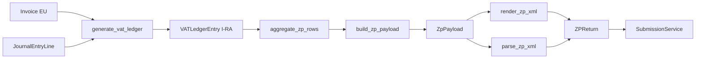

# Obrazac ZP — arhitektura (Zbirna prijava)

```text
Status: Implemented (L2 — Gen/Parse/Manual Sub + ops)
Version: 0.3
Last updated: 2026-07-10

Registry: docs/tax/FORM_REGISTRY.md
Konvencija: docs/tax/README.md (TaxFormEngine)
Referentni obrazac: docs/accounting/pdv-obrazac-architecture.md (PDV — frozen)
Uzorak implementacije: accounting/services/tax_forms/pdv_s/ (PDV-S)
Zašto nije ADR: operativni dokument; arhitektura ostaje ADR-0007/0009/0010
```

## Svrha

**Obrazac ZP** (Zbirna prijava) izvještava o **izlaznim isporukama u EU** (dobra i usluge). Predaje se elektronički na ePoreznu, uspoređuje se s **Obrazcem PDV** (I. dio, boxovi 101–103) i **VIES** sustavom.

ZP je **prvi novi obrazac** u Tax domeni koji implementira **TaxFormEngine** konvenciju bez refaktora frozen PDV pipelinea.

**Sprint 3 zatvoren (2026-07-10).** Pun ZP lifecycle: XSD gate → pipeline → `ZPReturn` → admin + `verify_zp_period` → produkcijski ledger 101/103. Retrospektiva: [`ADR-0014`](../architecture/ADR-0014-tax-domain-completion.md).

---

## Sprint 3 — implementacija ZP (feature redoslijed)

| # | Korak | Status | Napomena |
|---|-------|--------|----------|
| 1 | **Import službenog ZP XSD** → `accounting/schemas/zp/` | ✅ | `v1-0/` byte-identično — [`schemas/zp/README.md`](../../erp/app/accounting/schemas/zp/README.md) |
| 2 | **`aggregate.py`** | ✅ | `aggregate_zp_rows()` iz `VATLedgerEntry` (101/103); fixtures `tests/fixtures/tax/zp/` |
| 3 | **`render.py`**, **`parse.py`**, **`validation.py`** | ✅ | XSD = strukturna; poslovna pravila u istom modulu |
| 4 | **`ZPReturn`** + **`submit.py`** | ✅ | `SubmissionService` (ADR-0009); migracija `0018_zpreturn` |
| 5 | **CI** | ✅ | 10 `test_zp_*.py` modula u `pdv-ci.yml` |

**Nakon ZP lifecyclea (Sprint 3 zatvoren):** PDV 610+ → reverse charge → OSS → ADR-0014 ✅.

---

## Sprint 3 redoslijed (cijeli sprint)

| # | Stavka | Status | Dokument |
|---|--------|--------|----------|
| 1 | **ZP** (ovaj dokument) | ✅ | `docs/tax/ZP_ARCHITECTURE.md` |
| 1b | ZP ops (admin, verify, ledger 101/103) | ✅ | [`ADR-0014`](../architecture/ADR-0014-tax-domain-completion.md) |
| 2 | PDV boxovi 610+ (EU stjecanje → II.7 / ispravak VIII.1) | ✅ | [`pdv-mapping.md`](../accounting/pdv-mapping.md) |
| 3 | Reverse charge | ✅ | isto |
| 4 | OSS | ✅ | isto |
| 5 | ADR-0014 (Sprint 3 retrospektiva) | ✅ | [`ADR-0014-tax-domain-completion.md`](../architecture/ADR-0014-tax-domain-completion.md) |

---

## Pregled pipelinea

```text
Invoice (EU) / JE → generate_vat_ledger → VATLedgerEntry (I-RA)
    → aggregate_zp_rows → ZpPayload → render_zp_xml → ZPReturn
    → SubmissionService → SubmissionEvent
```

Poslovni iznosi računaju se **jednom** (do `ZpPayload`). XML je izvedeni artefakt.



**Odnos prema PDV-u:** boxovi **101** (dobra EU), **103** (usluge EU) na PDV obrascu moraju biti **usklađeni** sa zbrojevima u ZP (A-FAQ-4355). ZP i PDV dijele **VATLedger** kao izvor, ali imaju **zasebne** payload/XML modele.

---

## Izvori podataka

| Izvor | Što daje | PDV box (referenca) |
|-------|----------|---------------------|
| `Invoice` + `InvoiceItem` | Izlazni računi EU kupcima (PDV ID primatelja) | 101 (dobra), 103 (usluge) |
| `VATLedgerEntry` (I-RA) | Agregirane izlazne stavke s `vat_box` | 101, 103 |
| `JournalEntryLine` | Ručne/korektivne stavke EU izlaza | 101, 103 |
| `Partner` / EU VAT ID | Država + PDV identifikator primatelja | red ZP po primatelju |

**Pravilo:** agregacija ZP ide iz **VATLedger** (I-RA), ne direktno iz `Invoice` ORM-a u build sloju — isto kao PDV arhitekturni gate. Ledger mora biti generiran prije `build_zp_payload()`.

**Nije u scopeu v1 ZP:** box 102/104 (treće zemlje), NPS (105), trostrani poslovi — dokumentirati kao L1 proširenje.

### Preduvjeti

- [x] XSD shema ZP u repozitorij (`accounting/schemas/zp/v1-0/` — import iz [`ePorezna_Schemas.zip`](https://e-porezna.porezna-uprava.hr/Upute/G2B/ePorezna_Schemas.zip), vidi [`schemas/zp/README.md`](../../erp/app/accounting/schemas/zp/README.md))
- [x] Test fixtures + 6 scenarija (`tests/fixtures/tax/zp/`) — agregacija i cross-check
- [x] Referentno **produkcijsko** razdoblje s EU izlaznim isporukama (Fine Star) — ledger iz stvarnih računa (E2E test)
- [x] `generate_vat_ledger()` mapira EU izlaz na box 101/103 (`vat.py`)

---

## Payload

### ZpPayload (`@dataclass(frozen=True)`)

Kanonski poslovni model — neovisan o XML-u.

```python
@dataclass(frozen=True)
class ZpPayload:
    schema_version: str          # npr. "1.0" — iz XSD
    mapping_version: int         # ZP_MAPPING_VERSION
    period_from: date
    period_to: date
    taxpayer: ZpTaxpayer         # OIB, naziv, …
    prepared_by: ZpPreparedBy     # odgovorna osoba
    rows: tuple[ZpRow, ...]      # agregat po primatelju

@dataclass(frozen=True)
class ZpRow:
    country_code: str            # ISO / EL za GR
    pdv_id: str                  # bez prefixa države
    goods_value: Decimal         # dobra (→ PDV 101)
    services_value: Decimal      # usluge (→ PDV 103)
```

### Canonical Artifact

| Artefakt | Uloga |
|----------|-------|
| `payload.json` | **SSOT** po verziji (`ZPReturn`) |
| `unsigned.xml` | Izvedeni — `render_zp_xml(payload)` |
| `submitted.xml` | Arhiva potpisanog (import / attachment) |

Hash: `canonical_json(payload)` → SHA-256 → `ZPReturn.payload_hash` i `SubmissionEvent.payload_hash`.

---

## Mapping

### ZP_ROW_REGISTRY (SSOT — `boxes.py` ili `mapping.py`)

Po uzoru na `VAT_BOX_REGISTRY` / PDV-S agregaciju:

| ZP polje / red | PDV box | Izvor u ledgeru | Pravilo (draft) |
|----------------|---------|-----------------|-----------------|
| Dobra (I1) | 101 | I-RA, `vat_box=101` | Zbroj po `(country_code, pdv_id)` |
| Usluge (I2) | 103 | I-RA, `vat_box=103` | Zbroj po `(country_code, pdv_id)` |

`ZP_MAPPING_VERSION = 1` — inkrementirati kad promjena utječe na generirani payload.

### Usklađenost s PDV-om

| Provjera | Pravilo |
|----------|---------|
| ZP Σ dobra | = PDV `Podatak101` (tolerancija 0,01) |
| ZP Σ usluge | = PDV `Podatak103` |
| Cross-form | Contract test: `build_pdv_payload` + `build_zp_payload` za isto razdoblje |

Detalji citata: [`pdv-pu-uputa-2026-citations.md`](../accounting/pdv-pu-uputa-2026-citations.md) §3.1, A-FAQ-4355.

---

## Validation

### Slojevi

| Sloj | Modul | Što provjerava |
|------|-------|----------------|
| Strukturna (XSD) | `validation.py` → `validate_zp_xml()` | Službena XSD shema — **ne uređivati XSD** |
| Poslovna | `validation.py` → `validate_zp_payload()` | OIB, razdoblje, PDV ID, zbrojevi — što XSD ne izražava |
| Cross-form | `verify.py` | ZP ↔ PDV box 101/103; budući VIES hook |

XSD validacija **prije** kreacije `ZPReturn` zapisa (isto kao PDV draft pipeline).

---

## Render i parse

| Funkcija | Opis |
|----------|------|
| `render_zp_xml(payload) → bytes` | Unsigned XML iz payloada |
| `parse_zp_xml(xml_bytes) → ZpPayload` | Round-trip + import arhive |

Namespace i `verzijaSheme` prema službenoj XSD shemi: namespace `http://e-porezna.porezna-uprava.hr/sheme/zahtjevi/ObrazacZP/v1-0`, `verzijaSheme="1.0"` (provjereno u `ZP/ObrazacZPtipovi-v1-0.xsd` i `Primjer.xml` — vidi [`schemas/zp/README.md`](../../erp/app/accounting/schemas/zp/README.md)).

---

## Submission

**Ne implementirati vlastiti audit.** Delegacija na frozen servis:

```text
mark_zp_submitted(period) → get_or_create ZPReturn → SubmissionService.create_event()
attach_confirmation → SubmissionService.attach_confirmation()
ispravak → SubmissionService.supersede()
```

### Model `ZPReturn` (implementirano)

Po uzoru na `PDVSReturn` / `VATReturn` — verzioniranje **1:N** po `VATPeriod`:

| Polje | Svrha |
|-------|-------|
| `vat_period` | FK na `VATPeriod` (više verzija po razdoblju) |
| `version` | Inkrement (`next_zp_return_version()` s `select_for_update`) |
| `schema_version`, `mapping_version` | Shema XSD + `ZP_MAPPING_VERSION` |
| `payload_snapshot`, `payload_hash` | Canonical JSON + SHA-256 |
| `payload_json`, `xml_unsigned`, `xml_submitted` | FileField artefakti |
| `unsigned_xml_sha256` | Integritet nepotpisanog XML-a |
| `prepared_by` | FK `ResponsiblePerson` |

Implementira `SubmissionDocument` protocol. `TaxDocumentType.ZP` + mapiranje u `document_type_for_content_type()`.

Storage:

```text
zp_returns/{tenant_slug}/{year}/{month:02d}/v{version}/
  payload.json
  unsigned.xml
  submitted.xml
```

---

## Struktura koda (implementirano)

Standardni layout: [`FORM_IMPLEMENTATION_CONVENTION.md`](FORM_IMPLEMENTATION_CONVENTION.md)

```
accounting/services/tax_forms/zp/
  payload.py        # ZpPayload, ZpRow; ZP_MAPPING_VERSION = 1
  aggregate.py      # aggregate_zp_rows(period)
  build.py          # build_zp_payload(period) — pass-through gate
  render.py         # render_zp_xml
  parse.py          # parse_zp_xml
  validation.py     # validate_zp_xml (XSD), validate_zp_payload
  verify.py         # verify_zp_against_pdv_boxes
  canonical.py      # canonical_json, payload_hash
  submit.py         # mark_zp_submitted → SubmissionService
  zp_returns.py     # create_zp_return_draft
  versions.py       # next_zp_return_version

accounting/schemas/zp/v1-0/     # XSD (imported — vidi README)
accounting/tests/fixtures/tax/zp/
accounting/migrations/0018_zpreturn.py
domains/tax/forms/              # TaxFormEngine registracija (future facade)
```

**Ne dirati** `accounting/services/tax_forms/pdv/build.py`. Proširenje ledgera za box 101/103 → `vat.py` (todo `zp-ledger-101-103`).

---

## Test strategija

Fixtures **prije implementacije** — `accounting/tests/fixtures/tax/zp/`:

| Scenarij | Svrha |
|----------|-------|
| `single_eu_partner` | Jedan DE primatelj |
| `multiple_eu_partners` | Više EU primatelja |
| `period_correction` | Ispravak v1 → v2 + submission chain |
| `empty_period` | Prazan payload |
| `invalid_vat_id` | Validation error |
| `pdv_mismatch_101_103` | Verification fail ZP ↔ PDV |

Loader: `accounting/tests/fixtures/tax/zp/load.py`. Contract test: `test_zp_fixture_contract.py`.

Obvezni testni paket: [`TESTING_GUIDE.md`](TESTING_GUIDE.md).

Isti `fixtures/tax/{form}/` pattern za PDV-K, JOPPD, …

| Test | Status | Opis |
|------|--------|------|
| `test_zp_fixture_contract.py` | ✅ | Struktura fixturea |
| `test_zp_aggregate.py` | ✅ | Agregacija iz fixture ledgera (6 scenarija) |
| `test_zp_render_parse_roundtrip.py` | ✅ | payload → XML → parse ≈ payload |
| `test_zp_xsd_present.py` | ✅ | XSD load + službeni `Primjer.xml` |
| `test_zp_xsd_validation.py` | ✅ | XSD na generiranom XML-u |
| `test_zp_business_validation.py` | ✅ | OIB, PDV ID, razdoblje |
| `test_zp_pdv_cross_check.py` | ✅ | ZP zbroj vs `aggregate_vat_boxes` 101/103 |
| `test_zp_create_return_draft.py` | ✅ | Draft, verzioniranje, hash, atomičnost |
| `test_zp_submission.py` | ✅ | `mark_zp_submitted`, ispravak chain |
| `test_zp_verify.py` | ✅ | Unit testovi verify helpera |
| `test_verify_zp_period.py` | ✅ | Mgmt command — cross-check + XML diff |
| `test_zp_build.py` | — | Nije potreban — `build_zp_payload()` je pass-through |
| Snapshot fixture | ⏳ | `expected_payload_*.json` — djelomično pokriveno u create_return_draft testovima |

CI: `.github/workflows/pdv-ci.yml` — svi `test_zp_*.py` moduli u path filteru i test runu.

Regresija (produkcija):

```bash
docker compose exec django python manage.py verify_zp_period \
  --tenant finestar --year YYYY --month MM \
  --xml /path/to/submitted_zp.xml
```

Opcije (po uzoru na `verify_pdv_period`):

| Flag | Svrha |
|------|-------|
| `--tenant` | Slug tenanta (npr. `finestar`) |
| `--year`, `--month` | Razdoblje `VATPeriod` |
| `--xml` | Putanja do potpisanog `ZP_*.xml` — usporedba `build_zp_payload()` vs `parse_zp_xml()` |
| `--regenerate-ledger` | Ponovno pokreni `generate_vat_ledger()` prije provjere |
| `--benchmark` | Ispiši trajanje koraka pipelinea |

**Koraci provjere:**

1. `build_zp_payload(period)` — ERP payload iz VAT ledgera (boxovi 101/103).
2. `verify_zp_against_pdv_boxes()` — zbroj ZP dobara/usluga mora odgovarati `aggregate_vat_boxes` boxovima 101/103 (isti ledger kao PDV).
3. Ako je `--xml` zadan: `parse_zp_xml()` + `compare_zp_payload_fields()` — field-level diff; po-red usporedba `(country_code, pdv_id)`.

Command završava s `CommandError` ako cross-form provjera ili XML diff ne prođe. Bez `--xml` ispisuje samo zbrojeve i PDV usklađenost (korisno za brzu provjeru ledgera).

Implementacija: `accounting/management/commands/verify_zp_period.py`. Testovi: `test_verify_zp_period.py`.

---

## Implementacijski checklist

**Korak 1 — XSD**

- [x] Preuzeti službeni zip s ePorezna portala
- [x] Raspakirati u `accounting/schemas/zp/v1-0/` **bez izmjena** XSD datoteka
- [x] `examples/Primjer.xml` — službeni primjer s portala

**Koraci 2–5 — pipeline**

- [x] Test fixtures + contract test
- [x] `aggregate.py` (fixture-driven)
- [x] `render.py`, `parse.py`, `validation.py` (XSD + poslovna)
- [x] Snapshot + round-trip testovi
- [x] `ZPReturn` + `submit.py` → `SubmissionService`
- [x] Cross-form CI (PDV 101/103)
- [x] Admin: draft, download XML, označi predano
- [x] `verify_zp_period` management command
- [x] Produkcijsko I-RA → 101/103 (`generate_vat_ledger`)
- [x] [`FORM_REGISTRY.md`](FORM_REGISTRY.md) maturity → **L2** (Gen + Parse + Manual Sub)

---

## Reference

- [`FORM_REGISTRY.md`](FORM_REGISTRY.md)
- [`pdv-pu-uputa-2026-citations.md`](../accounting/pdv-pu-uputa-2026-citations.md) — ZP / PDV usklađenost
- [`pdv_s/`](../accounting/) — referentna implementacija sličnog EU obrasca
- [FAQ prijave PDV-a (PU)](https://porezna-uprava.gov.hr/hr/najcesce-postavljena-pitanja-faq-prijave-pdv-a/4355)
- ADR-0009 — SubmissionService
- [`domains/tax/forms/protocol.py`](../../erp/app/domains/tax/forms/protocol.py) — TaxFormEngine
